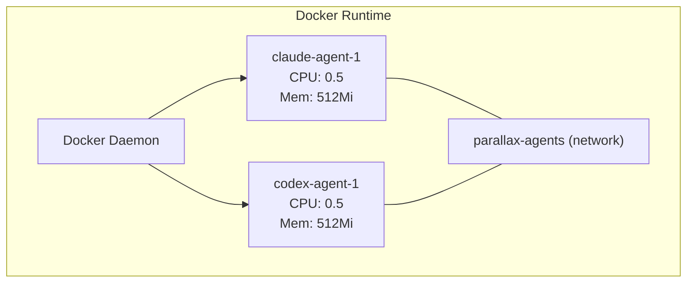
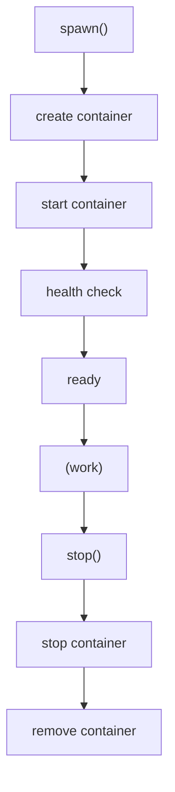

# Docker Runtime

The Docker runtime runs agents in isolated containers, providing resource limits and network isolation.

## Architecture



## Installation

```bash
cd packages/runtime-docker
pnpm install
pnpm build
```

## Prerequisites

- Docker Engine 20.10+
- Docker CLI

```bash
# Verify Docker is running
docker info
```

## Building Agent Images

### Base Image

```bash
docker build -t parallax/agent-base:latest -f Dockerfile.base .
```

### Agent-Specific Images

```bash
# Claude agent
docker build -t parallax/agent-claude:latest -f Dockerfile.claude .

# Codex agent
docker build -t parallax/agent-codex:latest -f Dockerfile.codex .

# Gemini agent
docker build -t parallax/agent-gemini:latest -f Dockerfile.gemini .
```

## Configuration

| Environment Variable | Default | Description |
|---------------------|---------|-------------|
| `PORT` | 3200 | HTTP server port |
| `DOCKER_SOCKET` | /var/run/docker.sock | Docker socket path |
| `DOCKER_NETWORK` | parallax-agents | Docker network name |
| `DEFAULT_MEMORY` | 512m | Default container memory |
| `DEFAULT_CPU` | 0.5 | Default CPU limit |

## Starting the Server

```bash
# Create network
docker network create parallax-agents

# Start runtime
pnpm start
```

## Container Lifecycle



## API Usage

### Spawn Agent with Resources

```bash
curl -X POST http://localhost:3200/agents \
  -H "Content-Type: application/json" \
  -d '{
    "name": "heavy-analyzer",
    "type": "claude",
    "resources": {
      "memory": "1g",
      "cpu": 1.0
    }
  }'
```

### Mount Volumes

```bash
curl -X POST http://localhost:3200/agents \
  -H "Content-Type: application/json" \
  -d '{
    "name": "file-processor",
    "type": "claude",
    "volumes": [
      "/host/data:/data:ro"
    ]
  }'
```

### Pass Secrets

```bash
curl -X POST http://localhost:3200/agents \
  -H "Content-Type: application/json" \
  -d '{
    "name": "secure-agent",
    "type": "claude",
    "env": {
      "API_KEY": "sk-..."
    }
  }'
```

## Resource Limits

### Memory

```yaml
resources:
  memory: "512m"   # Default
  memory: "1g"     # 1 GB
  memory: "2g"     # 2 GB
```

### CPU

```yaml
resources:
  cpu: 0.5    # Half a core (default)
  cpu: 1.0    # One core
  cpu: 2.0    # Two cores
```

## Networking

### Default Network

All agents run on the `parallax-agents` network by default:

```bash
# Agents can communicate via container names
docker exec agent-1 ping agent-2
```

### Custom Networks

```bash
curl -X POST http://localhost:3200/agents \
  -H "Content-Type: application/json" \
  -d '{
    "name": "isolated-agent",
    "type": "claude",
    "network": "custom-network"
  }'
```

## Logs and Monitoring

### Container Logs

```bash
# Via API
curl http://localhost:3200/agents/agent-123/logs

# Via Docker directly
docker logs parallax-agent-123
```

### Resource Usage

```bash
# Via API
curl http://localhost:3200/agents/agent-123/metrics

# Via Docker
docker stats parallax-agent-123
```

## Error Handling

| Error | Cause | Resolution |
|-------|-------|------------|
| `IMAGE_NOT_FOUND` | Agent image not built | Build the image |
| `NETWORK_ERROR` | Docker network issue | Create/check network |
| `RESOURCE_LIMIT` | Out of memory/CPU | Increase limits or reduce agents |
| `SOCKET_ERROR` | Cannot connect to Docker | Check Docker daemon |

## Security

### Image Security

- Use official base images
- Scan images for vulnerabilities
- Don't store secrets in images

### Runtime Security

```bash
# Read-only root filesystem
docker run --read-only ...

# Drop capabilities
docker run --cap-drop=ALL ...

# No new privileges
docker run --security-opt=no-new-privileges ...
```

## Best Practices

1. **Build Fresh Images** - Rebuild images regularly for security updates
2. **Set Resource Limits** - Prevent runaway containers
3. **Use Networks** - Isolate agent groups
4. **Clean Up** - Remove stopped containers promptly
5. **Log Rotation** - Configure Docker log rotation

## Next Steps

- [Kubernetes Runtime](/docs/agent-runtimes/kubernetes) - For production at scale
- [Local Runtime](/docs/agent-runtimes/local) - For development
