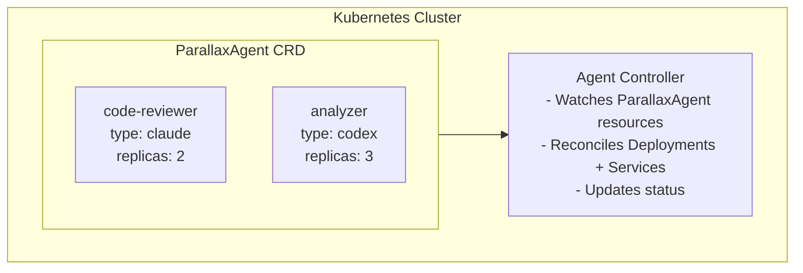

# Kubernetes Runtime

The Kubernetes runtime manages agents as CRD-based resources, enabling production-grade scaling and management.

## Architecture



## Installation

### 1. Install the CRD

```bash
kubectl apply -f packages/runtime-k8s/crds/parallax-agent.yaml
```

### 2. Deploy the Controller

```bash
kubectl apply -f packages/runtime-k8s/deploy/
```

### 3. Verify Installation

```bash
kubectl get crd parallaxagents.parallax.io
kubectl get pods -n parallax-system
```

## ParallaxAgent CRD

### Basic Example

```yaml
apiVersion: parallax.io/v1alpha1
kind: ParallaxAgent
metadata:
  name: code-reviewer
  namespace: default
spec:
  type: claude
  capabilities:
    - code_review
    - security_analysis
```

### Full Specification

```yaml
apiVersion: parallax.io/v1alpha1
kind: ParallaxAgent
metadata:
  name: enterprise-analyzer
  namespace: production
spec:
  # Agent type (required)
  type: claude

  # Capabilities (optional)
  capabilities:
    - code_review
    - architecture
    - security

  # Resource limits
  resources:
    requests:
      memory: "256Mi"
      cpu: "100m"
    limits:
      memory: "512Mi"
      cpu: "500m"

  # API credentials
  credentials:
    secretRef:
      name: claude-api-key
      key: CLAUDE_API_KEY

  # Scaling configuration
  scaling:
    minReplicas: 1
    maxReplicas: 5
    targetCPUUtilization: 70

  # Health checks
  healthCheck:
    initialDelaySeconds: 10
    periodSeconds: 30
    failureThreshold: 3

  # Node selection
  nodeSelector:
    workload-type: ai-agents
```

## Configuration

| Environment Variable | Default | Description |
|---------------------|---------|-------------|
| `PORT` | 3300 | HTTP server port |
| `KUBECONFIG` | ~/.kube/config | Kubernetes config path |
| `NAMESPACE` | parallax | Target namespace |
| `WATCH_NAMESPACE` | all | Namespaces to watch |

## Agent Lifecycle

```
Create ParallaxAgent CR
         │
         ▼
Controller detects new resource
         │
         ▼
Create Deployment + Service
         │
         ▼
Wait for pods ready
         │
         ▼
Update status: phase=Running
         │
         ▼
Agent ready for tasks
```

## Status Phases

| Phase | Description |
|-------|-------------|
| `Pending` | Resource created, waiting for pods |
| `Running` | Pods are ready and serving |
| `Scaling` | Scaling in progress |
| `Failed` | Pods failed to start |
| `Terminating` | Being deleted |

### Check Status

```bash
kubectl get parallaxagents

NAME            TYPE    PHASE    REPLICAS   AGE
code-reviewer   claude  Running  2/2        5m
analyzer        codex   Running  3/3        10m
```

## Credentials Management

### Using Kubernetes Secrets

```bash
# Create secret
kubectl create secret generic claude-api-key \
  --from-literal=CLAUDE_API_KEY=sk-ant-...
```

```yaml
# Reference in CRD
spec:
  credentials:
    secretRef:
      name: claude-api-key
      key: CLAUDE_API_KEY
```

### Using External Secrets

```yaml
spec:
  credentials:
    externalSecretRef:
      name: vault-claude-key
      key: api_key
```

## Scaling

### Manual Scaling

```bash
kubectl scale parallaxagent code-reviewer --replicas=5
```

### Horizontal Pod Autoscaler

```yaml
spec:
  scaling:
    minReplicas: 2
    maxReplicas: 10
    targetCPUUtilization: 70
    targetMemoryUtilization: 80
```

### Scale to Zero

```yaml
spec:
  scaling:
    minReplicas: 0
    scaleDownDelay: 300  # 5 minutes of idle before scaling down
```

## Networking

### Service Discovery

Each agent gets a Kubernetes Service:

```bash
# Access via service name
curl http://code-reviewer.default.svc.cluster.local:8080
```

### Network Policies

```yaml
apiVersion: networking.k8s.io/v1
kind: NetworkPolicy
metadata:
  name: agent-policy
spec:
  podSelector:
    matchLabels:
      app.kubernetes.io/managed-by: parallax
  ingress:
    - from:
        - podSelector:
            matchLabels:
              app: parallax-control-plane
```

## Monitoring

### Prometheus Metrics

```yaml
spec:
  metrics:
    enabled: true
    port: 9090
```

### Pod Metrics

```bash
kubectl top pods -l app.kubernetes.io/managed-by=parallax
```

### Controller Logs

```bash
kubectl logs -n parallax-system -l app=parallax-agent-controller
```

## Troubleshooting

### Agent Not Starting

```bash
# Check events
kubectl describe parallaxagent code-reviewer

# Check pod logs
kubectl logs -l parallax.io/agent=code-reviewer
```

### Authentication Failures

```bash
# Verify secret exists
kubectl get secret claude-api-key

# Check secret contents (base64)
kubectl get secret claude-api-key -o jsonpath='{.data.CLAUDE_API_KEY}'
```

### Scaling Issues

```bash
# Check HPA status
kubectl describe hpa code-reviewer-hpa

# Check resource usage
kubectl top pods -l parallax.io/agent=code-reviewer
```

## Best Practices

1. **Use Namespaces** - Isolate agents by environment
2. **Set Resource Limits** - Prevent resource contention
3. **Enable Autoscaling** - Handle load variations
4. **Use Network Policies** - Restrict agent communication
5. **Monitor Metrics** - Track performance and costs
6. **Rotate Secrets** - Use secret rotation for API keys

## Production Checklist

- [ ] CRD and controller deployed
- [ ] Secrets configured for API keys
- [ ] Resource limits set appropriately
- [ ] Autoscaling configured
- [ ] Network policies applied
- [ ] Monitoring and alerting set up
- [ ] Backup strategy for agent state

## Next Steps

- [Docker Runtime](/docs/agent-runtimes/docker) - For staging
- [Local Runtime](/docs/agent-runtimes/local) - For development
- [Enterprise Features](/docs/enterprise/overview) - HA and security
