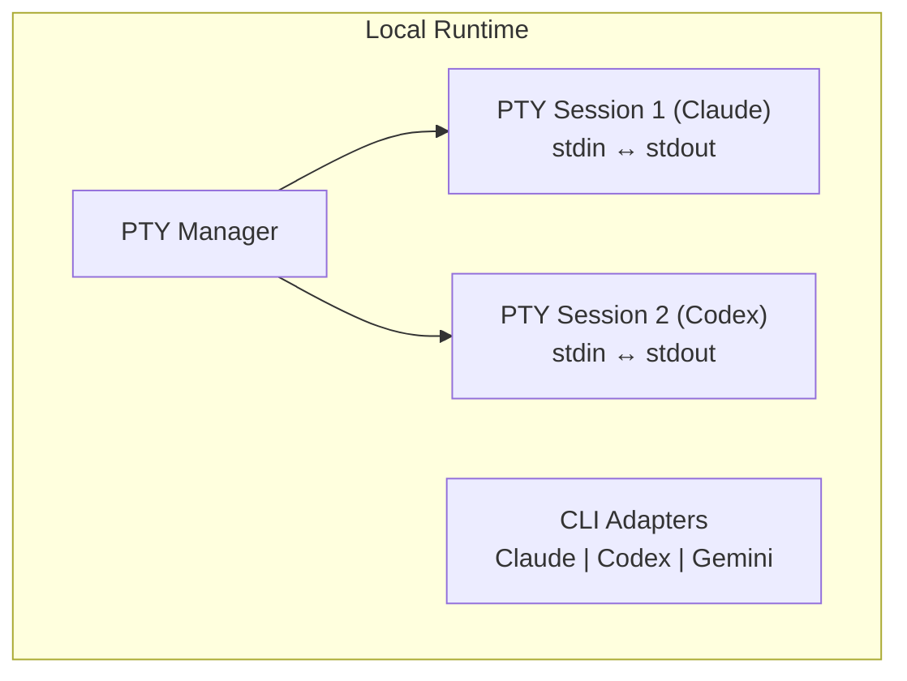
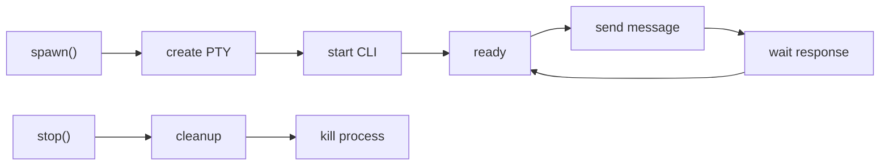

# Local Runtime

The local runtime spawns agents as PTY (pseudo-terminal) sessions on the host machine, ideal for development and testing.

## Architecture



## Installation

```bash
cd packages/runtime-local
pnpm install
pnpm build
```

## Prerequisites

Ensure the CLI tools are installed and authenticated:

```bash
# Claude Code
npm install -g @anthropic-ai/claude-code
claude auth

# Codex CLI
npm install -g @openai/codex
codex auth

# Gemini CLI
npm install -g @google/gemini-cli
gemini auth
```

## Configuration

| Environment Variable | Default | Description |
|---------------------|---------|-------------|
| `PORT` | 3100 | HTTP server port |
| `LOG_LEVEL` | info | Logging level |
| `MAX_AGENTS` | 10 | Maximum concurrent agents |
| `DEFAULT_TIMEOUT` | 60000 | Default command timeout (ms) |

## Starting the Server

```bash
# Development
pnpm dev

# Production
pnpm start

# With custom port
PORT=3150 pnpm start
```

## CLI Adapters

Each agent type has a dedicated adapter:

### Claude Adapter

```typescript
{
  command: 'claude',
  args: ['--print'],  // Non-interactive mode
  env: {
    CLAUDE_API_KEY: process.env.CLAUDE_API_KEY
  }
}
```

### Codex Adapter

```typescript
{
  command: 'codex',
  args: ['--quiet'],
  env: {
    OPENAI_API_KEY: process.env.OPENAI_API_KEY
  }
}
```

### Gemini Adapter

```typescript
{
  command: 'gemini',
  args: [],
  env: {
    GOOGLE_API_KEY: process.env.GOOGLE_API_KEY
  }
}
```

## PTY Sessions

Each agent runs in an isolated PTY session that:
- Provides full terminal emulation
- Captures all stdout/stderr output
- Maintains command history
- Handles interactive prompts

### Session Lifecycle



## API Usage

### Spawn Agent

```bash
curl -X POST http://localhost:3100/agents \
  -H "Content-Type: application/json" \
  -d '{
    "name": "my-claude",
    "type": "claude",
    "workdir": "/path/to/project"
  }'
```

### Send Message

```bash
curl -X POST http://localhost:3100/agents/agent-123/send \
  -H "Content-Type: application/json" \
  -d '{
    "message": "What files are in this directory?",
    "timeout": 30000
  }'
```

### Get Logs

```bash
curl http://localhost:3100/agents/agent-123/logs?lines=50
```

### Stop Agent

```bash
curl -X DELETE http://localhost:3100/agents/agent-123
```

## WebSocket Endpoints

The local runtime provides WebSocket endpoints for real-time streaming and event subscription.

### Terminal WebSocket

Connect directly to an agent's PTY for raw terminal I/O (ideal for xterm.js integration):

```
ws://localhost:3100/ws/agents/:id/terminal
```

**Usage with JavaScript:**

```javascript
const ws = new WebSocket(`ws://localhost:3100/ws/agents/${agentId}/terminal`);

// Receive terminal output
ws.onmessage = (event) => {
  if (event.data.startsWith('{')) {
    // Control message (e.g., { type: 'connected' })
    const ctrl = JSON.parse(event.data);
    console.log('Control:', ctrl.type);
  } else {
    // Raw terminal data - send to xterm.js
    terminal.write(event.data);
  }
};

// Send keyboard input
terminal.onData((data) => {
  ws.send(data);
});

// Resize terminal
ws.send(JSON.stringify({ type: 'resize', cols: 120, rows: 40 }));
```

### Events WebSocket

Subscribe to agent lifecycle events:

```
ws://localhost:3100/ws/events
ws://localhost:3100/ws/events?agentId=abc-123  # Filter by agent
```

**Events:**

| Event | Data | Description |
|-------|------|-------------|
| `agent_started` | `{ agent }` | Agent spawned |
| `agent_ready` | `{ agent }` | Agent ready for commands |
| `agent_stopped` | `{ agent, reason }` | Agent stopped |
| `agent_error` | `{ agent, error }` | Agent error |
| `login_required` | `{ agent, loginUrl }` | Authentication needed |
| `message` | `{ message }` | Agent output message |
| `question` | `{ agent, question }` | Agent asking a question |

**Example:**

```javascript
const ws = new WebSocket('ws://localhost:3100/ws/events');

ws.onmessage = (event) => {
  const { event: eventType, data, timestamp } = JSON.parse(event.data);

  switch (eventType) {
    case 'agent_ready':
      console.log(`Agent ${data.agent.name} is ready`);
      break;
    case 'login_required':
      // Show terminal UI for user to authenticate
      openTerminal(data.agent.id, data.loginUrl);
      break;
  }
};
```

## Error Handling

| Error | Cause | Resolution |
|-------|-------|------------|
| `CLI_NOT_FOUND` | CLI tool not installed | Install the CLI tool globally |
| `AUTH_REQUIRED` | CLI not authenticated | Run `claude auth` or equivalent |
| `SPAWN_FAILED` | PTY creation failed | Check permissions and resources |
| `TIMEOUT` | Command timed out | Increase timeout or check agent |

## Debugging

### View Agent Output

```bash
# Stream logs in real-time
curl -N http://localhost:3100/agents/agent-123/stream
```

### Check Agent Status

```bash
curl http://localhost:3100/agents/agent-123
```

### Health Check

```bash
curl http://localhost:3100/health
```

## Best Practices

1. **Set Working Directory** - Always specify `workdir` for file operations
2. **Use Timeouts** - Set appropriate timeouts for long-running tasks
3. **Clean Up** - Stop agents when done to free resources
4. **API Keys** - Use environment variables for API keys
5. **Log Level** - Use `debug` level when troubleshooting

## Next Steps

- [Docker Runtime](/docs/agent-runtimes/docker) - For isolated containers
- [Kubernetes Runtime](/docs/agent-runtimes/kubernetes) - For production
