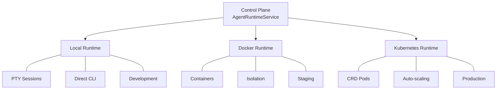

# Agent Runtimes

Parallax can spawn and manage CLI-based AI agents dynamically, enabling on-demand agent orchestration across multiple runtime environments.

## What are Agent Runtimes?

Agent Runtimes allow Parallax to:
- **Spawn** CLI agents (Claude Code, Codex, Gemini CLI) on demand
- **Manage** agent lifecycle (start, communicate, monitor, stop)
- **Scale** across local, Docker, and Kubernetes environments

## Supported Agent Types

| Agent Type | CLI Tool | Description |
|------------|----------|-------------|
| `claude` | Claude Code | Anthropic's Claude CLI for coding tasks |
| `codex` | Codex CLI | OpenAI's Codex CLI |
| `gemini` | Gemini CLI | Google's Gemini CLI |

## Runtime Environments



| Runtime | Use Case | Requirements |
|---------|----------|--------------|
| **[Local](/docs/agent-runtimes/local)** | Development | Node.js, CLI tools installed |
| **[Docker](/docs/agent-runtimes/docker)** | Staging/Testing | Docker daemon |
| **[Kubernetes](/docs/agent-runtimes/kubernetes)** | Production | K8s cluster with CRD support |

## Quick Start

### 1. Start a Runtime Server

```bash
# Local development
cd packages/runtime-local
pnpm build && pnpm start
# Server starts on port 3100
```

### 2. Configure Control Plane

```bash
export PARALLAX_LOCAL_RUNTIME_URL=http://localhost:3100
cd packages/control-plane
pnpm start
```

### 3. Spawn an Agent

```bash
curl -X POST http://localhost:3000/api/managed-agents \
  -H "Content-Type: application/json" \
  -d '{
    "name": "code-reviewer",
    "type": "claude",
    "capabilities": ["code_review"]
  }'
```

### 4. Send a Task

```bash
curl -X POST http://localhost:3000/api/managed-agents/agent-123/send \
  -H "Content-Type: application/json" \
  -d '{
    "message": "Review auth.ts for security issues",
    "expectResponse": true
  }'
```

## API Reference

### Core Endpoints

| Method | Endpoint | Description |
|--------|----------|-------------|
| `POST` | `/api/managed-agents` | Spawn new agent |
| `GET` | `/api/managed-agents` | List all agents |
| `GET` | `/api/managed-agents/:id` | Get agent details |
| `POST` | `/api/managed-agents/:id/send` | Send message to agent |
| `GET` | `/api/managed-agents/:id/logs` | Get agent logs |
| `GET` | `/api/managed-agents/:id/metrics` | Get agent metrics |
| `DELETE` | `/api/managed-agents/:id` | Stop agent |

### Spawn Request

```typescript
{
  name: string;           // Agent name
  type: 'claude' | 'codex' | 'gemini';
  capabilities?: string[];
  workdir?: string;       // Working directory
  env?: Record<string, string>;
  runtime?: 'local' | 'docker' | 'kubernetes';
}
```

### Agent Response

```typescript
{
  id: string;
  name: string;
  type: string;
  status: 'starting' | 'ready' | 'busy' | 'error' | 'stopped';
  runtime: string;
  createdAt: string;
}
```

## WebSocket Endpoints

The runtime provides real-time WebSocket endpoints for UI integration:

### Terminal Streaming

Connect directly to an agent's PTY for xterm.js integration:

```
ws://localhost:3100/ws/agents/:id/terminal
```

```javascript
const ws = new WebSocket(`ws://runtime:3100/ws/agents/${agentId}/terminal`);

// Raw terminal output -> xterm.js
ws.onmessage = (e) => terminal.write(e.data);

// Keyboard input -> PTY
terminal.onData((data) => ws.send(data));

// Resize
ws.send(JSON.stringify({ type: 'resize', cols: 120, rows: 40 }));
```

### Event Streaming

Subscribe to agent lifecycle events:

```
ws://localhost:3100/ws/events
ws://localhost:3100/ws/events?agentId=abc-123  # Filter by agent
```

| Event | Data | Description |
|-------|------|-------------|
| `agent_started` | `{ agent }` | Agent spawned |
| `agent_ready` | `{ agent }` | Agent ready for commands |
| `agent_stopped` | `{ agent, reason }` | Agent stopped |
| `agent_error` | `{ agent, error }` | Error occurred |
| `login_required` | `{ agent, loginUrl }` | Authentication needed |
| `message` | `{ message }` | Agent output |
| `question` | `{ agent, question }` | Agent needs input |

```javascript
const ws = new WebSocket('ws://runtime:3100/ws/events');

ws.onmessage = (e) => {
  const { event, data } = JSON.parse(e.data);
  if (event === 'login_required') {
    // Show terminal UI for authentication
    openTerminal(data.agent.id);
  }
};
```

## Multi-Runtime Selection

When multiple runtimes are configured, selection uses priority:

1. **Explicit** - If specified in spawn request
2. **Local** (priority 10) - Best for development
3. **Docker** (priority 20) - Good for staging
4. **Kubernetes** (priority 30) - Best for production

## Integration with Patterns

Managed agents work with org-chart patterns:

```yaml
structure:
  roles:
    architect:
      agentType: claude
      managed: true  # Spawn via runtime
      capabilities:
        - architecture
```

## Next Steps

- [Local Runtime](/docs/agent-runtimes/local) - Development setup
- [Docker Runtime](/docs/agent-runtimes/docker) - Container-based agents
- [Kubernetes Runtime](/docs/agent-runtimes/kubernetes) - Production deployment
- [Org-Chart Patterns](/docs/patterns/org-chart-patterns) - Hierarchical orchestration
