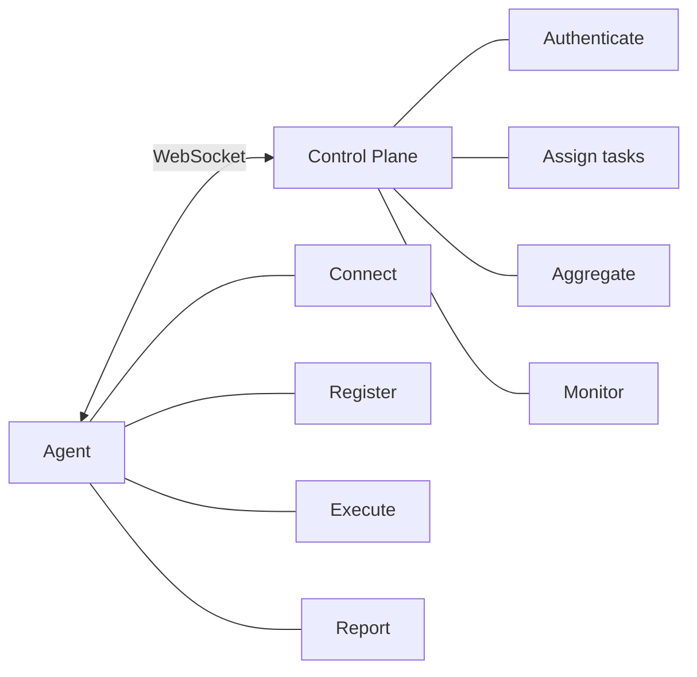
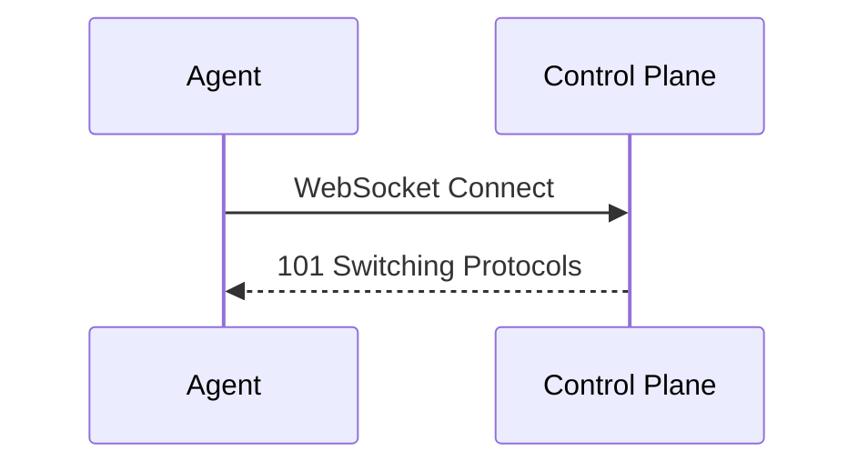
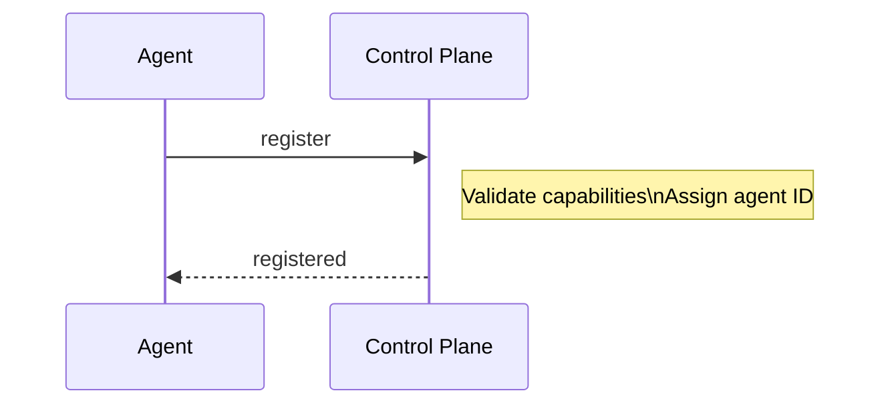
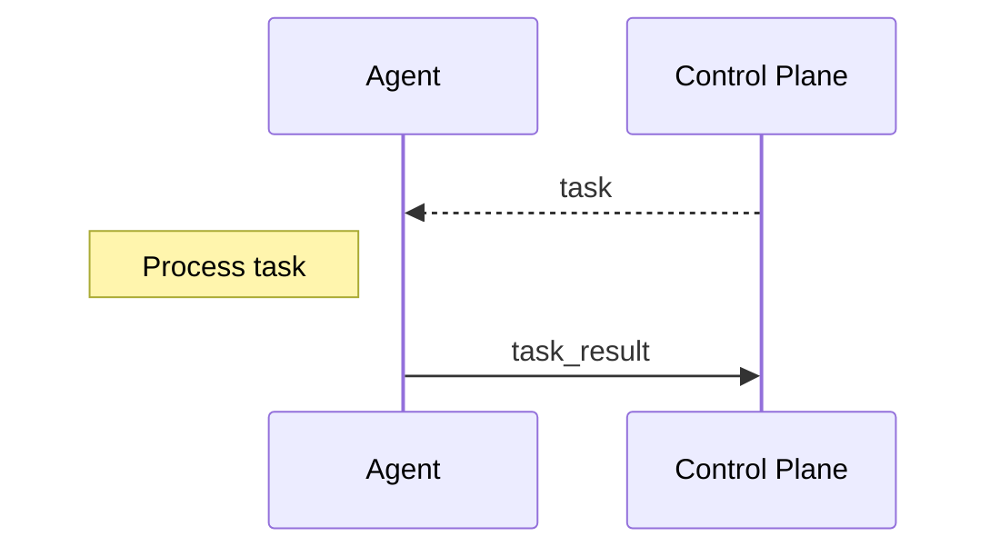
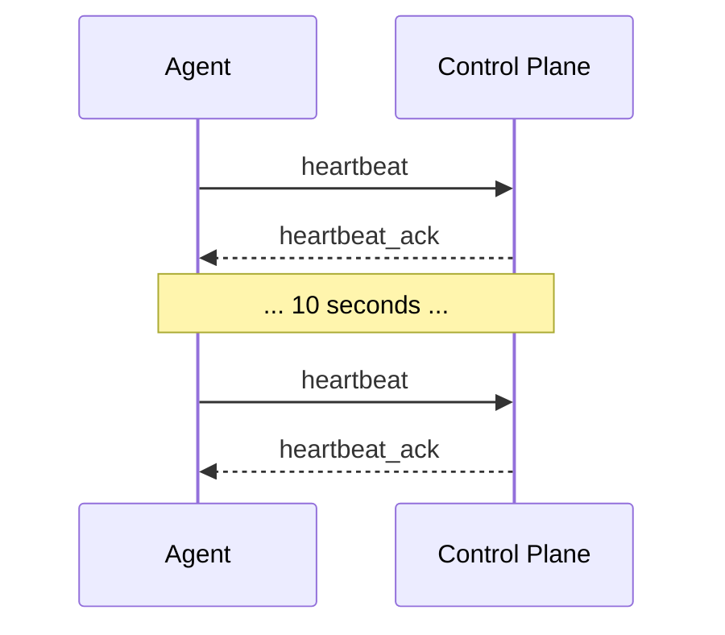
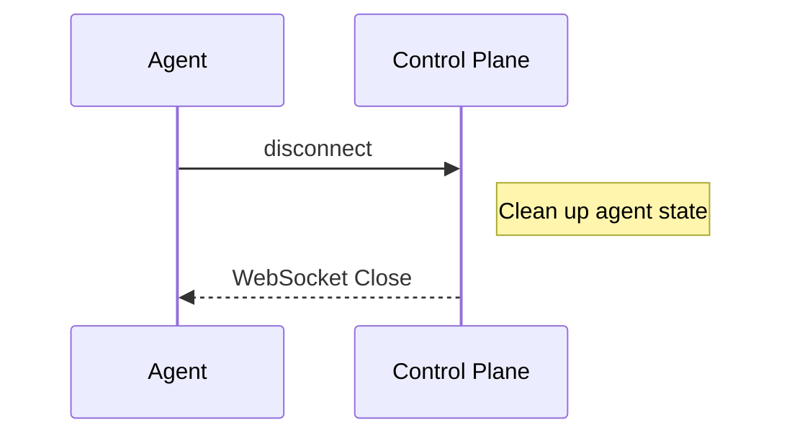

# Agent Protocol

WebSocket protocol specification for agent communication with the control plane.

## Overview

Agents connect to the control plane via WebSocket for bidirectional communication:



## Connection

### WebSocket URL

```
wss://parallax.example.com/ws/agent
```

Local development:
```
ws://localhost:8080/ws/agent
```

### Connection Headers

```http
GET /ws/agent HTTP/1.1
Host: parallax.example.com
Upgrade: websocket
Connection: Upgrade
Authorization: Bearer <token>
X-Agent-Id: agent_abc123
X-Agent-Capabilities: classification,analysis
```

### Connection Response

Success:
```http
HTTP/1.1 101 Switching Protocols
Upgrade: websocket
Connection: Upgrade
X-Connection-Id: conn_xyz789
```

Failure:
```http
HTTP/1.1 401 Unauthorized
Content-Type: application/json

{"error": "Invalid authentication token"}
```

## Message Format

All messages are JSON with this structure:

```typescript
interface Message {
  type: string;
  id: string;        // Message ID for correlation
  timestamp: string; // ISO 8601 timestamp
  payload: object;   // Message-specific data
}
```

## Agent → Control Plane Messages

### Register

Sent immediately after connection to register capabilities:

```json
{
  "type": "register",
  "id": "msg_001",
  "timestamp": "2024-01-15T10:30:00.000Z",
  "payload": {
    "capabilities": ["classification", "analysis"],
    "metadata": {
      "name": "my-agent",
      "model": "gpt-4",
      "version": "1.0.0"
    },
    "config": {
      "maxConcurrentTasks": 5,
      "taskTimeout": 30000
    }
  }
}
```

### Task Result

Send task completion result:

```json
{
  "type": "task_result",
  "id": "msg_002",
  "timestamp": "2024-01-15T10:30:05.000Z",
  "payload": {
    "taskId": "task_abc123",
    "executionId": "exec_xyz789",
    "status": "completed",
    "result": {
      "category": "technology",
      "confidence": 0.92
    },
    "duration": 1500,
    "metadata": {
      "tokensUsed": 150
    }
  }
}
```

### Task Error

Report task failure:

```json
{
  "type": "task_error",
  "id": "msg_003",
  "timestamp": "2024-01-15T10:30:05.000Z",
  "payload": {
    "taskId": "task_abc123",
    "executionId": "exec_xyz789",
    "error": {
      "code": "PROCESSING_ERROR",
      "message": "Failed to process input",
      "details": {
        "reason": "Content too long"
      }
    },
    "retryable": true
  }
}
```

### Heartbeat

Periodic health signal:

```json
{
  "type": "heartbeat",
  "id": "msg_004",
  "timestamp": "2024-01-15T10:30:10.000Z",
  "payload": {
    "status": "healthy",
    "activeTasks": 2,
    "metrics": {
      "cpuUsage": 45,
      "memoryUsage": 60,
      "tasksCompleted": 100,
      "averageLatency": 1200
    }
  }
}
```

### Status Update

Report capability or status changes:

```json
{
  "type": "status_update",
  "id": "msg_005",
  "timestamp": "2024-01-15T10:30:15.000Z",
  "payload": {
    "status": "busy",
    "capabilities": ["classification"],  // Updated capabilities
    "reason": "High load - reduced capabilities"
  }
}
```

### Disconnect

Graceful disconnect notification:

```json
{
  "type": "disconnect",
  "id": "msg_006",
  "timestamp": "2024-01-15T10:30:20.000Z",
  "payload": {
    "reason": "shutdown",
    "graceful": true
  }
}
```

## Control Plane → Agent Messages

### Registered

Confirmation of registration:

```json
{
  "type": "registered",
  "id": "msg_001",  // Correlates with register message
  "timestamp": "2024-01-15T10:30:00.100Z",
  "payload": {
    "agentId": "agent_abc123",
    "capabilities": ["classification", "analysis"],
    "config": {
      "heartbeatInterval": 10000,
      "taskTimeout": 30000
    }
  }
}
```

### Task Assignment

Assign a task to the agent:

```json
{
  "type": "task",
  "id": "msg_100",
  "timestamp": "2024-01-15T10:30:01.000Z",
  "payload": {
    "taskId": "task_abc123",
    "executionId": "exec_xyz789",
    "patternName": "content-classifier",
    "patternVersion": "1.0.0",
    "capability": "classification",
    "input": {
      "content": "Document text to classify",
      "options": {
        "categories": ["technology", "sports", "politics"]
      }
    },
    "timeout": 30000,
    "priority": "normal",
    "context": {
      "stepIndex": 0,
      "totalSteps": 1
    }
  }
}
```

### Task Cancelled

Notify task cancellation:

```json
{
  "type": "task_cancelled",
  "id": "msg_101",
  "timestamp": "2024-01-15T10:30:10.000Z",
  "payload": {
    "taskId": "task_abc123",
    "executionId": "exec_xyz789",
    "reason": "execution_timeout"
  }
}
```

### Heartbeat Ack

Acknowledge heartbeat:

```json
{
  "type": "heartbeat_ack",
  "id": "msg_004",  // Correlates with heartbeat
  "timestamp": "2024-01-15T10:30:10.050Z",
  "payload": {
    "serverTime": "2024-01-15T10:30:10.050Z",
    "nextHeartbeat": 10000
  }
}
```

### Configuration Update

Push configuration changes:

```json
{
  "type": "config_update",
  "id": "msg_200",
  "timestamp": "2024-01-15T10:30:30.000Z",
  "payload": {
    "config": {
      "heartbeatInterval": 5000,
      "maxConcurrentTasks": 3
    },
    "reason": "Load balancing adjustment"
  }
}
```

### Error

Protocol or processing error:

```json
{
  "type": "error",
  "id": "msg_002",  // Correlates with causing message
  "timestamp": "2024-01-15T10:30:05.000Z",
  "payload": {
    "code": "INVALID_MESSAGE",
    "message": "Unknown message type: foo",
    "fatal": false
  }
}
```

## Connection Lifecycle

### 1. Connect



### 2. Register



### 3. Task Processing



### 4. Heartbeat Loop



### 5. Disconnect



## Error Handling

### Reconnection

Agents should implement exponential backoff:

```typescript
const reconnect = async (attempt: number) => {
  const delay = Math.min(1000 * Math.pow(2, attempt), 30000);
  await sleep(delay);
  return connect();
};
```

### Task Retry

If a task fails with `retryable: true`, the control plane may reassign it:

```json
{
  "type": "task_error",
  "payload": {
    "taskId": "task_abc123",
    "error": {
      "code": "TIMEOUT",
      "message": "Task timed out"
    },
    "retryable": true
  }
}
```

### Fatal Errors

Fatal errors require reconnection:

```json
{
  "type": "error",
  "payload": {
    "code": "AUTHENTICATION_EXPIRED",
    "message": "Token has expired",
    "fatal": true
  }
}
```

## Flow Control

### Backpressure

Agents can indicate capacity limits:

```json
{
  "type": "status_update",
  "payload": {
    "status": "busy",
    "maxTasks": 0,  // Don't send more tasks
    "reason": "At capacity"
  }
}
```

### Task Rejection

Agents can reject tasks they cannot handle:

```json
{
  "type": "task_error",
  "payload": {
    "taskId": "task_abc123",
    "error": {
      "code": "REJECTED",
      "message": "Cannot handle this task type"
    },
    "retryable": true  // Control plane can reassign
  }
}
```

## Security

### Authentication

Agents authenticate using:

1. **Token**: Include in connection headers
2. **mTLS**: Client certificate authentication

### Message Signing

For additional security, messages can be signed:

```json
{
  "type": "task_result",
  "id": "msg_002",
  "timestamp": "2024-01-15T10:30:05.000Z",
  "payload": { ... },
  "signature": "sha256:abc123..."
}
```

### Rate Limiting

Control plane enforces:
- Max messages per second: 100
- Max message size: 1MB
- Max concurrent tasks per agent: configurable

## Metrics

### Agent-Side Metrics

Agents should track:

```prometheus
# Tasks processed
agent_tasks_total{status="completed"} 1000
agent_tasks_total{status="failed"} 50

# Task latency
agent_task_duration_seconds_bucket{le="1"} 800
agent_task_duration_seconds_bucket{le="5"} 950

# Connection status
agent_connection_status{status="connected"} 1

# Reconnection attempts
agent_reconnections_total 5
```

### Control Plane Metrics

```prometheus
# Connected agents
parallax_agents_connected{capability="classification"} 10

# Messages sent/received
parallax_ws_messages_total{direction="sent",type="task"} 10000
parallax_ws_messages_total{direction="received",type="task_result"} 9800

# Message latency
parallax_ws_message_latency_seconds{type="task_result"} 0.005
```

## Implementation Guide

### TypeScript Agent

```typescript
import WebSocket from 'ws';

class ParallaxAgent {
  private ws: WebSocket;
  private heartbeatInterval: NodeJS.Timeout;

  async connect() {
    this.ws = new WebSocket('wss://parallax.example.com/ws/agent', {
      headers: {
        'Authorization': `Bearer ${this.token}`,
      },
    });

    this.ws.on('open', () => this.register());
    this.ws.on('message', (data) => this.handleMessage(JSON.parse(data)));
    this.ws.on('close', () => this.reconnect());
  }

  private register() {
    this.send({
      type: 'register',
      id: this.generateId(),
      timestamp: new Date().toISOString(),
      payload: {
        capabilities: this.capabilities,
        metadata: this.metadata,
      },
    });
  }

  private handleMessage(msg: Message) {
    switch (msg.type) {
      case 'registered':
        this.startHeartbeat();
        break;
      case 'task':
        this.handleTask(msg.payload);
        break;
      case 'task_cancelled':
        this.cancelTask(msg.payload.taskId);
        break;
    }
  }

  private async handleTask(task: Task) {
    try {
      const result = await this.processTask(task);
      this.send({
        type: 'task_result',
        id: this.generateId(),
        timestamp: new Date().toISOString(),
        payload: {
          taskId: task.taskId,
          executionId: task.executionId,
          status: 'completed',
          result,
        },
      });
    } catch (error) {
      this.send({
        type: 'task_error',
        id: this.generateId(),
        timestamp: new Date().toISOString(),
        payload: {
          taskId: task.taskId,
          executionId: task.executionId,
          error: {
            code: 'PROCESSING_ERROR',
            message: error.message,
          },
          retryable: true,
        },
      });
    }
  }

  private startHeartbeat() {
    this.heartbeatInterval = setInterval(() => {
      this.send({
        type: 'heartbeat',
        id: this.generateId(),
        timestamp: new Date().toISOString(),
        payload: {
          status: 'healthy',
          activeTasks: this.activeTasks.size,
        },
      });
    }, 10000);
  }

  private send(msg: Message) {
    this.ws.send(JSON.stringify(msg));
  }
}
```

### Python Agent

```python
import asyncio
import websockets
import json
from datetime import datetime

class ParallaxAgent:
    async def connect(self):
        headers = {'Authorization': f'Bearer {self.token}'}
        async with websockets.connect(
            'wss://parallax.example.com/ws/agent',
            extra_headers=headers
        ) as ws:
            self.ws = ws
            await self.register()
            await self.message_loop()

    async def register(self):
        await self.send({
            'type': 'register',
            'id': self.generate_id(),
            'timestamp': datetime.utcnow().isoformat() + 'Z',
            'payload': {
                'capabilities': self.capabilities,
                'metadata': self.metadata,
            }
        })

    async def message_loop(self):
        async for message in self.ws:
            msg = json.loads(message)
            await self.handle_message(msg)

    async def handle_message(self, msg):
        if msg['type'] == 'task':
            await self.handle_task(msg['payload'])

    async def send(self, msg):
        await self.ws.send(json.dumps(msg))
```

## Next Steps

- [Control Plane API](/api/control-plane) - REST API reference
- [Webhooks](/api/webhooks) - Event notifications
- [TypeScript SDK](/sdk/typescript) - Use the SDK instead of raw protocol
