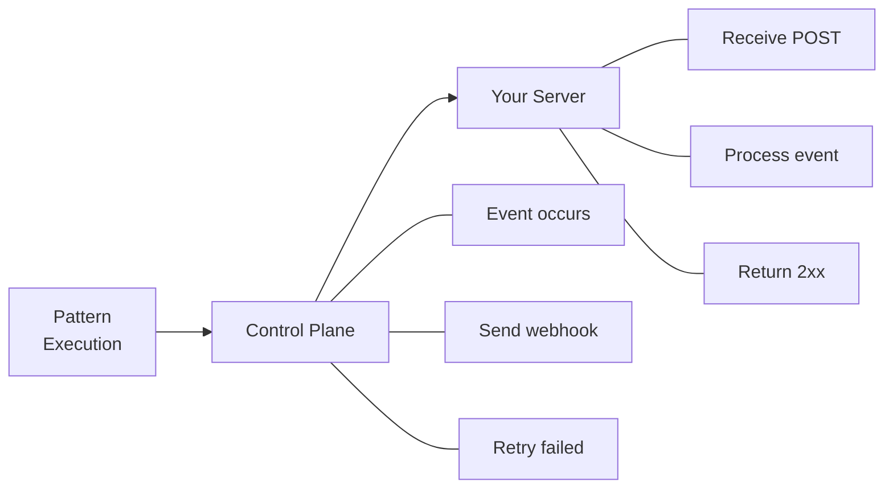

# Webhooks

Receive real-time notifications for execution events via webhooks.

## Overview

Webhooks allow you to receive HTTP callbacks when events occur in Parallax:



## Configuration

### Create Webhook

Via API:

```bash
curl -X POST https://parallax.example.com/api/webhooks \
  -H "Authorization: Bearer pk_live_abc123" \
  -H "Content-Type: application/json" \
  -d '{
    "url": "https://your-server.com/webhooks/parallax",
    "events": ["execution.completed", "execution.failed"],
    "secret": "whsec_abc123"
  }'
```

Via configuration:

```yaml
# parallax.config.yaml
webhooks:
  endpoints:
    - url: https://your-server.com/webhooks/parallax
      events:
        - execution.completed
        - execution.failed
      secret: ${WEBHOOK_SECRET}

    - url: https://alerts.example.com/parallax
      events:
        - agent.disconnected
      headers:
        X-Custom-Header: value
```

### Webhook Options

| Option | Description |
|--------|-------------|
| `url` | Destination URL (HTTPS required in production) |
| `events` | Array of event types to receive |
| `secret` | Secret for signature verification |
| `headers` | Custom headers to include |
| `enabled` | Enable/disable webhook |
| `retries` | Number of retry attempts (default: 3) |
| `timeout` | Request timeout in ms (default: 30000) |

## Events

### Execution Events

#### `execution.started`

Fired when pattern execution begins:

```json
{
  "id": "evt_abc123",
  "type": "execution.started",
  "timestamp": "2024-01-15T10:30:00.000Z",
  "data": {
    "executionId": "exec_xyz789",
    "pattern": {
      "name": "content-classifier",
      "version": "1.0.0"
    },
    "input": {
      "content": "Document text"
    },
    "metadata": {
      "requestId": "req_123"
    }
  }
}
```

#### `execution.completed`

Fired when execution succeeds:

```json
{
  "id": "evt_abc124",
  "type": "execution.completed",
  "timestamp": "2024-01-15T10:30:02.000Z",
  "data": {
    "executionId": "exec_xyz789",
    "pattern": {
      "name": "content-classifier",
      "version": "1.0.0"
    },
    "result": {
      "category": "technology",
      "confidence": 0.92
    },
    "duration": 2340,
    "agents": [
      {
        "id": "agent_1",
        "result": {"category": "technology", "confidence": 0.95}
      },
      {
        "id": "agent_2",
        "result": {"category": "technology", "confidence": 0.88}
      }
    ]
  }
}
```

#### `execution.failed`

Fired when execution fails:

```json
{
  "id": "evt_abc125",
  "type": "execution.failed",
  "timestamp": "2024-01-15T10:30:05.000Z",
  "data": {
    "executionId": "exec_xyz789",
    "pattern": {
      "name": "content-classifier",
      "version": "1.0.0"
    },
    "error": {
      "code": "TIMEOUT",
      "message": "Execution timed out after 30000ms"
    },
    "duration": 30000,
    "agents": [
      {
        "id": "agent_1",
        "status": "completed",
        "result": {"category": "technology"}
      },
      {
        "id": "agent_2",
        "status": "timeout"
      }
    ]
  }
}
```

#### `execution.cancelled`

Fired when execution is cancelled:

```json
{
  "id": "evt_abc126",
  "type": "execution.cancelled",
  "timestamp": "2024-01-15T10:30:03.000Z",
  "data": {
    "executionId": "exec_xyz789",
    "pattern": {
      "name": "content-classifier",
      "version": "1.0.0"
    },
    "reason": "Cancelled by user",
    "duration": 3000
  }
}
```

### Agent Events

#### `agent.connected`

Fired when agent connects:

```json
{
  "id": "evt_abc127",
  "type": "agent.connected",
  "timestamp": "2024-01-15T10:00:00.000Z",
  "data": {
    "agentId": "agent_abc123",
    "name": "classification-agent-1",
    "capabilities": ["classification", "analysis"],
    "region": "us-east-1",
    "metadata": {
      "model": "gpt-4"
    }
  }
}
```

#### `agent.disconnected`

Fired when agent disconnects:

```json
{
  "id": "evt_abc128",
  "type": "agent.disconnected",
  "timestamp": "2024-01-15T10:30:00.000Z",
  "data": {
    "agentId": "agent_abc123",
    "name": "classification-agent-1",
    "reason": "Connection lost",
    "graceful": false,
    "connectedDuration": 1800000
  }
}
```

#### `agent.unhealthy`

Fired when agent becomes unhealthy:

```json
{
  "id": "evt_abc129",
  "type": "agent.unhealthy",
  "timestamp": "2024-01-15T10:30:00.000Z",
  "data": {
    "agentId": "agent_abc123",
    "reason": "Missed heartbeat",
    "lastHeartbeat": "2024-01-15T10:29:45.000Z"
  }
}
```

### Pattern Events

#### `pattern.created`

```json
{
  "id": "evt_abc130",
  "type": "pattern.created",
  "timestamp": "2024-01-15T10:30:00.000Z",
  "data": {
    "name": "content-classifier",
    "version": "1.0.0",
    "createdBy": "alice@example.com"
  }
}
```

#### `pattern.updated`

```json
{
  "id": "evt_abc131",
  "type": "pattern.updated",
  "timestamp": "2024-01-15T10:30:00.000Z",
  "data": {
    "name": "content-classifier",
    "version": "1.1.0",
    "previousVersion": "1.0.0",
    "updatedBy": "alice@example.com"
  }
}
```

#### `pattern.deleted`

```json
{
  "id": "evt_abc132",
  "type": "pattern.deleted",
  "timestamp": "2024-01-15T10:30:00.000Z",
  "data": {
    "name": "content-classifier",
    "deletedBy": "alice@example.com"
  }
}
```

### System Events

#### `system.alert`

```json
{
  "id": "evt_abc133",
  "type": "system.alert",
  "timestamp": "2024-01-15T10:30:00.000Z",
  "data": {
    "severity": "warning",
    "message": "High execution latency detected",
    "details": {
      "avgLatency": 5000,
      "threshold": 3000
    }
  }
}
```

## Webhook Delivery

### Request Format

```http
POST /webhooks/parallax HTTP/1.1
Host: your-server.com
Content-Type: application/json
X-Parallax-Signature: sha256=abc123...
X-Parallax-Event: execution.completed
X-Parallax-Delivery: dlv_abc123
X-Parallax-Timestamp: 1705316400

{
  "id": "evt_abc123",
  "type": "execution.completed",
  "timestamp": "2024-01-15T10:30:00.000Z",
  "data": { ... }
}
```

### Headers

| Header | Description |
|--------|-------------|
| `X-Parallax-Signature` | HMAC signature for verification |
| `X-Parallax-Event` | Event type |
| `X-Parallax-Delivery` | Unique delivery ID |
| `X-Parallax-Timestamp` | Unix timestamp of send time |

### Expected Response

Return a 2xx status code to acknowledge receipt:

```http
HTTP/1.1 200 OK
Content-Type: application/json

{"received": true}
```

Non-2xx responses trigger retries.

## Signature Verification

### Algorithm

```
signature = HMAC-SHA256(secret, timestamp + "." + payload)
```

### TypeScript Example

```typescript
import crypto from 'crypto';

function verifyWebhook(
  payload: string,
  signature: string,
  timestamp: string,
  secret: string
): boolean {
  const expectedSignature = crypto
    .createHmac('sha256', secret)
    .update(`${timestamp}.${payload}`)
    .digest('hex');

  return crypto.timingSafeEqual(
    Buffer.from(signature),
    Buffer.from(`sha256=${expectedSignature}`)
  );
}

// Express middleware
app.post('/webhooks/parallax', express.raw({type: 'application/json'}), (req, res) => {
  const signature = req.headers['x-parallax-signature'] as string;
  const timestamp = req.headers['x-parallax-timestamp'] as string;

  if (!verifyWebhook(req.body.toString(), signature, timestamp, WEBHOOK_SECRET)) {
    return res.status(401).send('Invalid signature');
  }

  const event = JSON.parse(req.body.toString());
  // Process event...

  res.status(200).json({received: true});
});
```

### Python Example

```python
import hmac
import hashlib

def verify_webhook(payload: bytes, signature: str, timestamp: str, secret: str) -> bool:
    expected = hmac.new(
        secret.encode(),
        f"{timestamp}.".encode() + payload,
        hashlib.sha256
    ).hexdigest()
    return hmac.compare_digest(signature, f"sha256={expected}")

# Flask endpoint
@app.route('/webhooks/parallax', methods=['POST'])
def handle_webhook():
    signature = request.headers.get('X-Parallax-Signature')
    timestamp = request.headers.get('X-Parallax-Timestamp')

    if not verify_webhook(request.data, signature, timestamp, WEBHOOK_SECRET):
        return 'Invalid signature', 401

    event = request.json
    # Process event...

    return {'received': True}, 200
```

## Retry Policy

Failed deliveries are retried with exponential backoff:

| Attempt | Delay |
|---------|-------|
| 1 | Immediate |
| 2 | 1 minute |
| 3 | 5 minutes |
| 4 | 30 minutes |
| 5 | 2 hours |

After all retries fail, the webhook is marked as failed and can be viewed in the dashboard.

### Retry Headers

Retry requests include additional headers:

```http
X-Parallax-Retry-Count: 2
X-Parallax-Original-Timestamp: 1705316400
```

## Managing Webhooks

### List Webhooks

```http
GET /api/webhooks
```

```json
{
  "webhooks": [
    {
      "id": "wh_abc123",
      "url": "https://your-server.com/webhooks/parallax",
      "events": ["execution.completed", "execution.failed"],
      "enabled": true,
      "createdAt": "2024-01-15T10:00:00Z"
    }
  ]
}
```

### Get Webhook

```http
GET /api/webhooks/{webhookId}
```

```json
{
  "id": "wh_abc123",
  "url": "https://your-server.com/webhooks/parallax",
  "events": ["execution.completed", "execution.failed"],
  "enabled": true,
  "secret": "whsec_***",
  "createdAt": "2024-01-15T10:00:00Z",
  "statistics": {
    "deliveriesTotal": 1000,
    "deliveriesSucceeded": 980,
    "deliveriesFailed": 20,
    "averageLatency": 150
  }
}
```

### Update Webhook

```http
PATCH /api/webhooks/{webhookId}
```

```json
{
  "events": ["execution.completed"],
  "enabled": false
}
```

### Delete Webhook

```http
DELETE /api/webhooks/{webhookId}
```

### Test Webhook

Send a test event:

```http
POST /api/webhooks/{webhookId}/test
```

```json
{
  "event": "execution.completed"
}
```

### View Deliveries

List recent deliveries:

```http
GET /api/webhooks/{webhookId}/deliveries
```

```json
{
  "deliveries": [
    {
      "id": "dlv_abc123",
      "event": "execution.completed",
      "status": "succeeded",
      "statusCode": 200,
      "timestamp": "2024-01-15T10:30:00Z",
      "duration": 150
    },
    {
      "id": "dlv_abc124",
      "event": "execution.failed",
      "status": "failed",
      "statusCode": 500,
      "timestamp": "2024-01-15T10:30:05Z",
      "retries": 3,
      "lastError": "Connection timeout"
    }
  ]
}
```

### Retry Delivery

Manually retry a failed delivery:

```http
POST /api/webhooks/{webhookId}/deliveries/{deliveryId}/retry
```

## Event Filtering

### Filter by Pattern

Only receive events for specific patterns:

```json
{
  "url": "https://your-server.com/webhooks/parallax",
  "events": ["execution.completed"],
  "filters": {
    "pattern": ["content-classifier", "entity-extractor"]
  }
}
```

### Filter by Metadata

Filter based on execution metadata:

```json
{
  "url": "https://your-server.com/webhooks/parallax",
  "events": ["execution.completed"],
  "filters": {
    "metadata.environment": "production",
    "metadata.priority": "high"
  }
}
```

## Best Practices

### 1. Verify Signatures

Always verify webhook signatures to ensure authenticity:

```typescript
if (!verifyWebhook(payload, signature, timestamp, secret)) {
  return res.status(401).send('Invalid signature');
}
```

### 2. Respond Quickly

Return a response within 30 seconds. Process events asynchronously:

```typescript
app.post('/webhooks/parallax', async (req, res) => {
  // Acknowledge immediately
  res.status(200).json({received: true});

  // Process asynchronously
  processEvent(req.body).catch(console.error);
});
```

### 3. Handle Duplicates

Events may be delivered multiple times. Use the event ID for idempotency:

```typescript
async function processEvent(event) {
  const processed = await redis.get(`event:${event.id}`);
  if (processed) {
    return; // Already processed
  }

  // Process event...

  await redis.set(`event:${event.id}`, '1', 'EX', 86400);
}
```

### 4. Validate Timestamps

Reject old webhooks to prevent replay attacks:

```typescript
const timestamp = parseInt(req.headers['x-parallax-timestamp']);
const age = Date.now() - timestamp * 1000;

if (age > 300000) { // 5 minutes
  return res.status(401).send('Webhook too old');
}
```

### 5. Monitor Failures

Set up alerts for webhook failures:

```yaml
alerts:
  - name: WebhookFailureRate
    condition: webhook_failures / webhook_total > 0.05
    action: notify_ops
```

## Troubleshooting

### Webhooks Not Received

1. Check webhook is enabled
2. Verify URL is accessible from internet
3. Check firewall rules
4. Review delivery logs for errors

### Signature Verification Fails

1. Ensure using raw request body (not parsed JSON)
2. Check secret matches configuration
3. Verify timestamp format

### High Latency

1. Respond quickly, process async
2. Increase timeout if needed
3. Check endpoint performance

## Next Steps

- [Control Plane API](/docs/api/control-plane) - REST API
- [Agent Protocol](/docs/api/agent-protocol) - WebSocket protocol
- [Executing Patterns](/docs/sdk/executing-patterns) - SDK usage
