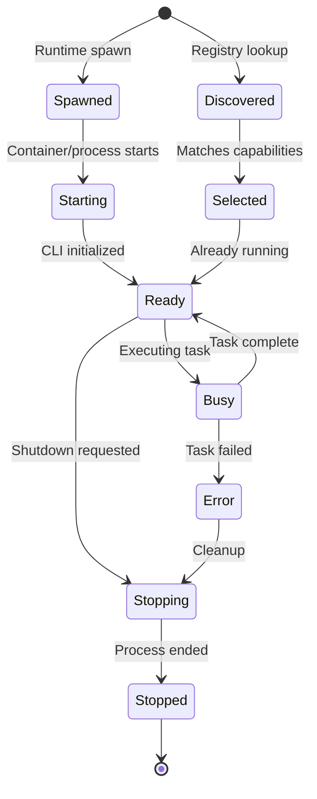
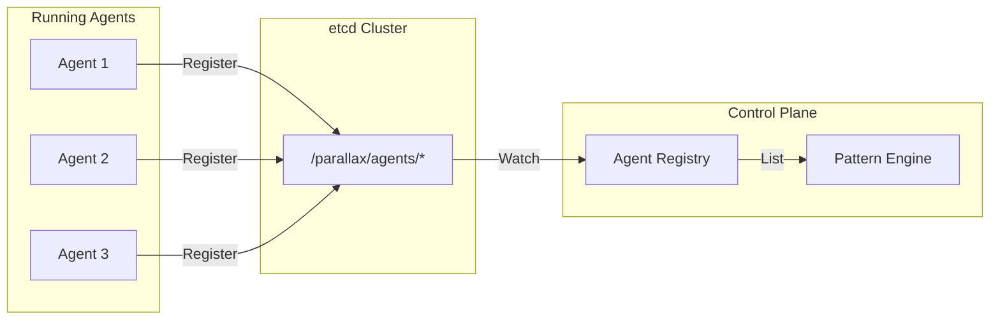
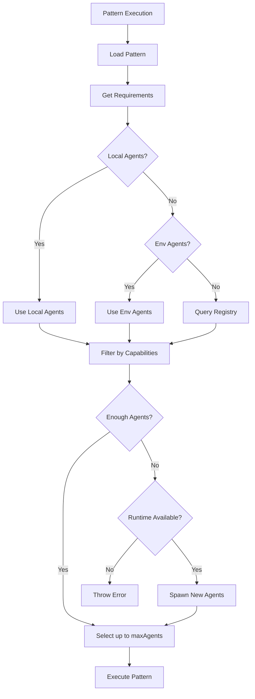
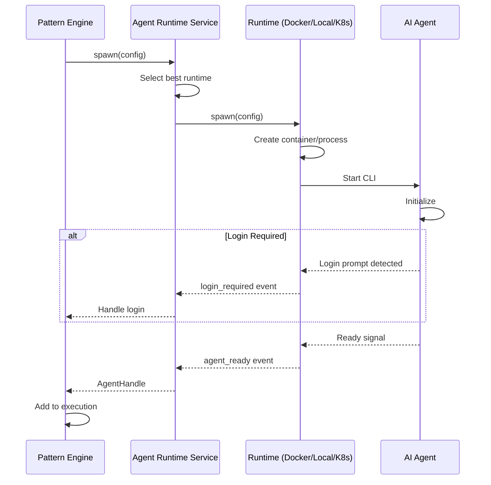
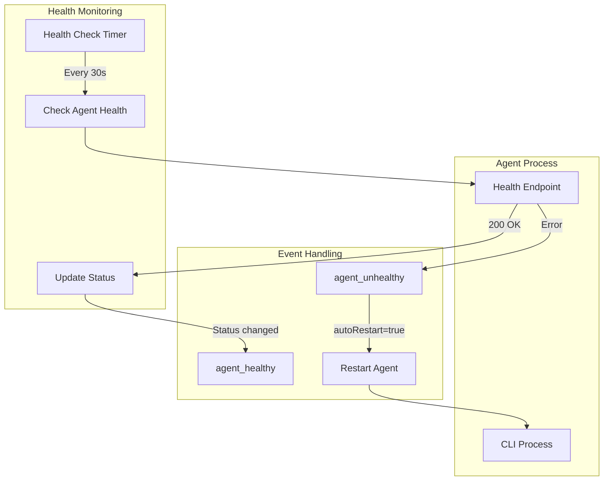
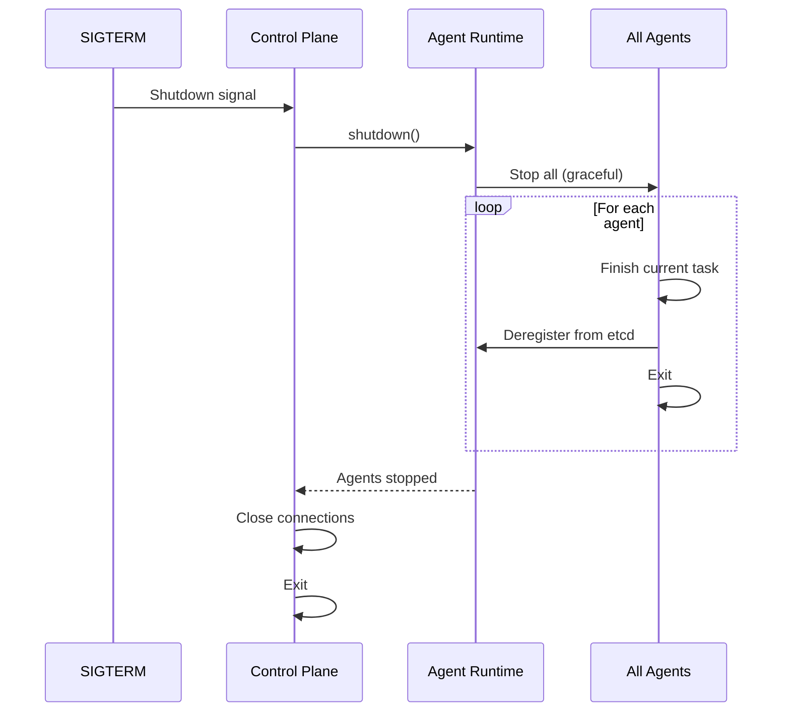

# Agent Lifecycle

This document explains how Parallax discovers, spawns, manages, and cleans up AI coding agents throughout their lifecycle.

## Overview



## Agent Discovery

Agents can be discovered through multiple mechanisms:

### 1. etcd Registry

Production deployments use etcd for service discovery:



```typescript
// Agent registers with etcd
await registry.register('agent', {
  id: 'claude-agent-1',
  name: 'Claude Engineer',
  endpoint: 'http://agent-1:8080',
  metadata: {
    type: 'claude',
    capabilities: ['implementation', 'typescript', 'testing'],
    expertise: 0.85,
  },
});
```

### 2. Local Agent Manager

For development, agents can be configured via environment variables:

```bash
# Configure local agents
export PARALLAX_LOCAL_AGENTS='[
  {
    "id": "local-claude",
    "name": "Local Claude",
    "endpoint": "http://localhost:8080",
    "capabilities": ["implementation", "code_review"]
  }
]'
```

### 3. Direct Registration

Agents can be registered directly with the Pattern Engine:

```typescript
patternEngine.registerLocalAgents([
  {
    id: 'test-agent-1',
    name: 'Test Agent',
    address: 'http://localhost:9001',
    capabilities: ['testing'],
  },
]);
```

## Agent Selection

When a pattern executes, agents are selected based on requirements:



### Capability Matching

```typescript
// Pattern requires these capabilities
pattern.agents = {
  capabilities: ['implementation', 'typescript'],
  minConfidence: 0.7,
};

// Agent selection filters by capabilities
agents = agents.filter(agent =>
  pattern.agents.capabilities.every(cap =>
    agent.capabilities.includes(cap)
  )
);
```

## Agent Spawning

When not enough agents are available, Parallax can spawn new ones via the Agent Runtime Service.

### Runtime Types

| Runtime | How It Spawns | Use Case |
|---------|---------------|----------|
| **Local** | PTY process | Development |
| **Docker** | Container | Production (single host) |
| **Kubernetes** | Pod | Production (scaled) |

### Spawn Flow



### Agent Configuration

```typescript
interface AgentConfig {
  // Identity
  id?: string;                    // Auto-generated if not provided
  name: string;                   // Human-readable name
  type: AgentType;                // 'claude' | 'codex' | 'gemini' | 'aider'

  // Capabilities
  capabilities: string[];         // What this agent can do
  role?: string;                  // Org role: architect, engineer, etc.

  // Environment
  workdir?: string;               // Working directory
  env?: Record<string, string>;   // Environment variables

  // Credentials
  credentials?: {
    anthropicKey?: string;        // For Claude
    openaiKey?: string;           // For Codex
    googleKey?: string;           // For Gemini
    githubToken?: string;         // For repo access
  };

  // Resources (containerized runtimes)
  resources?: {
    cpu?: string;                 // e.g., "1" or "500m"
    memory?: string;              // e.g., "2Gi"
    timeout?: number;             // Max lifetime in seconds
  };
}
```

### Docker Images

Parallax provides pre-built Docker images for each agent type:

| Image | CLI Installed | Size |
|-------|---------------|------|
| `parallax/agent-base` | Common tools | ~200MB |
| `parallax/agent-claude` | Claude Code | ~250MB |
| `parallax/agent-codex` | OpenAI Codex | ~250MB |
| `parallax/agent-gemini` | Google Gemini | ~250MB |
| `parallax/agent-aider` | Aider | ~300MB |

```bash
# Build all agent images
cd packages/runtime-docker
pnpm docker:build

# Run Claude agent manually
docker run -it --rm \
  -e ANTHROPIC_API_KEY=sk-... \
  -v $(pwd):/workspace \
  parallax/agent-claude
```

## Agent Communication

Agents communicate via gRPC or HTTP:

### gRPC Protocol

```protobuf
service Agent {
  rpc ExecuteTask(TaskRequest) returns (TaskResponse);
  rpc HealthCheck(HealthRequest) returns (HealthResponse);
  rpc StreamOutput(OutputRequest) returns (stream OutputChunk);
}

message TaskRequest {
  string task_id = 1;
  string description = 2;
  bytes data = 3;
  int32 timeout_ms = 4;
}

message TaskResponse {
  string task_id = 1;
  bytes result = 2;
  double confidence = 3;
  string reasoning = 4;
}
```

### HTTP Protocol

```http
POST /execute HTTP/1.1
Content-Type: application/json

{
  "taskId": "task-123",
  "description": "Implement user authentication",
  "data": { "requirements": "..." },
  "timeout": 30000
}
```

```http
HTTP/1.1 200 OK
Content-Type: application/json

{
  "taskId": "task-123",
  "result": { "code": "...", "files": [...] },
  "confidence": 0.87,
  "reasoning": "Implemented OAuth2 flow..."
}
```

## Agent Health Monitoring

The runtime continuously monitors agent health:



### Health Check Response

```typescript
interface HealthResponse {
  healthy: boolean;
  message?: string;
  runtime?: {
    name: string;
    type: string;
    activeAgents: number;
  };
}
```

## Agent Cleanup

Agents are cleaned up after pattern execution or on shutdown:

### After Execution

```typescript
// Pattern Engine cleanup
private async cleanupSpawnedAgents(executionId: string): Promise<void> {
  const agents = this.spawnedAgents.get(executionId);
  if (!agents) return;

  for (const agent of agents) {
    try {
      await this.agentRuntimeService.stop(agent.id);
    } catch (error) {
      this.logger.warn({ agentId: agent.id }, 'Failed to stop agent');
    }
  }

  this.spawnedAgents.delete(executionId);
}
```

### Graceful Shutdown



### Container Cleanup (Docker)

```typescript
// Docker runtime stops and removes containers
async stop(agentId: string, options?: StopOptions): Promise<void> {
  const container = this.containers.get(agentId);

  if (options?.force) {
    await container.kill();
  } else {
    await container.stop({ t: options?.timeout || 10 });
  }

  await container.remove();
  this.containers.delete(agentId);
}
```

## Metrics and Observability

### Agent Metrics

```typescript
interface AgentMetrics {
  cpu: number;           // CPU usage percentage
  memory: number;        // Memory in bytes
  uptime: number;        // Milliseconds since start
  messageCount: number;  // Messages processed
}
```

### Tracing

Agent operations are traced with OpenTelemetry:

```
Trace: pattern-execution
├── Span: select-agents
│   ├── Attribute: agent.count = 3
│   └── Attribute: capabilities = ["implementation"]
├── Span: spawn-agent (if needed)
│   ├── Attribute: agent.type = "claude"
│   └── Attribute: runtime = "docker"
├── Span: execute-task
│   ├── Attribute: agent.id = "claude-1"
│   ├── Attribute: confidence = 0.87
│   └── Attribute: duration_ms = 2500
└── Span: cleanup-agents
```

### Logging

```json
{
  "level": "info",
  "time": "2024-01-15T10:30:00.000Z",
  "msg": "Agent spawned for pattern execution",
  "agentId": "exec-123-agent-0",
  "patternName": "code-review",
  "runtime": "docker",
  "type": "claude"
}
```

## Best Practices

### 1. Pre-warm Agents

For latency-sensitive workloads, keep agents running:

```yaml
# Keep minimum agents ready
agents:
  warmPool:
    claude: 2
    aider: 1
```

### 2. Use Appropriate Runtimes

| Scenario | Recommended Runtime |
|----------|---------------------|
| Local development | Local |
| CI/CD pipelines | Docker |
| Production (single node) | Docker |
| Production (scaled) | Kubernetes |

### 3. Set Resource Limits

Prevent runaway agents:

```typescript
{
  resources: {
    cpu: "1",
    memory: "2Gi",
    timeout: 300  // 5 minute max
  }
}
```

### 4. Handle Login Gracefully

Agents may require authentication:

```typescript
agentRuntimeService.on('login_required', async (agent, url) => {
  // Option 1: Provide credentials
  await agent.provideCredentials({ apiKey: '...' });

  // Option 2: Notify user
  notifications.send(`Agent ${agent.name} requires login: ${url}`);
});
```

## Next Steps

- [Workspace Service](./workspace-service) - Git workspace provisioning
- [Agent Runtimes](/docs/agent-runtimes/overview) - Runtime configuration
- [Docker Images](/docs/agent-runtimes/docker) - Building and customizing images
