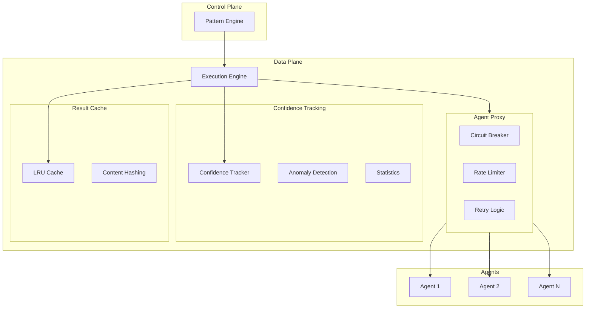
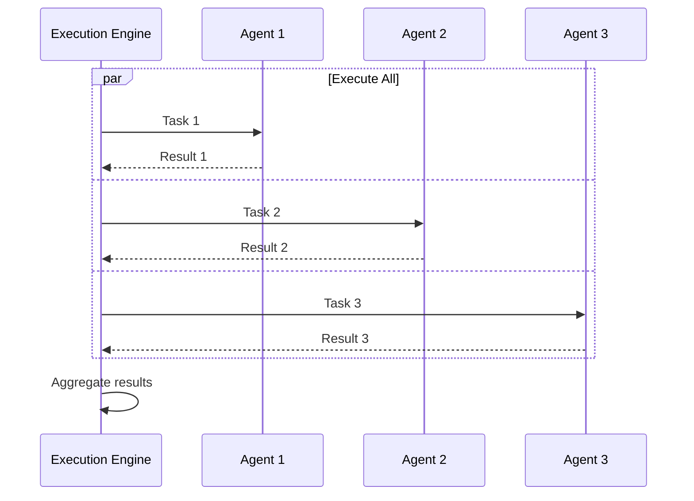
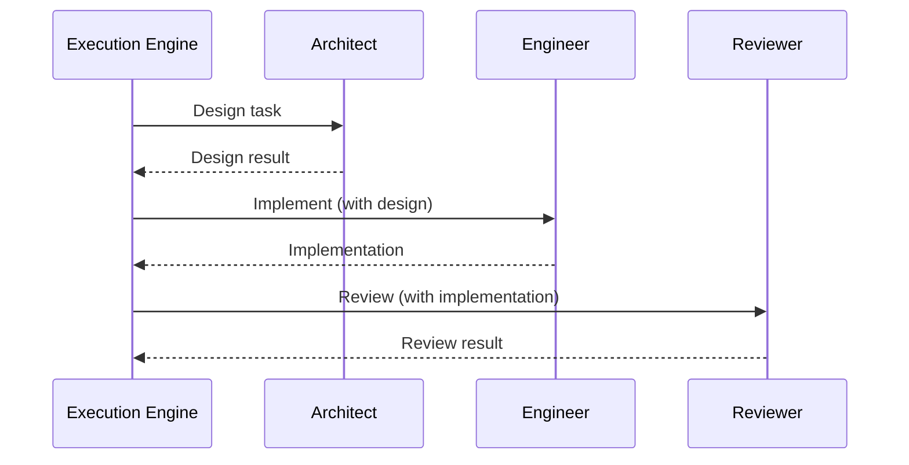
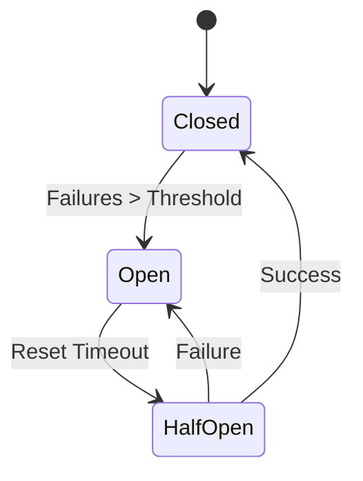
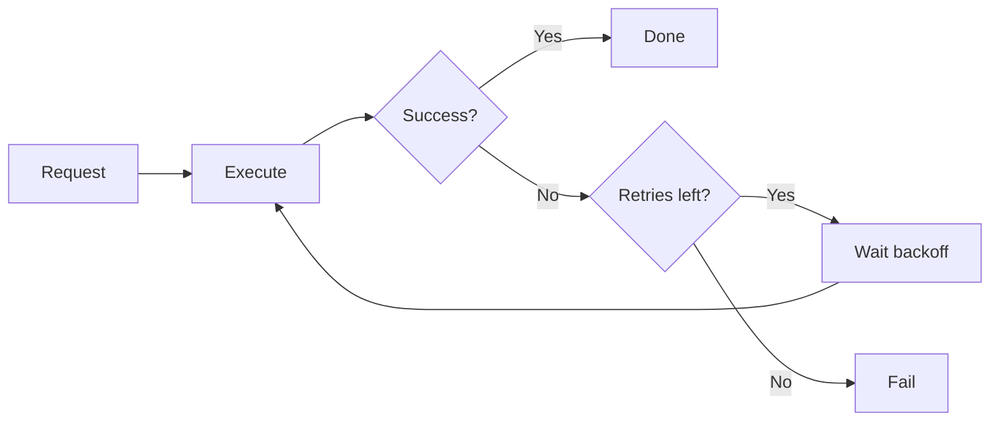
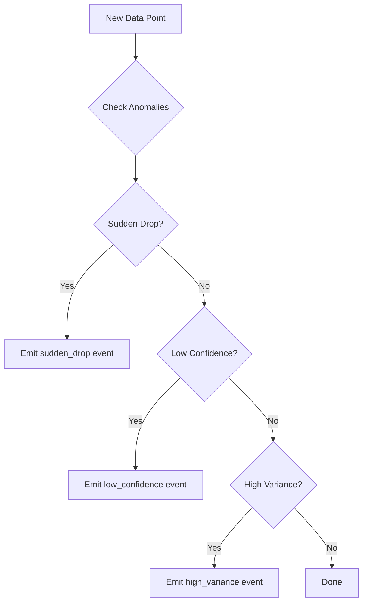
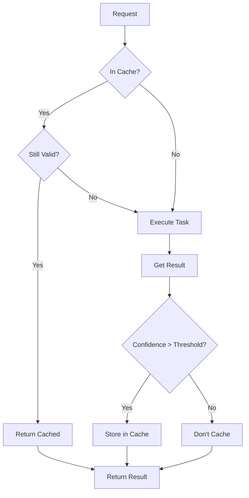

# Data Plane Architecture

The data plane handles the actual execution of tasks against AI agents. It provides reliability features like retries, circuit breakers, rate limiting, and result caching.

## Overview



## Execution Engine

The Execution Engine coordinates task execution with configurable strategies.

### Configuration

```typescript
interface ExecutionEngineConfig {
  // Maximum concurrent task executions
  maxConcurrency: number;        // Default: 10

  // Default timeout for agent tasks
  defaultTimeout: number;        // Default: 30000ms

  // Retry configuration
  retryConfig: {
    maxRetries: number;          // Default: 2
    backoffMultiplier: number;   // Default: 2
    initialDelay: number;        // Default: 1000ms
  };

  // Result caching
  cache: {
    enabled: boolean;            // Default: true
    ttl: number;                 // Default: 300 seconds
    confidenceThreshold: number; // Default: 0.8
    maxEntries: number;          // Default: 1000
  };
}
```

### Execution Strategies

#### Parallel Execution

Execute multiple tasks concurrently:

```typescript
const plan: ParallelExecutionPlan = {
  id: 'plan-123',
  tasks: [
    { id: 'task-1', type: 'agent', target: 'agent-1', payload: {...} },
    { id: 'task-2', type: 'agent', target: 'agent-2', payload: {...} },
    { id: 'task-3', type: 'agent', target: 'agent-3', payload: {...} },
  ],
  strategy: 'all',        // 'all' | 'race' | 'allSettled'
  maxConcurrency: 10,
  timeout: 30000,
};

const results = await executionEngine.executeParallel(plan);
```



#### Sequential Execution

Execute tasks in order, passing results forward:

```typescript
const plan: SequentialExecutionPlan = {
  id: 'plan-456',
  tasks: [
    { id: 'task-1', type: 'agent', target: 'architect', payload: {...} },
    { id: 'task-2', type: 'agent', target: 'engineer', payload: {...} },
    { id: 'task-3', type: 'agent', target: 'reviewer', payload: {...} },
  ],
  continueOnError: false,
  timeout: 60000,
};

const results = await executionEngine.executeSequential(plan);
```



### Task Types

| Type | Description | Target |
|------|-------------|--------|
| `agent` | Execute task on specific agent | Agent ID |
| `pattern` | Execute nested pattern | Pattern name |
| `http` | Make HTTP request | URL |
| `function` | Run custom function | Function name |

#### Nested Pattern Execution

Patterns can execute other patterns:

```typescript
const task: ExecutionTask = {
  id: 'nested-pattern',
  type: 'pattern',
  target: 'code-review',
  payload: { code: '...', requirements: '...' },
  metadata: { timeout: 60000 },
};
```

This is implemented via the `PatternExecutorAdapter` which bridges the data plane's `PatternExecutor` interface to the control plane's `PatternEngine`.

## Agent Proxy

The Agent Proxy handles communication with agents, adding reliability features.

### Circuit Breaker

Prevents cascading failures when agents are unhealthy:



```typescript
interface CircuitBreakerConfig {
  failureThreshold: number;    // Failures before opening (default: 5)
  resetTimeout: number;        // Time before half-open (default: 30000ms)
  monitoringPeriod: number;    // Window for counting failures (default: 60000ms)
}
```

### Rate Limiting

Prevents overwhelming agents:

```typescript
interface RateLimitConfig {
  maxRequests: number;   // Max requests per window (default: 100)
  windowMs: number;      // Window duration (default: 60000ms)
}
```

### Retry Logic

Automatic retries with exponential backoff:



```typescript
// Backoff calculation
delay = initialDelay * (backoffMultiplier ^ attemptNumber)

// Example: initialDelay=1000, multiplier=2
// Attempt 1: 1000ms
// Attempt 2: 2000ms
// Attempt 3: 4000ms
```

### Agent Registration

Agents can be registered dynamically:

```typescript
// Register agent with proxy
await agentProxy.registerAgent(
  'agent-123',
  'http://localhost:8080',
  'http'  // or 'grpc'
);

// Agent is now available for task execution
```

## Confidence Tracking

The Confidence Tracker maintains historical confidence data for agents and patterns.

### Data Points

```typescript
interface ConfidenceDataPoint {
  agentId: string;
  patternName: string;
  taskType: string;
  confidence: number;
  success: boolean;
  timestamp: Date;
  executionTime: number;
}
```

### Aggregation

Confidence is aggregated at multiple intervals:

```typescript
interface AggregationConfig {
  minute: number;   // Keep 60 minutes of minute-level data
  hour: number;     // Keep 24 hours of hourly data
  day: number;      // Keep 30 days of daily data
}
```

### Anomaly Detection

Detects unusual patterns in confidence scores:

```typescript
interface AnomalyDetectionConfig {
  enabled: boolean;
  suddenDropThreshold: number;     // Alert if confidence drops by this amount (default: 0.3)
  lowConfidenceThreshold: number;  // Alert if confidence below this (default: 0.5)
  highVarianceThreshold: number;   // Alert if variance exceeds this (default: 0.2)
  checkIntervalMs: number;         // How often to check (default: 60000ms)
}
```



### Querying Statistics

```typescript
// Get agent statistics
const stats = await confidenceTracker.getAgentStats('agent-123', {
  timeRange: { start: yesterday, end: now },
  patternName: 'code-review',
});

// Returns:
{
  agentId: 'agent-123',
  totalExecutions: 150,
  avgConfidence: 0.85,
  successRate: 0.92,
  avgExecutionTime: 2500,
  confidenceTrend: 0.02,  // Positive = improving
}
```

## Result Cache

High-confidence results are cached to avoid redundant computation.

### Cache Key Generation

```typescript
// Cache key is hash of:
// - Pattern name
// - Input data
// - Agent capabilities (sorted)
const cacheKey = hash({
  pattern: 'code-review',
  input: { code: '...', requirements: '...' },
  capabilities: ['code_review', 'testing'],
});
```

### Cache Policy



### Configuration

```typescript
interface CacheConfig {
  enabled: boolean;              // Enable/disable caching
  ttl: number;                   // Time-to-live in seconds
  confidenceThreshold: number;   // Minimum confidence to cache
  maxEntries: number;            // Maximum cache size (LRU eviction)
}
```

## Events

The Execution Engine emits events for monitoring:

| Event | Description | Data |
|-------|-------------|------|
| `task:started` | Task execution began | `{taskId, type, target}` |
| `task:completed` | Task succeeded | `{taskId, result, confidence, executionTime}` |
| `task:failed` | Task failed | `{taskId, error, retries}` |
| `task:retrying` | Retrying failed task | `{taskId, attempt, delay}` |
| `circuit:open` | Circuit breaker opened | `{agentId, failures}` |
| `circuit:close` | Circuit breaker closed | `{agentId}` |
| `anomaly:detected` | Confidence anomaly found | `{type, agentId, details}` |

```typescript
executionEngine.on('task:completed', (result) => {
  console.log(`Task ${result.taskId} completed with ${result.confidence} confidence`);
});

executionEngine.on('anomaly:detected', (anomaly) => {
  alerting.send(`Anomaly detected: ${anomaly.type} for ${anomaly.agentId}`);
});
```

## Integration with Control Plane

The data plane integrates with the control plane via:

1. **ExecutionEngine** passed to PatternEngine constructor
2. **PatternExecutorAdapter** for nested pattern execution
3. **Event forwarding** to ExecutionEventBus

```typescript
// In server.ts
const executionEngine = new ExecutionEngine(config, agentProxy, confidenceTracker, logger);

// Pattern engine uses execution engine
const patternEngine = new PatternEngine(
  runtimeManager,
  registry,
  patternsDir,
  logger,
  database,
  executionEvents,
  databasePatterns,
  workspaceService,
  executionEngine  // <-- Data plane integration
);

// Wire up nested pattern execution
const adapter = new PatternExecutorAdapter(patternEngine);
executionEngine.setPatternExecutor(adapter);
```

## Next Steps

- [Agent Lifecycle](./agent-lifecycle) - How agents are spawned and managed
- [Workspace Service](./workspace-service) - Git workspace provisioning
- [API Reference](/docs/api/control-plane) - REST API documentation
