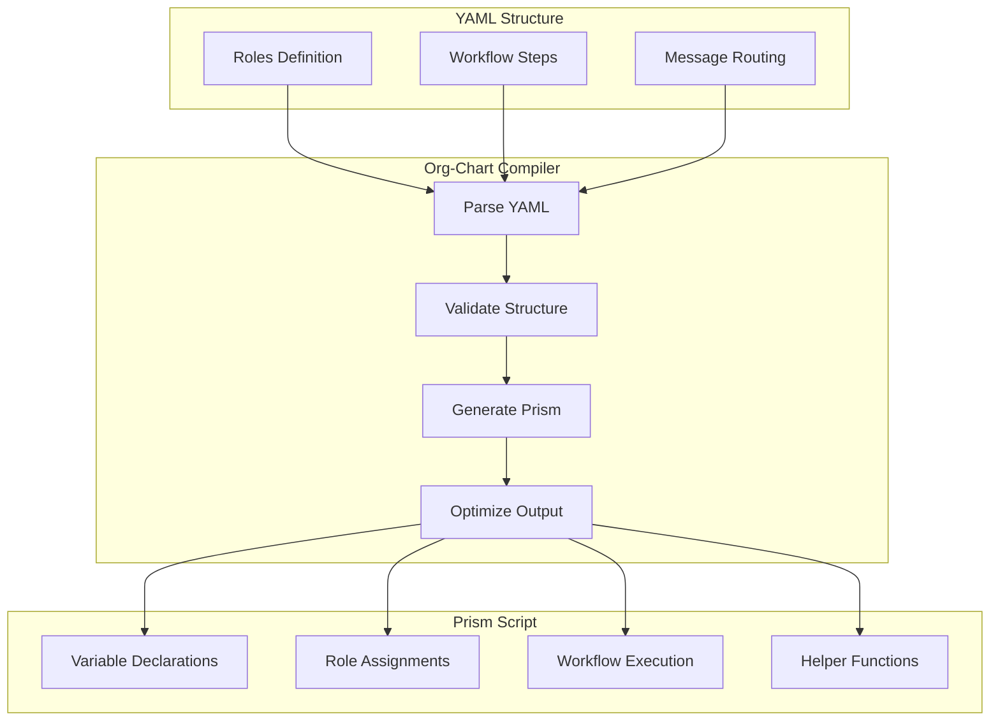
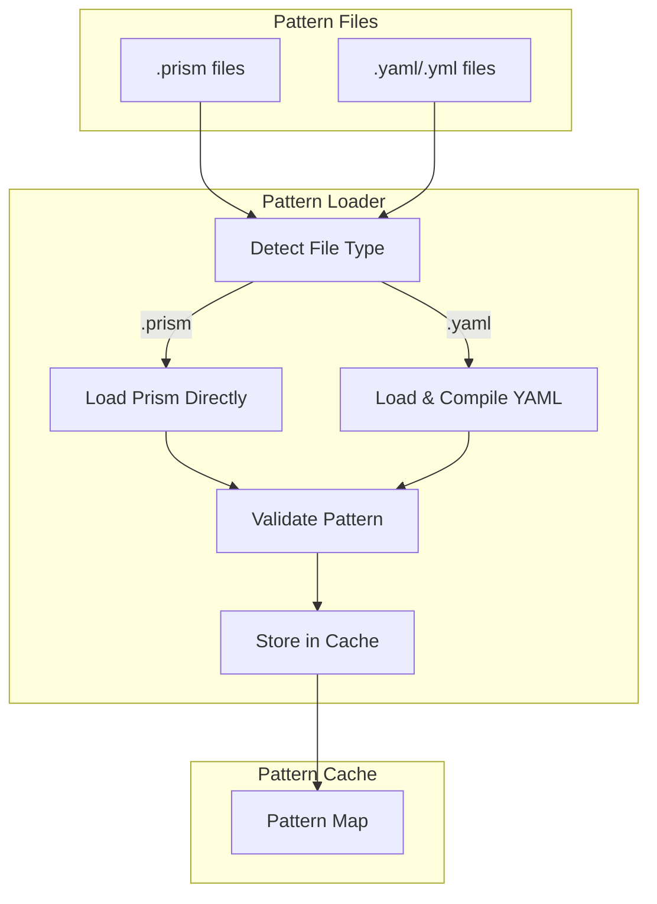
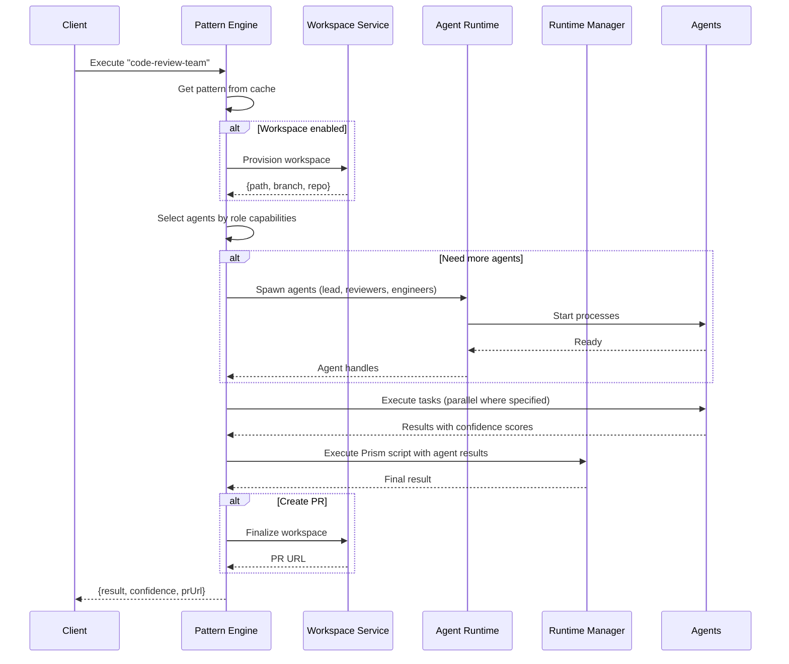

# Org-Chart Pattern Flow

Org-chart patterns allow you to define hierarchical teams of AI agents that work together like a software development organization. This document explains how these patterns flow from definition to execution.

## The Pattern Pipeline

```mermaid
flowchart LR
    subgraph Definition["1. Definition"]
        UI[Pattern Builder UI]
        YAML[YAML File]
    end

    subgraph Compilation["2. Compilation"]
        COMPILER[Org-Chart Compiler]
        PRISM[Prism Script]
    end

    subgraph Loading["3. Loading"]
        LOADER[Pattern Loader]
        CACHE[Pattern Cache]
    end

    subgraph Execution["4. Execution"]
        ENGINE[Pattern Engine]
        RUNTIME[Prism Runtime]
        AGENTS[AI Agents]
    end

    UI -->|Export| YAML
    YAML --> COMPILER
    COMPILER --> PRISM
    PRISM --> LOADER
    LOADER --> CACHE
    CACHE --> ENGINE
    ENGINE --> RUNTIME
    RUNTIME --> AGENTS
```



## Step 1: Define the Org-Chart

An org-chart pattern defines roles, their relationships, and a workflow:

```yaml
# patterns/code-review-team.yaml
name: code-review-team
version: "1.0.0"
description: A team that reviews and improves code

structure:
  roles:
    lead:
      name: Tech Lead
      singleton: true
      capabilities: [architecture, code_review, decision_making]

    reviewer:
      name: Code Reviewer
      reportsTo: lead
      minInstances: 2
      maxInstances: 4
      capabilities: [code_review, testing]

    engineer:
      name: Engineer
      reportsTo: lead
      minInstances: 1
      maxInstances: 2
      capabilities: [implementation, refactoring]

workflow:
  name: review-and-fix
  input:
    code: string
    requirements: string

  steps:
    # Lead creates review criteria
    - type: assign
      role: lead
      task: "Create review criteria for: ${input.requirements}"

    # Reviewers analyze in parallel
    - type: parallel
      steps:
        - type: assign
          role: reviewer
          task: "Review code for correctness"
        - type: assign
          role: reviewer
          task: "Review code for performance"

    # Aggregate review feedback
    - type: aggregate
      method: merge

    # Lead makes final decision
    - type: review
      reviewer: lead

    # If issues found, engineer fixes
    - type: condition
      check: "!step_3_result.approved"
      then:
        type: assign
        role: engineer
        task: "Fix issues: ${step_2_result.feedback}"
      else:
        type: assign
        role: lead
        task: "Approve changes"

  output: finalResult
```

## Step 2: Compilation to Prism

The org-chart compiler transforms YAML into executable Prism code:



### Generated Prism Code

The compiler generates Prism code like this:

```javascript
// Auto-generated from org-chart pattern: code-review-team
// Generated at: 2024-01-15T10:30:00.000Z

// === Team Structure ===
let roles = ["lead", "reviewer", "engineer"];

// Map agents to roles
let roleAssignments = {};
roleAssignments["lead"] = agentResults.slice(0, 1);
roleAssignments["reviewer"] = agentResults.slice(1, 3);
roleAssignments["engineer"] = agentResults.slice(3, 4);

// === Workflow Execution ===

// Step 0: assign
let step_0_result = (function() {
  let roleAgents = roleAssignments["lead"] || [];
  if (roleAgents.length === 0) {
    return { error: "No agents for role: lead", confidence: 0 };
  }
  let agent = roleAgents[0];
  return {
    role: "lead",
    task: "Create review criteria",
    result: agent?.result,
    confidence: agent?.confidence || 0.7,
    agentId: agent?.agentId
  };
})();

// Step 1: parallel
let step_1_result = [];
// ... parallel execution code ...

// Step 2: aggregate (merge)
let step_2_result = aggregateMerge(step_1_result);

// Step 3: review
let step_3_result = (function() {
  let reviewerAgents = roleAssignments["lead"] || [];
  // ... review logic ...
})();

// Step 4: condition
let step_4_result;
if (!step_3_result.approved) {
  // ... fix issues ...
} else {
  // ... approve ...
}

// === Final Output ===
let finalResult = {
  patternName: "code-review-team",
  workflow: "review-and-fix",
  result: step_4_result,
  roles: roles,
  agentsUsed: agentResults.length,
  confidence: calculateConfidence(agentResults)
};

finalResult
```

## Step 3: Pattern Loading

The Pattern Loader handles both `.prism` and `.yaml` files:



```typescript
// Pattern Loader automatically handles both formats
async loadPatterns(): Promise<void> {
  const files = await fs.readdir(this.patternsDir);

  // Load .prism files directly
  const prismFiles = files.filter(f => f.endsWith('.prism'));
  for (const file of prismFiles) {
    await this.loadPrismPattern(path.join(this.patternsDir, file));
  }

  // Compile and load .yaml files
  const yamlFiles = files.filter(f => f.endsWith('.yaml') || f.endsWith('.yml'));
  for (const file of yamlFiles) {
    await this.loadYamlPattern(path.join(this.patternsDir, file));
  }
}
```

## Step 4: Execution

When a pattern executes, the Pattern Engine orchestrates the full flow:



## Role Capabilities

Agents are matched to roles based on their capabilities:

| Role Type | Typical Capabilities |
|-----------|---------------------|
| Architect | `architecture`, `system_design`, `code_review` |
| Lead | `code_review`, `decision_making`, `mentoring` |
| Engineer | `implementation`, `refactoring`, `debugging` |
| Reviewer | `code_review`, `testing`, `security` |
| QA | `testing`, `automation`, `quality` |
| DevOps | `deployment`, `infrastructure`, `monitoring` |

```yaml
# Agent registration with capabilities
agents:
  - id: claude-architect
    type: claude
    capabilities: [architecture, system_design, code_review]

  - id: claude-engineer-1
    type: claude
    capabilities: [implementation, javascript, typescript]

  - id: aider-reviewer
    type: aider
    capabilities: [code_review, testing, python]
```

## Workflow Step Types

| Step Type | Description | Example |
|-----------|-------------|---------|
| `assign` | Assign task to a role | `{type: assign, role: engineer, task: "Implement feature"}` |
| `parallel` | Execute steps concurrently | `{type: parallel, steps: [...]}` |
| `sequential` | Execute steps in order | `{type: sequential, steps: [...]}` |
| `review` | Role reviews previous output | `{type: review, reviewer: lead}` |
| `approve` | Role approves/rejects | `{type: approve, approver: lead}` |
| `aggregate` | Combine results | `{type: aggregate, method: merge}` |
| `condition` | Conditional branching | `{type: condition, check: "...", then: ..., else: ...}` |
| `select` | Select agent from role | `{type: select, role: engineer, criteria: best}` |

## Aggregation Methods

| Method | Description |
|--------|-------------|
| `consensus` | Most common result wins |
| `majority` | Result with >50% agreement |
| `merge` | Combine all results into one object |
| `best` | Highest confidence result |
| `all` | Return all results as array |

## Best Practices

### 1. Design for Failure

Always have fallback paths:

```yaml
workflow:
  steps:
    - type: assign
      role: primary_engineer
      task: "Implement feature"

    - type: condition
      check: "step_0_result.confidence < 0.7"
      then:
        type: assign
        role: backup_engineer
        task: "Review and improve implementation"
```

### 2. Use Appropriate Parallelism

Parallelize independent tasks:

```yaml
# Good: Independent reviews can run in parallel
- type: parallel
  steps:
    - type: assign
      role: reviewer
      task: "Check security"
    - type: assign
      role: reviewer
      task: "Check performance"
    - type: assign
      role: reviewer
      task: "Check correctness"
```

### 3. Leverage Confidence Scores

Use confidence in conditions:

```yaml
- type: condition
  check: "step_1_result.confidence > 0.9"
  then:
    type: assign
    role: lead
    task: "Quick approval"
  else:
    type: review
    reviewer: lead
```

## Next Steps

- [Data Plane](./data-plane) - How the execution engine works
- [Agent Lifecycle](./agent-lifecycle) - Agent spawning and management
- [Pattern Examples](/docs/patterns/org-chart-patterns) - More org-chart examples
