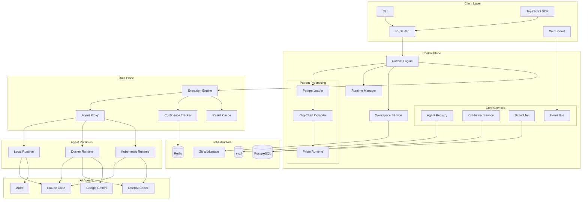
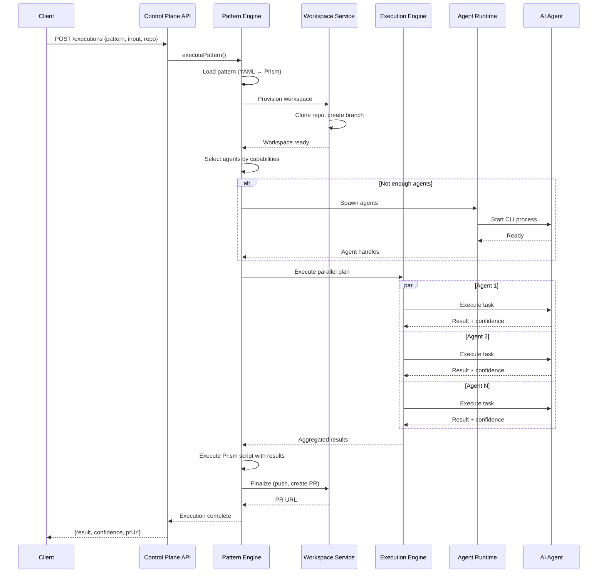
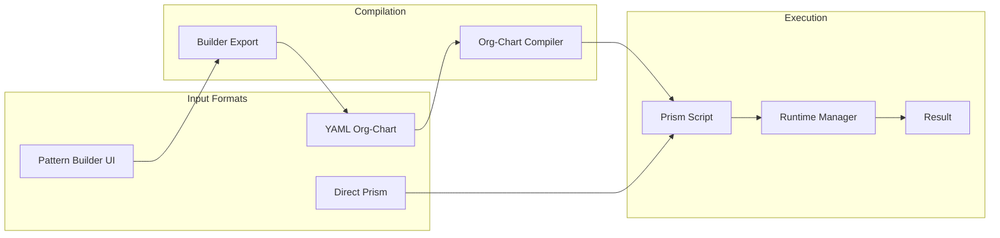
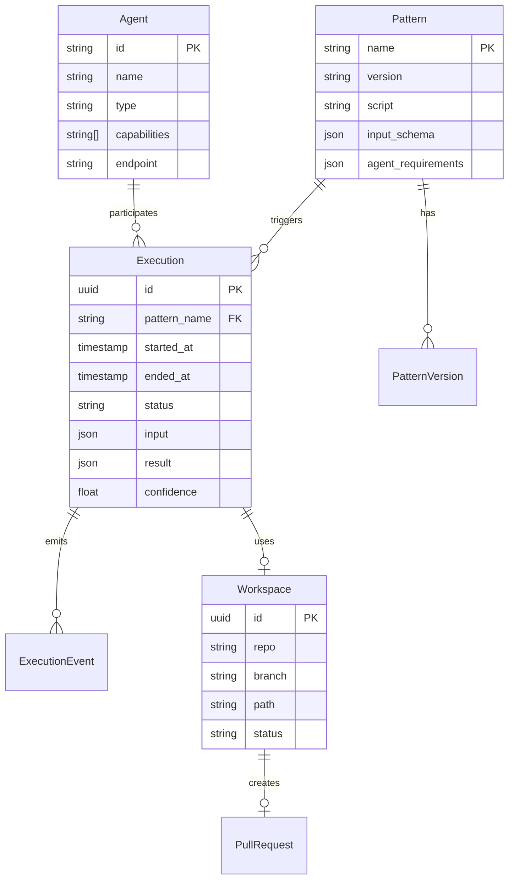

# System Architecture Overview

Parallax is a multi-agent orchestration platform that coordinates AI coding assistants to work together on complex tasks. This document provides a comprehensive overview of how all components work together.

## High-Level Architecture



## Core Components

### Control Plane

The control plane is the brain of Parallax. It receives pattern execution requests, coordinates agents, and aggregates results.

| Component | Responsibility |
|-----------|---------------|
| **Pattern Engine** | Loads patterns, selects agents, executes Prism scripts |
| **Runtime Manager** | Manages Prism runtime pool for script execution |
| **Workspace Service** | Provisions git workspaces for agents |
| **Agent Registry** | Tracks available agents via etcd |
| **Credential Service** | Issues short-lived git credentials |
| **Scheduler** | Manages scheduled pattern executions |
| **Event Bus** | Real-time execution event streaming |

### Data Plane

The data plane handles the actual execution of tasks against agents with reliability and performance features.

| Component | Responsibility |
|-----------|---------------|
| **Execution Engine** | Parallel/sequential task execution with retries |
| **Agent Proxy** | Communication layer with circuit breakers and rate limiting |
| **Confidence Tracker** | Tracks agent confidence scores over time |
| **Result Cache** | Caches high-confidence results |

### Agent Runtimes

Runtimes spawn and manage AI coding agent processes:

| Runtime | Use Case |
|---------|----------|
| **Local** | Development - runs CLIs directly on host |
| **Docker** | Production - isolated containers |
| **Kubernetes** | Scale - auto-scaling pods |

## Request Flow

Here's how a pattern execution request flows through the system:



## Pattern Pipeline

Patterns can be defined in multiple formats that all compile to Prism for execution:



### Why Prism?

Prism is Parallax's domain-specific language for agent orchestration. All pattern formats compile to Prism because:

1. **Single execution engine** - One runtime to maintain and optimize
2. **Confidence-aware** - Native support for confidence scores
3. **Deterministic** - Same inputs always produce same orchestration
4. **Inspectable** - Generated code can be reviewed and debugged

## Data Model



## Configuration

### Environment Variables

```bash
# Control Plane
PARALLAX_ETCD_ENDPOINTS=localhost:2379
PARALLAX_PATTERNS_DIR=./patterns
PARALLAX_WORKSPACES_DIR=./.workspaces

# Agent Runtimes
PARALLAX_LOCAL_RUNTIME_URL=http://localhost:8081
PARALLAX_DOCKER_RUNTIME_URL=http://localhost:8082
PARALLAX_K8S_RUNTIME_URL=http://localhost:8083

# Workspace/Git
PARALLAX_GITHUB_APP_ID=123456
PARALLAX_GITHUB_PRIVATE_KEY=-----BEGIN RSA...

# Data Plane
PARALLAX_EXECUTION_ENGINE=true
PARALLAX_AGENT_TIMEOUT=30000
PARALLAX_AGENT_RETRIES=2

# Observability
PARALLAX_TRACING_ENABLED=true
PARALLAX_JAEGER_ENDPOINT=http://localhost:14268/api/traces
```

## Next Steps

- [Org-Chart Patterns](./org-chart-flow) - How hierarchical teams work
- [Data Plane](./data-plane) - Execution engine internals
- [Agent Lifecycle](./agent-lifecycle) - How agents are spawned and managed
- [Workspace Service](./workspace-service) - Git workspace provisioning
