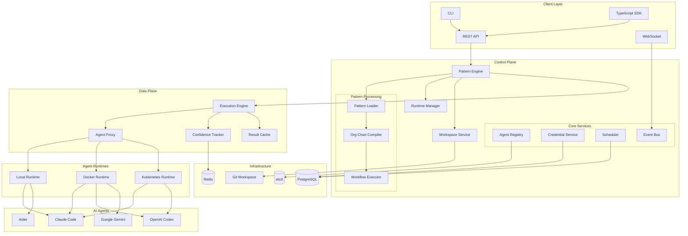
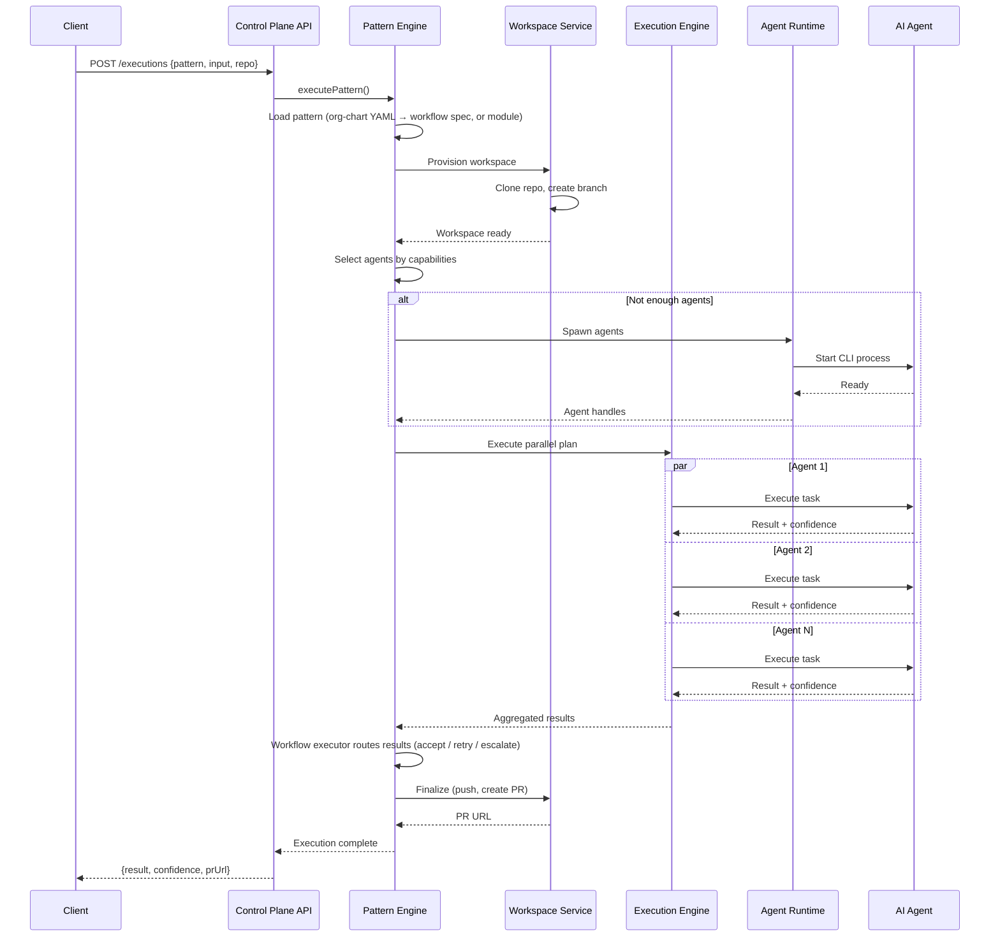
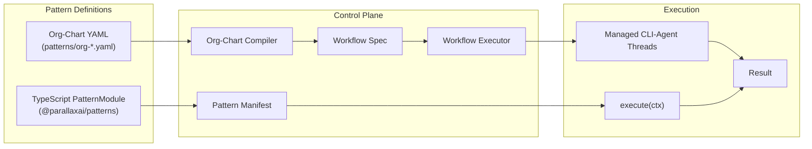
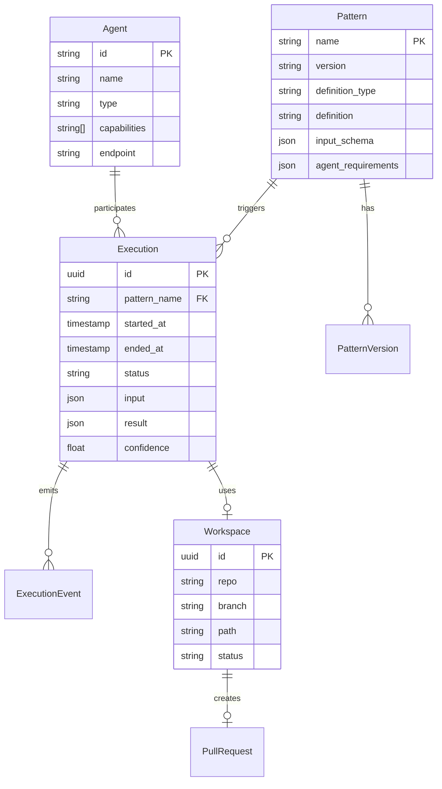

# System Architecture Overview

Parallax is a multi-agent orchestration platform that coordinates AI coding assistants to work together on complex tasks. This document provides a comprehensive overview of how all components work together.

## High-Level Architecture


```mermaid
flowchart TB
    subgraph Clients["Client Layer"]
        CLI[CLI]
        SDK[TypeScript SDK]
        API[REST API]
        WS[WebSocket]
    end

    subgraph ControlPlane["Control Plane"]
        direction TB
        PE[Pattern Engine]
        RM[Runtime Manager]
        WS_SVC[Workspace Service]

        subgraph PatternFlow["Pattern Processing"]
            PL[Pattern Loader]
            OCC[Org-Chart Compiler]
            WFE[Workflow Executor]
        end

        subgraph Services["Core Services"]
            REG[Agent Registry]
            CRED[Credential Service]
            SCHED[Scheduler]
            EVENTS[Event Bus]
        end
    end

    subgraph DataPlane["Data Plane"]
        EE[Execution Engine]
        AP[Agent Proxy]
        CT[Confidence Tracker]
        CACHE[Result Cache]
    end

    subgraph AgentRuntime["Agent Runtimes"]
        LOCAL[Local Runtime]
        DOCKER[Docker Runtime]
        K8S[Kubernetes Runtime]
    end

    subgraph Agents["AI Agents"]
        CLAUDE[Claude Code]
        CODEX[OpenAI Codex]
        GEMINI[Google Gemini]
        AIDER[Aider]
    end

    subgraph Infrastructure["Infrastructure"]
        ETCD[(etcd)]
        PG[(PostgreSQL)]
        REDIS[(Redis)]
        GIT[Git Workspace]
    end

    CLI --> API
    SDK --> API
    API --> PE
    WS --> EVENTS

    PE --> PL
    PE --> RM
    PE --> WS_SVC
    PL --> OCC
    OCC --> WFE

    PE --> EE
    EE --> AP
    EE --> CT
    EE --> CACHE

    AP --> LOCAL
    AP --> DOCKER
    AP --> K8S

    LOCAL --> CLAUDE
    LOCAL --> AIDER
    DOCKER --> CLAUDE
    DOCKER --> CODEX
    DOCKER --> GEMINI
    K8S --> CLAUDE
    K8S --> CODEX

    REG --> ETCD
    WS_SVC --> GIT
    CRED --> PG
    SCHED --> PG
    CT --> REDIS
```

## Core Components

### Control Plane

The control plane is the brain of Parallax. It receives pattern execution requests, coordinates agents, and aggregates results.

| Component | Responsibility |
|-----------|---------------|
| **Pattern Engine** | Loads patterns, selects agents, runs org-chart workflows and TypeScript pattern modules |
| **Org-Chart Compiler** | Parses org-chart YAML into a workflow spec (lives inside the control plane's `org-patterns/`) |
| **Workflow Executor** | Runs the workflow spec by spawning and routing managed CLI-agent threads |
| **Workspace Service** | Provisions git workspaces for agents |
| **Agent Registry** | Tracks available agents via etcd |
| **Credential Service** | Issues short-lived git credentials |
| **Scheduler** | Manages scheduled pattern executions |
| **Event Bus** | Real-time execution event streaming |

### Data Plane

The data plane handles the actual execution of tasks against agents with reliability and performance features.

| Component | Responsibility |
|-----------|---------------|
| **Execution Engine** | Parallel/sequential task execution with retries |
| **Agent Proxy** | Communication layer with circuit breakers and rate limiting |
| **Confidence Tracker** | Tracks agent confidence scores over time |
| **Result Cache** | Caches high-confidence results |

### Agent Runtimes

Runtimes spawn and manage AI coding agent processes:

| Runtime | Use Case |
|---------|----------|
| **Local** | Development - runs CLIs directly on host |
| **Docker** | Production - isolated containers |
| **Kubernetes** | Scale - auto-scaling pods |

## Request Flow

Here's how a pattern execution request flows through the system:


```mermaid
sequenceDiagram
    participant Client
    participant API as Control Plane API
    participant PE as Pattern Engine
    participant WS as Workspace Service
    participant EE as Execution Engine
    participant RT as Agent Runtime
    participant Agent as AI Agent

    Client->>API: POST /executions {pattern, input, repo}
    API->>PE: executePattern()

    PE->>PE: Load pattern (org-chart YAML → workflow spec, or module)
    PE->>WS: Provision workspace
    WS->>WS: Clone repo, create branch
    WS-->>PE: Workspace ready

    PE->>PE: Select agents by capabilities

    alt Not enough agents
        PE->>RT: Spawn agents
        RT->>Agent: Start CLI process
        Agent-->>RT: Ready
        RT-->>PE: Agent handles
    end

    PE->>EE: Execute parallel plan

    par Agent 1
        EE->>Agent: Execute task
        Agent-->>EE: Result + confidence
    and Agent 2
        EE->>Agent: Execute task
        Agent-->>EE: Result + confidence
    and Agent N
        EE->>Agent: Execute task
        Agent-->>EE: Result + confidence
    end

    EE-->>PE: Aggregated results
    PE->>PE: Workflow executor routes results (accept / retry / escalate)

    PE->>WS: Finalize (push, create PR)
    WS-->>PE: PR URL

    PE-->>API: Execution complete
    API-->>Client: {result, confidence, prUrl}
```

## Pattern Pipeline

Parallax has two kinds of patterns, each with its own execution path — there is no shared DSL or compilation-to-script step:


```mermaid
flowchart LR
    subgraph Input["Pattern Definitions"]
        YAML["Org-Chart YAML\n(patterns/org-*.yaml)"]
        MODULE["TypeScript PatternModule\n(@parallaxai/patterns)"]
    end

    subgraph Control["Control Plane"]
        OCC[Org-Chart Compiler]
        SPEC[Workflow Spec]
        WFE[Workflow Executor]
        MANIFEST[Pattern Manifest]
    end

    subgraph Execution["Execution"]
        THREADS["Managed CLI-Agent Threads"]
        EXEC["execute(ctx)"]
        RESULT[Result]
    end

    YAML --> OCC
    OCC --> SPEC
    SPEC --> WFE
    WFE --> THREADS
    THREADS --> RESULT

    MODULE --> MANIFEST
    MANIFEST --> EXEC
    EXEC --> RESULT
```

### Two execution paths

- **Org-chart YAML** — the org-chart compiler (inside the control plane's `org-patterns/`) parses the YAML into a workflow spec. The **workflow executor** runs that spec by spawning and routing **managed CLI-agent threads**, applying the per-role confidence/escalation policy.
- **TypeScript pattern modules** — a `PatternModule` from the `@parallaxai/patterns` manifest is loaded and its `execute(ctx)` runs directly. Modules are deployed *with* the control plane (Temporal-style), not uploaded at runtime.

Both paths are confidence-aware: results carry `Confident<T>` values, and routing (accept / retry / escalate) is driven by verification, not self-reported scores.

## Data Model


```mermaid
erDiagram
    Pattern ||--o{ Execution : triggers
    Pattern ||--o{ PatternVersion : has
    Execution ||--o{ ExecutionEvent : emits
    Execution ||--o| Workspace : uses
    Workspace ||--o| PullRequest : creates
    Agent ||--o{ Execution : participates

    Pattern {
        string name PK
        string version
        string definition_type
        string definition
        json input_schema
        json agent_requirements
    }

    Execution {
        uuid id PK
        string pattern_name FK
        timestamp started_at
        timestamp ended_at
        string status
        json input
        json result
        float confidence
    }

    Workspace {
        uuid id PK
        string repo
        string branch
        string path
        string status
    }

    Agent {
        string id PK
        string name
        string type
        string[] capabilities
        string endpoint
    }
```

## Configuration

### Environment Variables

```bash
# Control Plane
PARALLAX_ETCD_ENDPOINTS=localhost:2379
PARALLAX_PATTERNS_DIR=./patterns
PARALLAX_WORKSPACES_DIR=./.workspaces

# Agent Runtimes
PARALLAX_LOCAL_RUNTIME_URL=http://localhost:8081
PARALLAX_DOCKER_RUNTIME_URL=http://localhost:8082
PARALLAX_K8S_RUNTIME_URL=http://localhost:8083

# Workspace/Git
PARALLAX_GITHUB_APP_ID=123456
PARALLAX_GITHUB_PRIVATE_KEY=-----BEGIN RSA...

# Data Plane
PARALLAX_EXECUTION_ENGINE=true
PARALLAX_AGENT_TIMEOUT=30000
PARALLAX_AGENT_RETRIES=2

# Observability
PARALLAX_TRACING_ENABLED=true
PARALLAX_JAEGER_ENDPOINT=http://localhost:14268/api/traces
```

## Next Steps

- [Org-Chart Patterns](./org-chart-flow) - How hierarchical teams work
- [Data Plane](./data-plane) - Execution engine internals
- [Agent Lifecycle](./agent-lifecycle) - How agents are spawned and managed
- [Workspace Service](./workspace-service) - Git workspace provisioning
