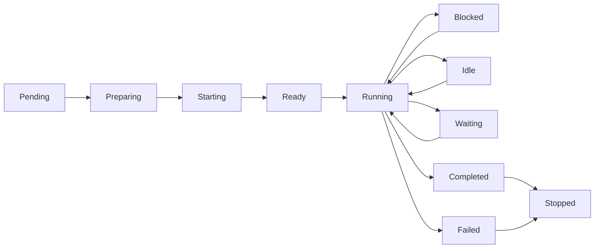

# Threads

Threads are Parallax's orchestration-level unit for long-lived work.

An agent is the execution substrate. A thread is the supervised work stream the control plane reasons about.

## Why Threads Exist

Managed agents are useful when you want to spawn a CLI worker and talk to it directly.

Threads add the layer Parallax needs for:

- long-horizon coding tasks
- mutable workspaces and worktrees
- durable status and summaries
- shared decisions between parallel workers
- episodic memory injected into future work
- explicit orchestration over `blocked`, `idle`, `turn_complete`, and `completed` events

## Agent vs Thread

| Concept | Purpose | Lifetime | Owned By |
|---------|---------|----------|----------|
| Agent | Executes commands and model turns | Process / container / pod | Runtime |
| Thread | Represents supervised work | Long-lived task stream | Control plane |

A thread may be backed by one concrete agent session, but the control plane treats the thread as the thing it schedules, observes, and resumes.

## Thread Lifecycle

## Thread State

A thread handle tracks:

- `executionId`
- `runtimeName`
- `agentType`
- `role`
- `status`
- `objective`
- `workspace`
- `summary`
- `completion`
- `lastActivityAt`
- `metadata`

## Preparation

Threads can be spawned with a `ThreadPreparationSpec`, which lets Parallax package:

- workspace selection or provisioning
- environment variables
- bootstrap or context files
- approval preset

Parallax uses this to inject memory files like `.parallax/thread-memory.md` before a worker starts.

## Thread Events

Parallax normalizes runtime signals into thread events:

- `thread_started`
- `thread_ready`
- `thread_blocked`
- `thread_tool_running`
- `thread_turn_complete`
- `thread_idle`
- `thread_summary_updated`
- `thread_completed`
- `thread_failed`
- `thread_stopped`

These events are what patterns, org charts, and supervisors should react to instead of raw terminal transcripts.

## Memory

Threads are the boundary where Parallax compresses and reuses context.

Current thread memory surfaces include:

- shared decisions captured from thread summaries, failures, and completions
- episodic experiences extracted from successful, partial, and failed work
- ranked memory injection based on repo, role, objective overlap, outcome, and recency

## Prism Integration

Parallax now includes thread-oriented primitives for explicit orchestration:

- `spawnThread`
- `awaitThread`
- `sendThreadInput`
- `shareDecision`
- `collectThreadSummaries`
- `finalizeThread`

Use threads when you need supervision over long-running workers, not just one-shot task execution.
