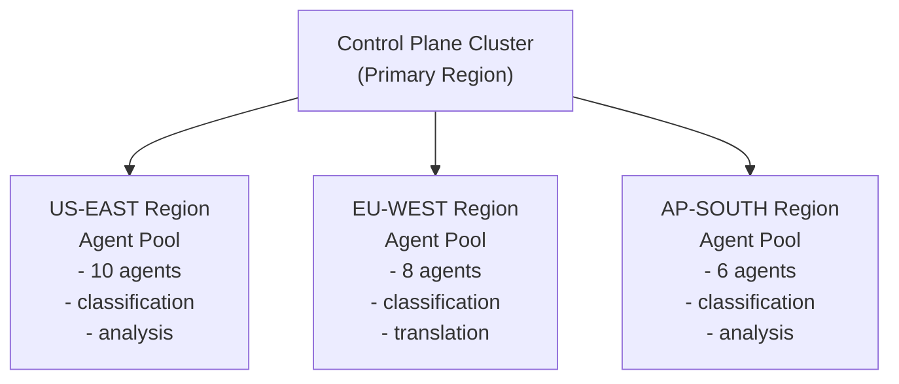
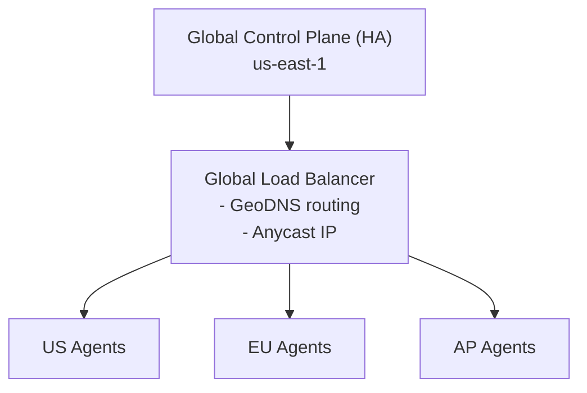
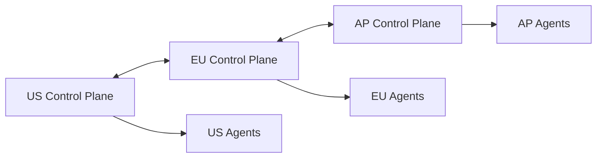

# Multi-Region

Deploy agents across geographic regions for latency optimization, compliance, and disaster recovery.

## Overview

Multi-region deployment distributes agents across geographic locations while maintaining centralized orchestration.



## Use Cases

### Latency Optimization

Route tasks to the nearest agents:

```yaml
routing:
  strategy: latency
  # Prefer agents in same region as request origin
  preferences:
    - sameRegion
    - nearestRegion
    - anyRegion
```

### Data Residency

Keep data within specific regions for compliance:

```yaml
routing:
  strategy: affinity
  rules:
    - match:
        input.dataResidency: eu
      agents:
        region: eu-west-1
    - match:
        input.dataResidency: us
      agents:
        region: us-east-1
```

### Disaster Recovery

Automatic failover to backup regions:

```yaml
routing:
  strategy: failover
  primary: us-east-1
  secondary: us-west-2
  failoverThreshold: 3  # Failed health checks
```

## Configuration

### Region Definition

Define available regions:

```yaml
# parallax.config.yaml
regions:
  - id: us-east-1
    name: US East (Virginia)
    endpoint: https://us-east.parallax.example.com
    primary: true

  - id: eu-west-1
    name: EU West (Ireland)
    endpoint: https://eu-west.parallax.example.com

  - id: ap-south-1
    name: Asia Pacific (Mumbai)
    endpoint: https://ap-south.parallax.example.com
```

### Agent Region Assignment

Agents declare their region:

```typescript
const agent = new ParallaxAgent({
  controlPlaneUrl: 'https://parallax.example.com',
  region: 'us-east-1',
  capabilities: ['classification', 'analysis'],
});
```

Or via environment variable:

```bash
PARALLAX_AGENT_REGION=us-east-1
```

### Helm Values

```yaml
# values.yaml
multiRegion:
  enabled: true
  currentRegion: us-east-1

  regions:
    - id: us-east-1
      primary: true
    - id: eu-west-1
    - id: ap-south-1

  routing:
    strategy: latency
    crossRegionEnabled: true
```

## Routing Strategies

### Latency-Based Routing

Route to lowest-latency agents:

```yaml
routing:
  strategy: latency
  config:
    # Maximum acceptable latency (ms)
    maxLatency: 200

    # Prefer same region even if slightly slower
    sameRegionBonus: 50

    # Fallback if no low-latency agents available
    fallback: anyRegion
```

### Affinity-Based Routing

Route based on data or request attributes:

```yaml
routing:
  strategy: affinity
  rules:
    # Route by explicit region request
    - match:
        input.preferredRegion: "*"
      agents:
        region: $input.preferredRegion

    # Route EU data to EU
    - match:
        input.userCountry: ["DE", "FR", "IT", "ES"]
      agents:
        region: eu-west-1

    # Route financial data to US
    - match:
        input.dataType: financial
      agents:
        region: us-east-1

    # Default: use any region
    - match: {}
      agents:
        region: "*"
```

### Capability-Based Routing

Route based on regional capabilities:

```yaml
routing:
  strategy: capability
  config:
    # Region-specific capabilities
    regionCapabilities:
      eu-west-1:
        - translation
        - gdpr-compliant
      us-east-1:
        - classification
        - analysis
      ap-south-1:
        - analysis
        - multilingual

    # Prefer regions with required capabilities
    requireExactMatch: false
```

### Weighted Routing

Distribute load across regions:

```yaml
routing:
  strategy: weighted
  weights:
    us-east-1: 50
    eu-west-1: 30
    ap-south-1: 20
```

### Failover Routing

Automatic failover between regions:

```yaml
routing:
  strategy: failover
  config:
    primary: us-east-1
    failoverOrder:
      - us-west-2
      - eu-west-1

    # Health check configuration
    healthCheck:
      interval: 10s
      timeout: 5s
      unhealthyThreshold: 3
      healthyThreshold: 2

    # Failback configuration
    failback:
      enabled: true
      delay: 300s  # Wait before failing back
```

## Cross-Region Communication

### Global Control Plane

Single control plane serving all regions:



Configuration:

```yaml
controlPlane:
  mode: global
  regions:
    - us-east-1
    - eu-west-1
    - ap-south-1

  loadBalancer:
    type: geoDNS
    healthCheck:
      path: /health/ready
```

### Federated Control Planes

Regional control planes with federation:



Configuration:

```yaml
controlPlane:
  mode: federated
  currentRegion: us-east-1

  federation:
    enabled: true
    peers:
      - region: eu-west-1
        endpoint: https://eu-control.parallax.example.com
        authSecret: federation-secret
      - region: ap-south-1
        endpoint: https://ap-control.parallax.example.com
        authSecret: federation-secret

    sync:
      patterns: true      # Sync pattern definitions
      agents: false       # Agents local to region
      executions: false   # Executions local to region
```

## Pattern Configuration

### Region-Aware Patterns

Specify regional requirements in patterns:

```yaml
name: gdpr-compliant-analysis
version: 1.0.0

agents:
  capabilities: [analysis, gdpr-compliant]
  region: eu-west-1  # Strict region requirement

execution:
  strategy: parallel
```

### Multi-Region Patterns

Leverage multiple regions:

```yaml
name: global-consensus
version: 1.0.0

agents:
  capabilities: [classification]
  distribution:
    # Require agents from multiple regions
    regions:
      - us-east-1
      - eu-west-1
      - ap-south-1
    minPerRegion: 1

aggregation:
  strategy: consensus
  # Require agreement across regions
  crossRegion: true
```

### Region Override

Allow runtime region override:

```yaml
name: flexible-analysis
version: 1.0.0

agents:
  capabilities: [analysis]
  region: $input.preferredRegion || "auto"
```

Execute with region preference:

```typescript
const result = await client.executePattern('flexible-analysis', {
  content: 'Document text',
  preferredRegion: 'eu-west-1',
});
```

## Monitoring

### Regional Metrics

```prometheus
# Agents per region
parallax_agents_connected{region="us-east-1"} 10
parallax_agents_connected{region="eu-west-1"} 8
parallax_agents_connected{region="ap-south-1"} 6

# Executions per region
parallax_executions_total{region="us-east-1"} 5000
parallax_executions_total{region="eu-west-1"} 3500
parallax_executions_total{region="ap-south-1"} 1500

# Cross-region latency
parallax_cross_region_latency_seconds{from="us-east-1",to="eu-west-1"} 0.085
parallax_cross_region_latency_seconds{from="us-east-1",to="ap-south-1"} 0.180

# Regional health
parallax_region_health{region="us-east-1"} 1
parallax_region_health{region="eu-west-1"} 1
parallax_region_health{region="ap-south-1"} 1
```

### Alerts

```yaml
groups:
  - name: parallax-multi-region
    rules:
      - alert: RegionUnhealthy
        expr: parallax_region_health == 0
        for: 1m
        labels:
          severity: critical
        annotations:
          summary: "Region {{ $labels.region }} is unhealthy"

      - alert: RegionNoAgents
        expr: parallax_agents_connected == 0
        for: 2m
        labels:
          severity: warning
        annotations:
          summary: "No agents in region {{ $labels.region }}"

      - alert: HighCrossRegionLatency
        expr: parallax_cross_region_latency_seconds > 0.5
        for: 5m
        labels:
          severity: warning
        annotations:
          summary: "High latency between {{ $labels.from }} and {{ $labels.to }}"
```

### Regional Dashboard

View regional distribution:

```bash
parallax region status

# Output:
# Region        Agents  Executions  Latency  Status
# us-east-1     10      5000        -        healthy
# eu-west-1     8       3500        85ms     healthy
# ap-south-1    6       1500        180ms    healthy
```

## Disaster Recovery

### Active-Active

All regions actively serving traffic:

```yaml
disasterRecovery:
  mode: active-active

  regions:
    us-east-1:
      weight: 50
    eu-west-1:
      weight: 30
    ap-south-1:
      weight: 20

  # No automatic failover needed - all active
```

### Active-Passive

Primary region with standby:

```yaml
disasterRecovery:
  mode: active-passive

  primary: us-east-1
  standby:
    - eu-west-1
    - ap-south-1

  failover:
    automatic: true
    threshold: 3
    cooldown: 300s
```

### Failover Procedure

Manual failover:

```bash
# Check current status
parallax region status

# Initiate failover
parallax region failover --from us-east-1 --to eu-west-1

# Failback when ready
parallax region failback --to us-east-1
```

Automatic failover triggers:

1. Health checks fail for threshold period
2. Agent count drops below minimum
3. Error rate exceeds threshold
4. Latency exceeds maximum

## Data Replication

### Pattern Replication

Sync patterns across regions:

```yaml
replication:
  patterns:
    enabled: true
    mode: eventual  # or "strong"
    excludePatterns:
      - "dev-*"
      - "test-*"
```

### Execution Data

By default, execution data stays in the originating region:

```yaml
replication:
  executions:
    enabled: false  # Local by default

    # Optional: replicate for analytics
    analytics:
      enabled: true
      destination: us-east-1
      delay: 60s  # Async replication
```

## Network Configuration

### VPC Peering

Connect regional VPCs:

```yaml
# Terraform example
resource "aws_vpc_peering_connection" "us_eu" {
  vpc_id        = aws_vpc.us_east.id
  peer_vpc_id   = aws_vpc.eu_west.id
  peer_region   = "eu-west-1"
  auto_accept   = false
}
```

### Private Connectivity

Use private endpoints:

```yaml
regions:
  - id: us-east-1
    endpoint: https://parallax.us-east-1.internal
    privateLink: true

  - id: eu-west-1
    endpoint: https://parallax.eu-west-1.internal
    privateLink: true
```

### Global Accelerator

Reduce latency with edge locations:

```yaml
globalAccelerator:
  enabled: true
  endpoints:
    - region: us-east-1
      weight: 50
    - region: eu-west-1
      weight: 30
    - region: ap-south-1
      weight: 20
```

## Best Practices

1. **Start with latency-based routing** - Simplest and most effective for most use cases

2. **Use region affinity for compliance** - GDPR, data residency requirements

3. **Deploy agents close to data** - Minimize data transfer latency

4. **Monitor cross-region latency** - Alert on degradation

5. **Test failover regularly** - Ensure DR procedures work

6. **Use federation carefully** - Adds complexity, only use when needed

7. **Plan for capacity per region** - Don't assume traffic will balance evenly

## Troubleshooting

### Agents Not Routing to Expected Region

```bash
# Check agent region
parallax agent list --region us-east-1

# Check routing rules
parallax routing show

# Test routing
parallax routing test --input '{"userCountry": "DE"}'
```

### High Cross-Region Latency

```bash
# Measure latency
parallax region latency --from us-east-1 --to eu-west-1

# Check network path
traceroute eu-west.parallax.example.com
```

### Failover Not Triggering

```bash
# Check health status
parallax region health us-east-1

# View failover logs
parallax logs --filter failover

# Manual trigger
parallax region failover --force --to eu-west-1
```

## Next Steps

- [High Availability](/docs/enterprise/high-availability) - HA within regions
- [Security](/docs/enterprise/security) - Cross-region security
- [Persistence](/docs/enterprise/persistence) - Data replication
