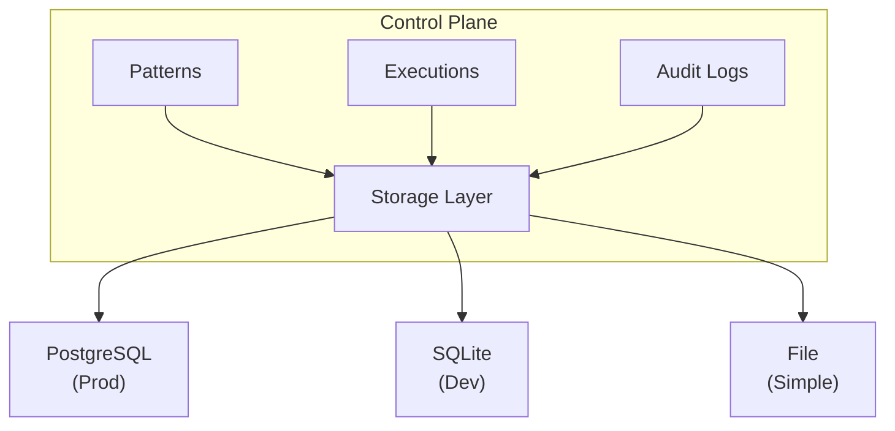

# Persistence

Configure durable storage for patterns, execution history, and audit logs.

## Overview

Parallax Enterprise supports persistent storage backends for production deployments where data durability is required.



## Storage Backends

### PostgreSQL (Recommended)

Production-grade relational database:

```yaml
# parallax.config.yaml
storage:
  type: postgresql
  postgresql:
    host: postgres.example.com
    port: 5432
    database: parallax
    username: parallax
    password: ${POSTGRES_PASSWORD}

    # Connection pool
    pool:
      minConnections: 5
      maxConnections: 20
      idleTimeout: 60000

    # SSL
    ssl:
      enabled: true
      mode: verify-full
      ca: /etc/ssl/certs/ca.crt
```

**Features**:
- ACID transactions
- Concurrent access
- Full-text search
- Point-in-time recovery
- Replication support

### SQLite

Embedded database for simple deployments:

```yaml
storage:
  type: sqlite
  sqlite:
    path: /data/parallax.db

    # Write-ahead logging for better concurrency
    walMode: true

    # Busy timeout (ms)
    busyTimeout: 5000
```

**Features**:
- Zero configuration
- Single file storage
- Good for development
- Limited concurrent writes

### File System

Simple file-based storage:

```yaml
storage:
  type: file
  file:
    basePath: /data/parallax

    # File format
    format: yaml  # or json

    # Compression
    compress: true
```

**Features**:
- Human-readable files
- Easy backup
- Limited querying
- Not recommended for production

## What's Stored

### Patterns

Pattern definitions and versions:

```sql
-- PostgreSQL schema
CREATE TABLE patterns (
  id UUID PRIMARY KEY,
  name VARCHAR(255) NOT NULL,
  version VARCHAR(50) NOT NULL,
  description TEXT,
  definition JSONB NOT NULL,
  created_at TIMESTAMP WITH TIME ZONE,
  created_by VARCHAR(255),
  UNIQUE(name, version)
);

CREATE INDEX idx_patterns_name ON patterns(name);
CREATE INDEX idx_patterns_created_at ON patterns(created_at);
```

Stored data:
- Pattern YAML/JSON definition
- Version history
- Metadata (author, description)
- Creation timestamp

### Executions

Execution records and results:

```sql
CREATE TABLE executions (
  id UUID PRIMARY KEY,
  pattern_name VARCHAR(255) NOT NULL,
  pattern_version VARCHAR(50) NOT NULL,
  status VARCHAR(50) NOT NULL,
  input JSONB,
  output JSONB,
  error JSONB,
  started_at TIMESTAMP WITH TIME ZONE,
  completed_at TIMESTAMP WITH TIME ZONE,
  duration_ms INTEGER,
  metadata JSONB
);

CREATE INDEX idx_executions_pattern ON executions(pattern_name);
CREATE INDEX idx_executions_status ON executions(status);
CREATE INDEX idx_executions_started_at ON executions(started_at);
```

Stored data:
- Input/output data
- Execution status and errors
- Timing information
- Agent assignments
- Step-by-step results

### Audit Logs

Security and compliance logging:

```sql
CREATE TABLE audit_logs (
  id UUID PRIMARY KEY,
  timestamp TIMESTAMP WITH TIME ZONE NOT NULL,
  action VARCHAR(100) NOT NULL,
  actor VARCHAR(255),
  resource_type VARCHAR(100),
  resource_id VARCHAR(255),
  details JSONB,
  ip_address INET,
  user_agent TEXT
);

CREATE INDEX idx_audit_timestamp ON audit_logs(timestamp);
CREATE INDEX idx_audit_action ON audit_logs(action);
CREATE INDEX idx_audit_actor ON audit_logs(actor);
```

Stored data:
- All API actions
- User/system identification
- Request details
- IP addresses

## Configuration

### Environment Variables

| Variable | Description |
|----------|-------------|
| `PARALLAX_STORAGE_TYPE` | Storage backend (postgresql, sqlite, file) |
| `PARALLAX_DATABASE_URL` | Full database connection URL |
| `PARALLAX_DATABASE_HOST` | Database host |
| `PARALLAX_DATABASE_PORT` | Database port |
| `PARALLAX_DATABASE_NAME` | Database name |
| `PARALLAX_DATABASE_USER` | Database user |
| `PARALLAX_DATABASE_PASSWORD` | Database password |

### Helm Values

```yaml
# values.yaml
persistence:
  enabled: true

postgresql:
  enabled: true
  auth:
    username: parallax
    password: ${POSTGRES_PASSWORD}
    database: parallax
  primary:
    persistence:
      enabled: true
      size: 50Gi
      storageClass: fast-ssd
  readReplicas:
    replicaCount: 2
```

### External PostgreSQL

Connect to existing PostgreSQL:

```yaml
persistence:
  enabled: true

postgresql:
  enabled: false  # Don't deploy PostgreSQL

externalDatabase:
  host: postgres.example.com
  port: 5432
  database: parallax
  username: parallax
  existingSecret: postgres-credentials
  existingSecretPasswordKey: password
```

## Data Retention

### Configure Retention

```yaml
storage:
  retention:
    # Execution history
    executions:
      enabled: true
      maxAge: 30d
      maxCount: 100000

    # Audit logs
    auditLogs:
      enabled: true
      maxAge: 90d

    # Cleanup schedule
    cleanupSchedule: "0 2 * * *"  # 2 AM daily
```

### Manual Cleanup

```bash
# Delete old executions
parallax storage cleanup executions --older-than 30d

# Delete old audit logs
parallax storage cleanup audit-logs --older-than 90d

# Dry run
parallax storage cleanup executions --older-than 30d --dry-run
```

### Archive Before Delete

```bash
# Archive to S3 before deletion
parallax storage archive executions \
  --older-than 30d \
  --destination s3://backups/parallax/executions/
```

## Backup and Restore

### PostgreSQL Backup

```bash
# Full backup
pg_dump -h localhost -U parallax -d parallax > backup.sql

# Compressed backup
pg_dump -h localhost -U parallax -d parallax | gzip > backup.sql.gz

# Specific tables
pg_dump -h localhost -U parallax -d parallax \
  -t patterns -t executions > backup.sql
```

### PostgreSQL Restore

```bash
# Restore full backup
psql -h localhost -U parallax -d parallax < backup.sql

# Restore compressed
gunzip -c backup.sql.gz | psql -h localhost -U parallax -d parallax
```

### Kubernetes CronJob

```yaml
apiVersion: batch/v1
kind: CronJob
metadata:
  name: parallax-backup
spec:
  schedule: "0 3 * * *"  # 3 AM daily
  jobTemplate:
    spec:
      template:
        spec:
          containers:
            - name: backup
              image: postgres:15
              command:
                - /bin/sh
                - -c
                - |
                  pg_dump -h $PGHOST -U $PGUSER -d $PGDATABASE | \
                  gzip | \
                  aws s3 cp - s3://backups/parallax/$(date +%Y%m%d).sql.gz
              env:
                - name: PGHOST
                  value: parallax-postgresql
                - name: PGUSER
                  valueFrom:
                    secretKeyRef:
                      name: postgres-credentials
                      key: username
                - name: PGPASSWORD
                  valueFrom:
                    secretKeyRef:
                      name: postgres-credentials
                      key: password
                - name: PGDATABASE
                  value: parallax
          restartPolicy: OnFailure
```

### Point-in-Time Recovery

Configure PostgreSQL for PITR:

```yaml
postgresql:
  primary:
    configuration: |
      wal_level = replica
      archive_mode = on
      archive_command = 'aws s3 cp %p s3://wal-archive/%f'
```

Restore to specific time:

```bash
# Set recovery target
recovery_target_time = '2024-01-15 10:30:00'

# Restore
pg_restore --target-time='2024-01-15 10:30:00'
```

## Schema Migrations

### Automatic Migrations

Migrations run automatically on startup:

```yaml
storage:
  migrations:
    enabled: true
    autoRun: true
```

### Manual Migrations

```bash
# Check current version
parallax storage migrate status

# Run pending migrations
parallax storage migrate up

# Rollback last migration
parallax storage migrate down

# Migrate to specific version
parallax storage migrate to 20240115
```

### Migration Files

```sql
-- migrations/20240115_add_execution_tags.sql
-- +migrate Up
ALTER TABLE executions ADD COLUMN tags JSONB;
CREATE INDEX idx_executions_tags ON executions USING GIN (tags);

-- +migrate Down
DROP INDEX idx_executions_tags;
ALTER TABLE executions DROP COLUMN tags;
```

## Performance Optimization

### Connection Pooling

```yaml
storage:
  postgresql:
    pool:
      minConnections: 10
      maxConnections: 50
      maxIdleTime: 300000
      acquireTimeout: 30000
```

### Indexing

Important indexes for query performance:

```sql
-- Execution queries
CREATE INDEX idx_executions_pattern_status ON executions(pattern_name, status);
CREATE INDEX idx_executions_created_at_desc ON executions(started_at DESC);

-- Pattern queries
CREATE INDEX idx_patterns_name_version ON patterns(name, version);

-- Audit queries
CREATE INDEX idx_audit_actor_timestamp ON audit_logs(actor, timestamp);
```

### Partitioning

For large execution tables:

```sql
-- Create partitioned table
CREATE TABLE executions (
  id UUID,
  started_at TIMESTAMP WITH TIME ZONE,
  -- ... other columns
) PARTITION BY RANGE (started_at);

-- Create monthly partitions
CREATE TABLE executions_2024_01 PARTITION OF executions
  FOR VALUES FROM ('2024-01-01') TO ('2024-02-01');

CREATE TABLE executions_2024_02 PARTITION OF executions
  FOR VALUES FROM ('2024-02-01') TO ('2024-03-01');
```

### Read Replicas

Route read queries to replicas:

```yaml
storage:
  postgresql:
    primary:
      host: postgres-primary.example.com
    replicas:
      - host: postgres-replica-1.example.com
      - host: postgres-replica-2.example.com
    readPreference: replica  # primary, replica, any
```

## Monitoring

### Metrics

```prometheus
# Storage operation latency
parallax_storage_operation_duration_seconds{operation="write",table="executions"}

# Connection pool
parallax_storage_pool_connections_active
parallax_storage_pool_connections_idle
parallax_storage_pool_waiting_requests

# Storage size
parallax_storage_table_rows{table="executions"}
parallax_storage_table_size_bytes{table="executions"}
```

### Alerts

```yaml
groups:
  - name: parallax-storage
    rules:
      - alert: StorageConnectionPoolExhausted
        expr: parallax_storage_pool_waiting_requests > 10
        for: 1m
        labels:
          severity: warning

      - alert: StorageHighLatency
        expr: parallax_storage_operation_duration_seconds{quantile="0.99"} > 1
        for: 5m
        labels:
          severity: warning

      - alert: StorageDiskSpaceLow
        expr: parallax_storage_disk_free_bytes < 10737418240  # 10GB
        for: 5m
        labels:
          severity: critical
```

## Troubleshooting

### Connection Issues

```bash
# Test connection
parallax storage test-connection

# Check from pod
kubectl exec -it parallax-control-plane-0 -- \
  psql -h postgres -U parallax -d parallax -c "SELECT 1"
```

### Migration Failures

```bash
# Check migration status
parallax storage migrate status

# View migration logs
kubectl logs parallax-control-plane-0 | grep migration

# Manual fix
psql -h postgres -U parallax -d parallax
# Fix the issue, then mark migration as complete
INSERT INTO schema_migrations (version) VALUES ('20240115');
```

### Performance Issues

```sql
-- Find slow queries
SELECT query, calls, mean_time, total_time
FROM pg_stat_statements
ORDER BY total_time DESC
LIMIT 10;

-- Check table bloat
SELECT relname, n_dead_tup, last_vacuum
FROM pg_stat_user_tables
ORDER BY n_dead_tup DESC;

-- Run vacuum
VACUUM ANALYZE executions;
```

## Best Practices

1. **Use PostgreSQL for production** - SQLite and file storage are for development only

2. **Enable connection pooling** - Prevents connection exhaustion under load

3. **Set up automated backups** - Test restore procedures regularly

4. **Configure retention policies** - Don't let data grow unbounded

5. **Monitor storage metrics** - Alert on latency and disk space

6. **Use read replicas** - Scale read-heavy workloads

7. **Partition large tables** - Improve query performance and maintenance

## Next Steps

- [High Availability](/enterprise/high-availability) - HA configuration
- [Multi-Region](/enterprise/multi-region) - Geographic distribution
- [Security](/enterprise/security) - Secure storage access
