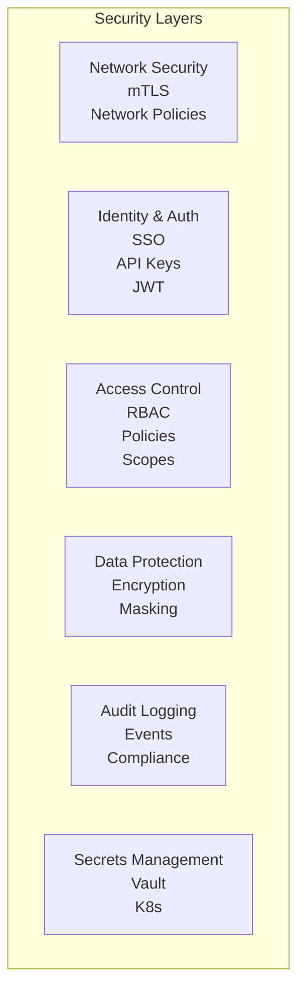

# Security

Enterprise security features including mTLS, RBAC, SSO integration, and audit logging.

## Overview

Parallax Enterprise provides comprehensive security features for production deployments:



## mTLS (Mutual TLS)

### Overview

Mutual TLS ensures both client and server authenticate each other:

```mermaid
sequenceDiagram
  participant Agent
  participant ControlPlane as Control Plane
  Agent->>ControlPlane: Hello
  ControlPlane-->>Agent: Server Cert
  Agent->>ControlPlane: Client Cert
  ControlPlane-->>Agent: Verified
  Agent<->>ControlPlane: Encrypted
```

### Enable mTLS

```yaml
# parallax.config.yaml
security:
  mtls:
    enabled: true

    # Server certificate
    serverCert: /etc/parallax/certs/server.crt
    serverKey: /etc/parallax/certs/server.key

    # CA for client verification
    clientCA: /etc/parallax/certs/ca.crt

    # Require client certificates
    clientAuth: require  # require, request, or none
```

### Generate Certificates

Using cert-manager (recommended):

```yaml
# Issuer
apiVersion: cert-manager.io/v1
kind: ClusterIssuer
metadata:
  name: parallax-ca-issuer
spec:
  ca:
    secretName: parallax-ca-secret

---
# Server certificate
apiVersion: cert-manager.io/v1
kind: Certificate
metadata:
  name: parallax-server
  namespace: parallax
spec:
  secretName: parallax-server-tls
  issuerRef:
    name: parallax-ca-issuer
    kind: ClusterIssuer
  commonName: parallax-control-plane
  dnsNames:
    - parallax-control-plane
    - parallax-control-plane.parallax.svc
    - parallax.example.com

---
# Client certificate for agents
apiVersion: cert-manager.io/v1
kind: Certificate
metadata:
  name: parallax-agent
  namespace: parallax
spec:
  secretName: parallax-agent-tls
  issuerRef:
    name: parallax-ca-issuer
    kind: ClusterIssuer
  commonName: parallax-agent
  usages:
    - client auth
```

### Agent Configuration

```typescript
const agent = new ParallaxAgent({
  controlPlaneUrl: 'https://parallax.example.com',
  tls: {
    cert: fs.readFileSync('/path/to/agent.crt'),
    key: fs.readFileSync('/path/to/agent.key'),
    ca: fs.readFileSync('/path/to/ca.crt'),
  },
});
```

### Helm Values

```yaml
security:
  mtls:
    enabled: true
    serverCertSecret: parallax-server-tls
    clientCASecret: parallax-ca-secret

certManager:
  enabled: true
  issuer:
    create: true
    name: parallax-issuer
```

## Authentication

### API Keys

Simple token-based authentication:

```yaml
security:
  authentication:
    apiKeys:
      enabled: true
```

Generate keys:

```bash
parallax auth create-key --name "production-client" --scopes "execute,read"
```

Use in requests:

```bash
curl -H "Authorization: Bearer pk_live_abc123" \
  https://parallax.example.com/api/patterns
```

### JWT Tokens

JSON Web Token authentication:

```yaml
security:
  authentication:
    jwt:
      enabled: true
      issuer: https://auth.example.com
      audience: parallax
      jwksUri: https://auth.example.com/.well-known/jwks.json
```

### SSO Integration

#### OIDC (OpenID Connect)

```yaml
security:
  sso:
    enabled: true
    provider: oidc

    oidc:
      issuer: https://auth.example.com
      clientId: ${OIDC_CLIENT_ID}
      clientSecret: ${OIDC_CLIENT_SECRET}
      scopes:
        - openid
        - profile
        - email
      redirectUri: https://parallax.example.com/auth/callback
```

#### Okta

```yaml
security:
  sso:
    enabled: true
    provider: okta

    okta:
      domain: your-org.okta.com
      clientId: ${OKTA_CLIENT_ID}
      clientSecret: ${OKTA_CLIENT_SECRET}
      authorizationServerId: default
```

#### Azure AD

```yaml
security:
  sso:
    enabled: true
    provider: azure

    azure:
      tenantId: ${AZURE_TENANT_ID}
      clientId: ${AZURE_CLIENT_ID}
      clientSecret: ${AZURE_CLIENT_SECRET}
```

#### Google

```yaml
security:
  sso:
    enabled: true
    provider: google

    google:
      clientId: ${GOOGLE_CLIENT_ID}
      clientSecret: ${GOOGLE_CLIENT_SECRET}
      hostedDomain: example.com  # Optional: restrict to domain
```

### Agent Authentication

Agents authenticate using:

```yaml
security:
  agentAuth:
    method: mtls  # mtls, token, or both

    token:
      # Require agent registration token
      registrationRequired: true
```

Register agent:

```bash
# Generate registration token
parallax agent create-token --capabilities classification,analysis

# Agent uses token on first connect
PARALLAX_AGENT_TOKEN=at_abc123 node agent.js
```

## Role-Based Access Control (RBAC)

### Enable RBAC

```yaml
security:
  rbac:
    enabled: true
    defaultRole: viewer
```

### Built-in Roles

| Role | Permissions |
|------|-------------|
| `admin` | Full access to all resources |
| `operator` | Manage patterns and executions |
| `developer` | Create and execute patterns |
| `viewer` | Read-only access |

### Custom Roles

```yaml
security:
  rbac:
    roles:
      - name: pattern-manager
        permissions:
          - resource: patterns
            actions: [create, read, update, delete]
          - resource: executions
            actions: [read]

      - name: execution-only
        permissions:
          - resource: patterns
            actions: [read]
          - resource: executions
            actions: [create, read]
```

### Role Bindings

Assign roles to users or groups:

```yaml
security:
  rbac:
    bindings:
      # User binding
      - subject:
          type: user
          name: alice@example.com
        role: admin

      # Group binding
      - subject:
          type: group
          name: engineering
        role: developer

      # Service account binding
      - subject:
          type: serviceAccount
          name: ci-pipeline
        role: execution-only
```

### Pattern-Level Permissions

Restrict pattern access:

```yaml
name: sensitive-analysis
version: 1.0.0

security:
  # Only specific users can execute
  allowedUsers:
    - alice@example.com
    - bob@example.com

  # Or by role
  allowedRoles:
    - admin
    - security-team
```

### API Scopes

Fine-grained API access:

| Scope | Access |
|-------|--------|
| `patterns:read` | Read pattern definitions |
| `patterns:write` | Create/update patterns |
| `patterns:delete` | Delete patterns |
| `executions:create` | Execute patterns |
| `executions:read` | Read execution results |
| `agents:read` | View agent list |
| `agents:manage` | Register/remove agents |
| `admin` | Full administrative access |

Create scoped API key:

```bash
parallax auth create-key \
  --name "read-only" \
  --scopes "patterns:read,executions:read"
```

## Audit Logging

### Enable Audit Logging

```yaml
security:
  audit:
    enabled: true

    # What to log
    events:
      - authentication
      - authorization
      - patterns
      - executions
      - agents
      - admin

    # Log level
    level: standard  # minimal, standard, or verbose
```

### Audit Log Format

```json
{
  "timestamp": "2024-01-15T10:30:00.000Z",
  "eventId": "evt_abc123",
  "action": "pattern.execute",
  "outcome": "success",
  "actor": {
    "type": "user",
    "id": "alice@example.com",
    "ip": "10.0.0.1",
    "userAgent": "parallax-cli/1.0.0"
  },
  "resource": {
    "type": "pattern",
    "id": "content-classifier",
    "version": "1.0.0"
  },
  "details": {
    "executionId": "exec_xyz789",
    "inputSize": 1024,
    "agentCount": 3
  },
  "request": {
    "method": "POST",
    "path": "/api/patterns/content-classifier/execute",
    "requestId": "req_abc123"
  }
}
```

### Log Destinations

#### File

```yaml
security:
  audit:
    destination: file
    file:
      path: /var/log/parallax/audit.log
      rotation:
        maxSize: 100MB
        maxAge: 30d
        compress: true
```

#### Elasticsearch

```yaml
security:
  audit:
    destination: elasticsearch
    elasticsearch:
      hosts:
        - https://es.example.com:9200
      index: parallax-audit
      username: ${ES_USERNAME}
      password: ${ES_PASSWORD}
```

#### Splunk

```yaml
security:
  audit:
    destination: splunk
    splunk:
      host: splunk.example.com
      port: 8088
      token: ${SPLUNK_HEC_TOKEN}
      index: parallax_audit
```

#### CloudWatch

```yaml
security:
  audit:
    destination: cloudwatch
    cloudwatch:
      logGroup: /parallax/audit
      region: us-east-1
```

### Query Audit Logs

```bash
# Recent events
parallax audit list --since 1h

# Filter by action
parallax audit list --action "pattern.execute"

# Filter by user
parallax audit list --actor "alice@example.com"

# Export for analysis
parallax audit export --since 7d --format json > audit.json
```

## Data Protection

### Encryption at Rest

```yaml
security:
  encryption:
    atRest:
      enabled: true
      # AWS KMS
      provider: aws-kms
      keyId: alias/parallax-encryption
```

### Encryption in Transit

All communications encrypted via TLS (see mTLS section).

### Sensitive Data Handling

Mask sensitive fields in logs:

```yaml
security:
  dataProtection:
    masking:
      enabled: true
      fields:
        - "input.password"
        - "input.apiKey"
        - "input.ssn"
        - "output.*.secret"

      # Masking method
      method: redact  # redact, hash, or partial
```

### Input Validation

```yaml
security:
  inputValidation:
    enabled: true

    # Maximum input size
    maxSize: 10MB

    # Content type validation
    allowedContentTypes:
      - application/json
      - text/plain

    # Sanitization
    sanitize:
      html: true
      scripts: true
```

## Secrets Management

### Kubernetes Secrets

```yaml
security:
  secrets:
    provider: kubernetes

    # Reference secrets in config
    apiKey:
      secretRef:
        name: parallax-secrets
        key: api-key
```

### HashiCorp Vault

```yaml
security:
  secrets:
    provider: vault

    vault:
      address: https://vault.example.com
      auth:
        method: kubernetes
        role: parallax
      secretPath: secret/data/parallax
```

Use in patterns:

```yaml
name: external-api
version: 1.0.0

# Secret reference (resolved at runtime)
config:
  apiKey: vault:secret/data/api-keys#external-api
```

### AWS Secrets Manager

```yaml
security:
  secrets:
    provider: aws-secrets-manager

    aws:
      region: us-east-1
      secretPrefix: parallax/
```

## Network Security

### Network Policies

```yaml
apiVersion: networking.k8s.io/v1
kind: NetworkPolicy
metadata:
  name: parallax-control-plane
  namespace: parallax
spec:
  podSelector:
    matchLabels:
      app: parallax-control-plane
  policyTypes:
    - Ingress
    - Egress
  ingress:
    # Only allow from ingress controller
    - from:
        - namespaceSelector:
            matchLabels:
              name: ingress-nginx
      ports:
        - port: 8080
  egress:
    # Only allow to database and Redis
    - to:
        - podSelector:
            matchLabels:
              app: postgresql
      ports:
        - port: 5432
    - to:
        - podSelector:
            matchLabels:
              app: redis
      ports:
        - port: 6379
```

### IP Allowlisting

```yaml
security:
  network:
    ipAllowlist:
      enabled: true
      ranges:
        - 10.0.0.0/8      # Internal network
        - 192.168.0.0/16  # VPN
        - 203.0.113.0/24  # Office
```

### Rate Limiting

```yaml
security:
  rateLimit:
    enabled: true

    # Global limits
    global:
      requestsPerSecond: 1000
      burstSize: 100

    # Per-client limits
    perClient:
      requestsPerSecond: 100
      burstSize: 50

    # Per-pattern limits
    perPattern:
      requestsPerMinute: 60
```

## Security Monitoring

### Metrics

```prometheus
# Authentication attempts
parallax_auth_attempts_total{method="api_key",outcome="success"}
parallax_auth_attempts_total{method="api_key",outcome="failure"}

# Authorization decisions
parallax_authz_decisions_total{action="execute",outcome="allow"}
parallax_authz_decisions_total{action="execute",outcome="deny"}

# Rate limit hits
parallax_rate_limit_hits_total{client="client-123"}
```

### Alerts

```yaml
groups:
  - name: parallax-security
    rules:
      - alert: HighAuthFailureRate
        expr: |
          rate(parallax_auth_attempts_total{outcome="failure"}[5m])
          / rate(parallax_auth_attempts_total[5m]) > 0.1
        for: 5m
        labels:
          severity: warning
        annotations:
          summary: High authentication failure rate

      - alert: UnauthorizedAccessAttempts
        expr: |
          increase(parallax_authz_decisions_total{outcome="deny"}[5m]) > 100
        for: 1m
        labels:
          severity: warning
        annotations:
          summary: Many unauthorized access attempts

      - alert: CertificateExpiringSoon
        expr: parallax_certificate_expiry_seconds < 604800
        for: 1h
        labels:
          severity: warning
        annotations:
          summary: Certificate expiring within 7 days
```

## Compliance

### SOC 2

Required configurations:

```yaml
security:
  # Access control
  rbac:
    enabled: true

  # Audit logging
  audit:
    enabled: true
    level: verbose
    retention: 365d

  # Encryption
  encryption:
    atRest:
      enabled: true
    inTransit:
      enabled: true

  # Session management
  sessions:
    timeout: 30m
    maxConcurrent: 3
```

### GDPR

```yaml
security:
  gdpr:
    enabled: true

    # Data residency
    dataResidency:
      region: eu-west-1

    # Right to erasure
    dataRetention:
      executionData: 30d
      auditLogs: 90d

    # Consent tracking
    consent:
      required: true
```

### HIPAA

```yaml
security:
  hipaa:
    enabled: true

    # PHI handling
    phi:
      encryptionRequired: true
      accessLogging: true
      minimumNecessary: true

    # Audit requirements
    audit:
      level: verbose
      retention: 6y
```

## Best Practices

1. **Enable mTLS in production** - Don't rely on network security alone

2. **Use least-privilege RBAC** - Only grant necessary permissions

3. **Rotate credentials regularly** - API keys, certificates, tokens

4. **Monitor security metrics** - Alert on anomalies

5. **Enable audit logging** - Required for compliance and investigation

6. **Keep secrets out of patterns** - Use secret references

7. **Review access regularly** - Remove unused accounts and keys

## Next Steps

- [High Availability](/docs/enterprise/high-availability) - Secure HA setup
- [Persistence](/docs/enterprise/persistence) - Secure storage
- [Multi-Region](/docs/enterprise/multi-region) - Cross-region security
