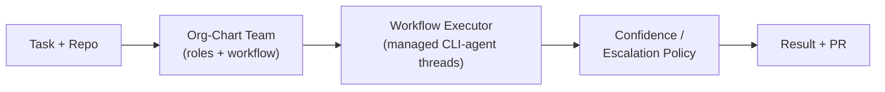

# Welcome to Parallax

**Parallax** is an orchestration platform for **teams of real CLI coding agents** — Claude Code, Codex, Gemini, Aider — arranged as an org chart and coordinated to work together on complex tasks, with confidence as a first-class routing signal.

## Why Parallax?

A single coding agent is unreliable on real work. It stops early, claims done when it isn't, and has no one checking it. Parallax runs **multiple agents as a structured team** — engineers, reviewers, a lead — across local, Docker, Kubernetes, and gateway (edge/Raspberry Pi) runtimes, and uses **verification-driven confidence** to decide what to accept, what to retry, and what to escalate.

### Key Benefits

- **Org-chart teams** - Roles, hierarchy, and workflow, not one lone agent
- **Real CLI agents** - Orchestrate the coding tools you already use
- **Verification-driven confidence** - Route on test/typecheck/review results, not self-reported guesses
- **Safe escalation** - The swarm knows when to ask a human, instead of failing silently
- **Runs anywhere** - Local PTY, Docker, Kubernetes, or over a gateway to edge hardware

## How It Works



1. **Define a team** - Describe roles, hierarchy, and workflow in an org-chart YAML pattern
2. **Or write a module** - Author custom orchestration logic as a TypeScript pattern module
3. **Execute** - The workflow executor spawns and routes managed CLI-agent threads
4. **Route on confidence** - Verification results drive accept / retry / escalate per role

## Two kinds of patterns

Parallax patterns come in two forms:

- **Org-chart patterns** — YAML files (`patterns/org-*.yaml`) that declare roles, hierarchy, and a workflow. The workflow executor runs them by spawning and coordinating managed CLI-agent threads.
- **Custom-logic patterns** — TypeScript modules in [`packages/patterns`](https://github.com/HaruHunab1320/parallax/tree/main/packages/patterns) (`@parallaxai/patterns`). A `PatternModule` implements `execute(ctx)` and is deployed *with* the control plane (Temporal-style) — it is not an uploaded script.

There is no separate DSL or compilation step: org-chart YAML is executed directly by the workflow executor, and module patterns are loaded from the `@parallaxai/patterns` manifest.

## Quick Example

An org-chart pattern declaring a small review team:

```yaml
name: code-review-team
version: "1.0.0"
description: A team that reviews and improves code

structure:
  roles:
    lead:
      name: Tech Lead
      singleton: true
      capabilities: [architecture, code_review, decision_making]
    engineer:
      name: Engineer
      reportsTo: lead
      minInstances: 1
      capabilities: [implementation, refactoring]

workflow:
  name: review-and-fix
  input:
    requirements: string
  steps:
    - type: assign
      role: engineer
      task: "Implement: ${input.requirements}"
    - type: review
      reviewer: lead
```

## What's Next?

<div className="row">
  <div className="col col--6">
    <div className="card">
      <div className="card__header">
        <h3>🚀 Get Started</h3>
      </div>
      <div className="card__body">
        Install Parallax and run your first pattern in under 5 minutes.
      </div>
      <div className="card__footer">
        <a className="button button--primary button--block" href="/docs/getting-started/quickstart">Quickstart Guide</a>
      </div>
    </div>
  </div>
  <div className="col col--6">
    <div className="card">
      <div className="card__header">
        <h3>📚 Learn Concepts</h3>
      </div>
      <div className="card__body">
        Understand agents, patterns, and how Parallax orchestrates them.
      </div>
      <div className="card__footer">
        <a className="button button--secondary button--block" href="/docs/getting-started/concepts">Core Concepts</a>
      </div>
    </div>
  </div>
</div>

## Confidence as triage

Every result carries a confidence signal, but Parallax treats it as **verification-driven triage**, not calibrated LLM introspection. Cheap oracles (tests, typecheck) come first, then a structural acceptance check, then a second agent, then a human. See [Confidence as Triage](/docs/concepts/confidence) for the full model.

The confidence algebra — `Confident<T>` plus combinators (`cf`, `best`, `gate`, `uncertain`, `coalesce`) and aggregation — lives in [`@parallaxai/confidence`](https://github.com/HaruHunab1320/parallax/tree/main/packages/confidence).

## Any-language agents

Parallax is not TypeScript-only. Any agent can join by speaking the gRPC contract defined in [`/proto`](https://github.com/HaruHunab1320/parallax/tree/main/proto). Maintained SDKs are **TypeScript** and **Python**; Go and Rust examples live under `examples/polyglot/`.

## Open Source

Parallax is open source under the Apache 2.0 license. The open source version includes:

- ✅ Unlimited local agents
- ✅ Org-chart YAML patterns and TypeScript pattern modules
- ✅ Verification-driven confidence and escalation
- ✅ Full SDK access
- ✅ In-memory execution

[Enterprise features](/docs/enterprise/overview) add distributed execution, persistence, high availability, and more for production deployments.
