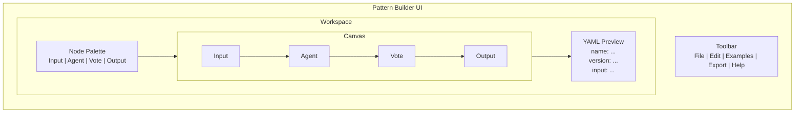

# Pattern Builder

The Pattern Builder is a visual editor for creating orchestration patterns using a drag-and-drop interface. Build complex multi-agent workflows without writing YAML.

[Launch Pattern Builder](https://parallax.dev/builder)

## Features

- **Drag-and-drop interface** - Create patterns visually
- **Real-time YAML preview** - See the generated configuration
- **15+ example patterns** - Start from proven templates
- **Export to YAML or Prism** - Deploy anywhere
- **Validation** - Catch errors before deployment

## Interface Overview



## Getting Started

### 1. Open the Builder

Navigate to [parallax.dev/builder](https://parallax.dev/builder) or click "Pattern Builder" in the navigation.

### 2. Start from an Example (Recommended)

Click **Examples** in the toolbar and select a template:

| Example | Description |
|---------|-------------|
| Multi-Agent Voting | Basic voting pattern |
| Quality-Gated Analysis | Consensus with retry |
| Entity Extraction | Merge-based extraction |
| Translation Verification | Back-translation pattern |
| Prompt A/B Testing | Compare prompt variants |

### 3. Or Build from Scratch

1. Drag an **Input** node onto the canvas
2. Drag an **Agent** node and connect it to the input
3. Add aggregation (Vote, Consensus, or Merge)
4. Add an **Output** node
5. Configure each node in the properties panel

### 4. Configure Nodes

Click any node to edit its properties:

- **Input Node**: Define input fields and types
- **Agent Node**: Set capabilities and count
- **Aggregation Nodes**: Configure strategy and thresholds
- **Output Node**: Map result variables

### 5. Preview and Export

The YAML preview updates in real-time. When ready:

1. Click **Export**
2. Choose format (YAML or Prism)
3. Copy or download the configuration

## Keyboard Shortcuts

| Shortcut | Action |
|----------|--------|
| `Cmd/Ctrl + S` | Save pattern |
| `Cmd/Ctrl + Z` | Undo |
| `Cmd/Ctrl + Shift + Z` | Redo |
| `Delete` / `Backspace` | Delete selected |
| `Cmd/Ctrl + D` | Duplicate selected |
| `Cmd/Ctrl + A` | Select all |
| `Space + Drag` | Pan canvas |
| `Scroll` | Zoom in/out |
| `F` | Fit to screen |

## Canvas Controls

### Navigation

- **Pan**: Hold `Space` and drag, or use scroll wheel + Shift
- **Zoom**: Scroll wheel, or use zoom controls in toolbar
- **Fit**: Press `F` or click "Fit" button

### Selection

- **Single**: Click a node
- **Multiple**: Cmd/Ctrl + Click, or drag selection box
- **All**: Cmd/Ctrl + A

### Editing

- **Move**: Drag selected nodes
- **Connect**: Drag from output handle to input handle
- **Delete**: Select and press Delete
- **Duplicate**: Cmd/Ctrl + D

## Workflow Tips

### Start Simple

Begin with the simplest pattern that could work:

1. Input → Agent → Output
2. Test it works
3. Add aggregation
4. Add validation
5. Add complexity as needed

### Use Examples

The example patterns demonstrate best practices:

- Proper node connections
- Appropriate aggregation strategies
- Quality gate placement
- Output variable mapping

### Validate Before Export

The builder shows validation errors:

- **Red border**: Missing required configuration
- **Warning icon**: Potential issues
- **Error panel**: Detailed error messages

### Test Incrementally

Export and test your pattern at each stage:

```bash
# Test locally
parallax pattern validate my-pattern.yaml

# Dry run
parallax pattern execute my-pattern.yaml --dry-run
```

## Example: Building a Voting Pattern

### Step 1: Add Input

1. Drag **Input** node to canvas
2. Click to select
3. Add field: `content` with type `string`

### Step 2: Add Agents

1. Drag **Agent** node to canvas
2. Connect Input → Agent
3. Configure:
   - Capabilities: `classification`
   - Min agents: `3`

### Step 3: Add Voting

1. Drag **Vote** node to canvas
2. Connect Agent → Vote
3. Configure:
   - Method: `majority`
   - Min votes: `2`

### Step 4: Add Output

1. Drag **Output** node to canvas
2. Connect Vote → Output
3. Map variables:
   - `category`: `$vote.result`
   - `confidence`: `$vote.confidence`

### Step 5: Export

1. Click **Export → YAML**
2. Copy the generated YAML:

```yaml
name: content-classifier
version: 1.0.0

input:
  content: string

agents:
  capabilities: [classification]
  min: 3

execution:
  strategy: parallel

aggregation:
  strategy: voting
  method: majority
  minVotes: 2

output:
  category: $vote.result
  confidence: $vote.confidence
```

## Troubleshooting

### Nodes Won't Connect

- Verify compatible types (output → input)
- Check that the source node has an output handle
- Ensure the target node has an input handle

### YAML Preview Empty

- Ensure at least Input and Output nodes exist
- Check for validation errors
- Verify all required fields are configured

### Pattern Won't Validate

- Read error messages in the error panel
- Check required node configurations
- Ensure all connections are complete

## Next Steps

- [Nodes](/docs/pattern-builder/nodes) - Detailed node reference
- [Connections](/docs/pattern-builder/connections) - Connection rules
- [Exporting](/docs/pattern-builder/exporting) - Export formats and options
