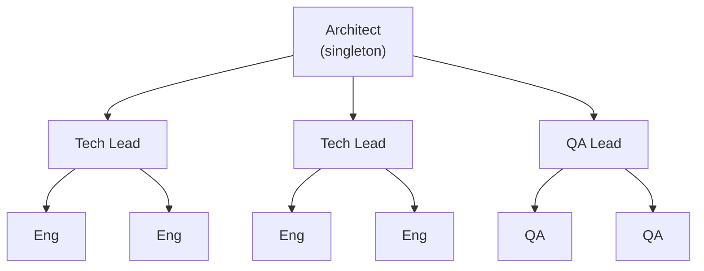

# Org-Chart Patterns

Org-Chart Patterns enable hierarchical multi-agent orchestration with roles, routing, and escalation - modeling real organizational structures.

## Overview

Instead of flat parallel execution, org-chart patterns define:
- **Roles** - Functions within the team (architect, engineer, QA)
- **Hierarchy** - Reporting structure between roles
- **Routing** - How messages flow between roles
- **Escalation** - How unresolved questions bubble up
- **Workflows** - Sequences of role assignments



## Basic Pattern Structure

```yaml
name: startup-team
version: "1.0.0"
description: Lean team with architect oversight

structure:
  name: Startup Team
  roles:
    architect:
      id: architect
      name: Systems Architect
      agentType: claude
      singleton: true
      capabilities:
        - architecture
        - code_review

    engineer:
      id: engineer
      name: Software Engineer
      agentType:
        - claude
        - codex
      reportsTo: architect
      minInstances: 2
      maxInstances: 4
      capabilities:
        - implementation

  routing:
    - from: engineer
      to: architect
      topics: [architecture, design]

  escalation:
    defaultBehavior: route_to_reports_to
    timeoutMs: 30000

workflow:
  name: Feature Development
  input:
    task:
      type: string
  steps:
    - type: assign
      role: architect
      task: "Design: ${input.task}"
    - type: parallel
      steps:
        - type: assign
          role: engineer
          task: "Implement core: ${step_0_result}"
        - type: assign
          role: engineer
          task: "Implement tests: ${step_0_result}"
    - type: review
      reviewer: architect
      subject: ${step_1_result}
  output: step_2_result
```

## Role Configuration

### Role Properties

| Property | Type | Description |
|----------|------|-------------|
| `id` | string | Unique identifier |
| `name` | string | Display name |
| `agentType` | string/string[] | Allowed agent types |
| `capabilities` | string[] | Required capabilities |
| `singleton` | boolean | Only one instance allowed |
| `minInstances` | number | Minimum agents |
| `maxInstances` | number | Maximum agents |
| `reportsTo` | string | Parent role |

### Example Hierarchy

```yaml
roles:
  cto:
    singleton: true
    # No reportsTo - top of hierarchy

  architect:
    reportsTo: cto
    maxInstances: 2

  tech_lead:
    reportsTo: architect
    minInstances: 2

  engineer:
    reportsTo: tech_lead
    minInstances: 4
    maxInstances: 10
```

## Routing Rules

### Topic-Based Routing

```yaml
routing:
  - from: engineer
    to: architect
    topics:
      - architecture
      - security

  - from: qa
    to: tech_lead
    topics:
      - bugs
      - testing
```

### Message Type Routing

```yaml
routing:
  - from: engineer
    to: architect
    messageTypes:
      - question
      - escalation

  - from: architect
    to: engineer
    messageTypes:
      - task
      - feedback
```

### Wildcard Routing

```yaml
routing:
  - from: "*"          # Any role
    to: architect
    topics:
      - security       # Security always to architect
```

## Escalation

### Configuration

```yaml
escalation:
  # Default: up the reporting chain
  defaultBehavior: route_to_reports_to

  # Topic-specific overrides
  topicRoutes:
    security: architect
    compliance: legal

  # Timeout before auto-escalation
  timeoutMs: 45000

  # Max levels to escalate
  maxDepth: 3

  # At max depth
  onMaxDepth: surface_to_user
```

### Escalation Behaviors

| Behavior | Description |
|----------|-------------|
| `route_to_reports_to` | Escalate to manager |
| `surface_to_user` | Show to human operator |
| `fail` | Fail the workflow |
| `return_best_effort` | Return partial result |

## Workflow Steps

### Assign

Send task to a role:

```yaml
- type: assign
  role: engineer
  task: "Implement feature: ${input.requirements}"
```

### Parallel

Execute steps concurrently:

```yaml
- type: parallel
  steps:
    - type: assign
      role: engineer
      task: "Frontend"
    - type: assign
      role: engineer
      task: "Backend"
```

### Sequential

Execute steps in order:

```yaml
- type: sequential
  steps:
    - type: assign
      role: engineer
      task: "Write code"
    - type: assign
      role: qa
      task: "Test code"
```

### Review

Request review from a role:

```yaml
- type: review
  reviewer: tech_lead
  subject: ${step_0_result}
```

### Approve

Request approval:

```yaml
- type: approve
  approver: architect
  subject:
    code: ${implementation}
    review: ${review_result}
```

### Aggregate

Combine results:

```yaml
- type: aggregate
  method: consensus  # or: majority, merge, best
```

### Condition

Conditional execution:

```yaml
- type: condition
  check: ${review_approved}
  then:
    type: assign
    role: engineer
    task: "Deploy"
  else:
    type: assign
    role: engineer
    task: "Fix issues"
```

## Built-in Patterns

### Startup Team

Lean team with architect oversight:

```yaml
name: startup-team
structure:
  roles:
    architect: { singleton: true }
    engineer: { reportsTo: architect, minInstances: 2 }
workflow:
  steps:
    - assign architect: "Design"
    - parallel:
        - assign engineer: "Implement core"
        - assign engineer: "Implement tests"
    - review architect
```

### Enterprise Review

Multi-level review process:

```yaml
name: enterprise-review
structure:
  roles:
    architect: { singleton: true }
    tech_lead: { reportsTo: architect }
    engineer: { reportsTo: tech_lead }
    qa: { reportsTo: tech_lead }
workflow:
  steps:
    - assign engineer: "Self-review"
    - review tech_lead
    - assign qa: "Test plan"
    - approve architect
```

### Pair Programming

Driver/Navigator collaboration:

```yaml
name: pair-programming
structure:
  roles:
    navigator: { singleton: true }
    driver: { singleton: true }
  routing:
    - from: driver
      to: navigator
      messageTypes: [question]
workflow:
  steps:
    - assign navigator: "Plan approach"
    - assign driver: "Implement"
    - assign navigator: "Review"
    - assign driver: "Refine"
    - review navigator
```

## Variable Resolution

| Variable | Description |
|----------|-------------|
| `${input.field}` | Input field value |
| `${step_N_result}` | Result from step N |
| `${context.executionId}` | Execution ID |

## Execution

### Via API

```bash
curl -X POST http://localhost:3000/api/patterns/startup-team/execute \
  -H "Content-Type: application/json" \
  -d '{
    "input": {
      "task": "Implement user authentication"
    }
  }'
```

### Response

```json
{
  "executionId": "exec-123",
  "patternName": "startup-team",
  "output": { "implemented": true, "tests": "passing" },
  "metrics": {
    "durationMs": 45000,
    "stepsExecuted": 4,
    "agentsUsed": 3
  },
  "steps": [
    { "step": 0, "type": "assign", "durationMs": 10000 },
    { "step": 1, "type": "parallel", "durationMs": 20000 },
    { "step": 2, "type": "review", "durationMs": 15000 }
  ]
}
```

## Best Practices

1. **Clear Hierarchies** - Define explicit reporting structures
2. **Appropriate Team Sizes** - Balance parallelism with coordination
3. **Explicit Routing** - Define topic and message type routes
4. **Reasonable Timeouts** - Set escalation timeouts appropriately
5. **Graceful Escalation** - Surface unresolved questions to users

## Next Steps

- [Voting Patterns](/docs/patterns/voting-patterns) - Flat voting patterns
- [Agent Runtimes](/docs/agent-runtimes/overview) - Spawn managed agents
- [Advanced Composition](/docs/patterns/advanced-composition) - Complex workflows
