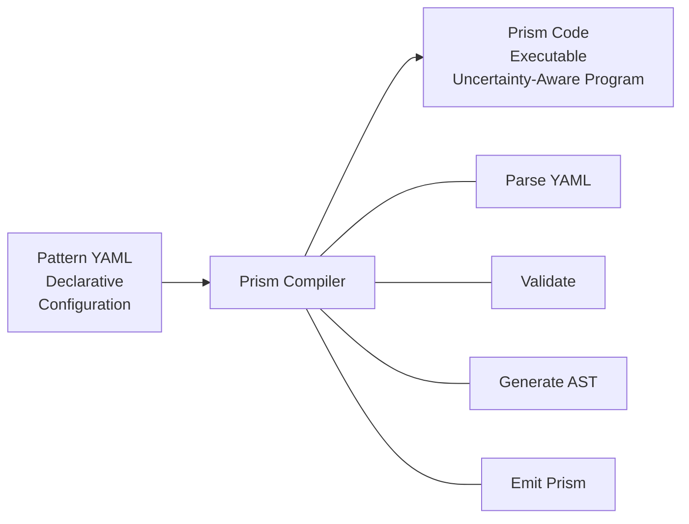

# YAML to Prism Compilation

Learn how Parallax patterns written in YAML compile to executable Prism code.

## Compilation Overview

The Parallax compiler transforms declarative YAML patterns into imperative Prism code:



## Basic Pattern Compilation

### Simple Voting Pattern

**YAML Input:**

```yaml
name: sentiment-classifier
version: 1.0.0

input:
  text: string

agents:
  capabilities: [classification]
  min: 3

execution:
  strategy: parallel
  timeout: 30000

aggregation:
  strategy: voting
  method: majority

validation:
  minConfidence: 0.7

output:
  sentiment: $vote.result
  confidence: $vote.confidence
```

**Compiled Prism:**

```prism
pattern sentiment_classifier v1.0.0 {
  input {
    text: string required
  }

  // Agent selection
  agents = select(
    capabilities: ["classification"],
    min: 3
  )

  // Parallel execution across agents
  results = parallel agents timeout(30000) {
    classify_sentiment(input.text)
  }

  // Voting aggregation
  vote_result = vote(results, method: "majority")

  // Confidence validation
  uncertain if (vote_result) threshold(0.7, 0.5) {
    high {
      return {
        sentiment: vote_result.result,
        confidence: vote_result.confidence
      }
    }
    medium {
      return {
        sentiment: vote_result.result,
        confidence: vote_result.confidence,
        warning: "Confidence below optimal threshold"
      }
    }
    low {
      fail("Confidence threshold not met", {
        required: 0.7,
        actual: <~ vote_result
      })
    }
  }
}
```

## Compilation Rules

### Metadata Mapping

| YAML | Prism |
|------|-------|
| `name: pattern-name` | `pattern pattern_name` |
| `version: 1.0.0` | `v1.0.0` |
| `description: ...` | `// Description comment` |

### Input Schema

**YAML:**
```yaml
input:
  text:
    type: string
    required: true
    maxLength: 10000
  options:
    type: object
    required: false
    properties:
      verbose: boolean
```

**Prism:**
```prism
input {
  text: string required max_length(10000)
  options: {
    verbose: boolean
  } optional
}
```

### Agent Selection

**YAML:**
```yaml
agents:
  capabilities: [classification, english]
  min: 3
  max: 5
  taskTimeout: 10000
```

**Prism:**
```prism
agents = select(
  capabilities: ["classification", "english"],
  min: 3,
  max: 5,
  task_timeout: 10000
)
```

### Execution Strategies

#### Parallel

**YAML:**
```yaml
execution:
  strategy: parallel
  timeout: 30000
  waitForAll: true
```

**Prism:**
```prism
results = parallel agents timeout(30000) wait_all {
  execute_task(input)
}
```

#### Sequential

**YAML:**
```yaml
execution:
  strategy: sequential
  steps:
    - capability: research
      output: research_result
    - capability: analysis
      input: $research_result
      output: analysis_result
```

**Prism:**
```prism
result = sequential {
  research_result = with_agents(capability: "research") {
    research(input)
  }

  analysis_result = with_agents(capability: "analysis") {
    analyze(research_result)
  }

  return analysis_result
}
```

#### Race

**YAML:**
```yaml
execution:
  strategy: race
  timeout: 10000
  minConfidence: 0.7
```

**Prism:**
```prism
result = race agents timeout(10000) {
  process(input)
} until (response ~@> 0.7)
```

### Aggregation Strategies

#### Voting

**YAML:**
```yaml
aggregation:
  strategy: voting
  method: weighted
  weights:
    expert-agent: 2.0
    default: 1.0
```

**Prism:**
```prism
vote_result = vote(results, {
  method: "weighted",
  weights: {
    "expert-agent": 2.0,
    default: 1.0
  }
})
```

#### Consensus

**YAML:**
```yaml
aggregation:
  strategy: consensus
  threshold: 0.8
  fields:
    - name: sentiment
      threshold: 0.7
    - name: category
      threshold: 0.9
```

**Prism:**
```prism
consensus_result = consensus(results, {
  threshold: 0.8,
  fields: {
    sentiment: { threshold: 0.7 },
    category: { threshold: 0.9 }
  }
})
```

#### Merge

**YAML:**
```yaml
aggregation:
  strategy: merge
  method: union
  deduplication: true
```

**Prism:**
```prism
merged_result = merge(results, {
  method: "union",
  deduplicate: true
})
```

### Validation

**YAML:**
```yaml
validation:
  minConfidence: 0.7
  onFailure: retry
  maxRetries: 3
```

**Prism:**
```prism
validated = validate_result(aggregated, {
  min_confidence: 0.7
})

if (!validated) {
  for (attempt = 1; attempt <= 3; attempt++) {
    results = retry_execution()
    aggregated = aggregate(results)
    validated = validate_result(aggregated, { min_confidence: 0.7 })
    if (validated) break
  }
}

uncertain if (aggregated) threshold(0.7, 0.5) {
  high { return aggregated }
  medium { return aggregated with warning }
  low { fail("Validation failed after retries") }
}
```

### Output Mapping

**YAML:**
```yaml
output:
  result: $consensus.result
  confidence: $consensus.confidence
  metadata:
    agentCount: $execution.agentCount
    duration: $execution.duration
```

**Prism:**
```prism
return {
  result: consensus_result.result,
  confidence: consensus_result.confidence,
  metadata: {
    agent_count: execution.agent_count,
    duration: execution.duration
  }
}
```

## Multi-Step Pattern Compilation

### Pipeline Pattern

**YAML:**
```yaml
name: document-pipeline
version: 1.0.0

input:
  document: string

steps:
  - id: extract
    agents:
      capabilities: [extraction]
      min: 3
    aggregation:
      strategy: merge
    output: entities

  - id: analyze
    agents:
      capabilities: [analysis]
      min: 3
    input:
      document: $input.document
      entities: $entities
    aggregation:
      strategy: consensus
    output: analysis

output:
  entities: $entities
  analysis: $analysis
```

**Compiled Prism:**

```prism
pattern document_pipeline v1.0.0 {
  input {
    document: string required
  }

  // Step: extract
  extract_agents = select(capabilities: ["extraction"], min: 3)
  extract_results = parallel extract_agents {
    extract_entities(input.document)
  }
  entities = merge(extract_results)

  // Step: analyze
  analyze_agents = select(capabilities: ["analysis"], min: 3)
  analyze_results = parallel analyze_agents {
    analyze({
      document: input.document,
      entities: entities
    })
  }
  analysis = consensus(analyze_results)

  return {
    entities: entities,
    analysis: analysis
  }
}
```

### Conditional Steps

**YAML:**
```yaml
steps:
  - id: classify
    agents:
      capabilities: [classification]
      min: 3
    aggregation:
      strategy: voting
    output: classification

  - id: route
    type: switch
    value: $classification.result
    cases:
      document: process-document
      image: process-image
      default: process-generic
```

**Compiled Prism:**

```prism
// Step: classify
classify_agents = select(capabilities: ["classification"], min: 3)
classify_results = parallel classify_agents {
  classify(input)
}
classification = vote(classify_results)

// Step: route (switch)
match classification.result {
  "document" => {
    result = process_document(input)
  }
  "image" => {
    result = process_image(input)
  }
  _ => {
    result = process_generic(input)
  }
}
```

## Viewing Compiled Output

### CLI Command

```bash
# Compile and view Prism output
parallax pattern compile my-pattern.yaml --output prism

# Compile with AST output
parallax pattern compile my-pattern.yaml --output ast

# Compile and save to file
parallax pattern compile my-pattern.yaml -o my-pattern.prism
```

### Programmatic Access

```typescript
import { PatternCompiler } from '@parallax/sdk';

const compiler = new PatternCompiler();

// Compile YAML to Prism
const yaml = fs.readFileSync('pattern.yaml', 'utf-8');
const prism = compiler.compile(yaml);

console.log(prism.code);       // Prism source code
console.log(prism.ast);        // Abstract Syntax Tree
console.log(prism.sourceMap);  // Source mapping for debugging
```

## Optimization

The compiler applies several optimizations:

### Dead Code Elimination

Unused variables and unreachable code paths are removed.

### Agent Selection Optimization

```yaml
# Multiple agent declarations with same capabilities are merged
steps:
  - id: step1
    agents:
      capabilities: [analysis]
  - id: step2
    agents:
      capabilities: [analysis]
```

```prism
// Compiled with shared agent pool
analysis_agents = select(capabilities: ["analysis"])

step1_results = parallel analysis_agents { ... }
step2_results = parallel analysis_agents { ... }
```

### Confidence Propagation

The compiler tracks confidence flow and inserts appropriate operators:

```yaml
aggregation:
  strategy: consensus
  threshold: 0.8

validation:
  minConfidence: 0.7
```

```prism
// Confidence automatically propagates through operations
consensus_result = consensus(results, threshold: 0.8)

// Validation uses confidence-aware constructs
uncertain if (consensus_result) threshold(0.7, 0.5) {
  high { return consensus_result }
  // ...
}
```

## Debugging

### Source Maps

The compiler generates source maps linking Prism code back to YAML:

```bash
parallax pattern debug my-pattern.yaml
```

### Validation Errors

Compilation errors reference the original YAML location:

```
Error: Invalid aggregation strategy 'voteing'
  at my-pattern.yaml:15:12

    13 |   aggregation:
    14 |     strategy: voteing
       |               ^^^^^^^
    15 |     method: majority
```

## Next Steps

- [Using Prism Directly](/prism/using-prism-directly) - Write Prism code
- [Prism Syntax Reference](/prism/syntax) - Full language syntax
- [Pattern YAML Syntax](/patterns/yaml-syntax) - YAML reference
