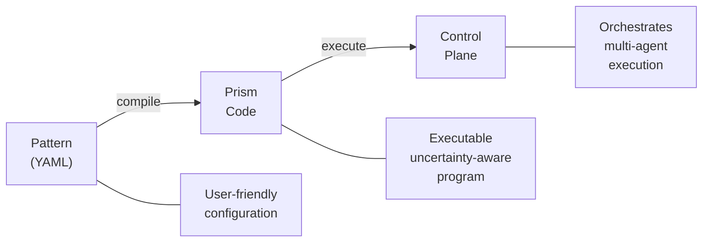

# Prism DSL

<div className="prism-hero">
  
  
  <p style={{color: 'var(--ifm-color-emphasis-600)', marginTop: '0.5rem'}}>
    <strong>Powered by Prism</strong> — A language where uncertainty is a first-class citizen
  </p>
</div>

Prism is the domain-specific language that powers Parallax pattern execution. When you write patterns in YAML, they compile to Prism code for execution.

## What is Prism?

Prism is a TypeScript-based programming language where **uncertainty is a first-class citizen**. It's designed specifically for AI-driven applications where confidence levels matter.



## Key Features

### First-Class Uncertainty

Values in Prism can carry confidence scores that automatically propagate through calculations:

```prism
// Attach confidence to a value
temperature = 72.5 ~> 0.95

// Confidence propagates through operations
adjusted = temperature + 5  // Inherits confidence
```

### Native LLM Integration

Prism has built-in support for LLM operations with automatic confidence extraction:

```prism
analysis = llm("Analyze this code for vulnerabilities")
// 'analysis' automatically includes extracted confidence
```

### Confidence-Based Control Flow

The `uncertain if` statement enables branching based on confidence thresholds:

```prism
uncertain if (analysis) {
  high { deploy_to_production() }    // confidence >= 0.7
  medium { request_human_review() }  // 0.5 <= confidence < 0.7
  low { block_deployment() }         // confidence < 0.5
}
```

## Why Prism for Multi-Agent Systems?

Prism is ideal for Parallax because:

1. **Confidence Propagation**: When multiple agents produce results with varying confidence, Prism can combine and propagate these values meaningfully.

2. **Threshold Gating**: Quality gates and validation become natural language constructs rather than complex conditional logic.

3. **AI-Native Operations**: LLM calls are first-class operations with built-in uncertainty handling.

4. **Aggregation Semantics**: Voting, consensus, and merging operations have semantic support.

## Relationship to YAML Patterns

Most users write patterns in YAML, which provides a declarative, user-friendly format:

```yaml
name: sentiment-classifier
version: 1.0.0

agents:
  capabilities: [classification]
  min: 3

aggregation:
  strategy: voting
  method: majority

validation:
  minConfidence: 0.7
```

This YAML compiles to Prism code that the control plane executes:

```prism
pattern sentiment_classifier {
  agents = select(capabilities: ["classification"], min: 3)

  results = parallel agents {
    llm("Classify the sentiment of: {{input.text}}")
  }

  vote_result = vote(results, method: "majority")

  uncertain if (vote_result) {
    high { return vote_result }
    medium { return vote_result with warning }
    low { fail("Confidence below threshold") }
  }
}
```

## When to Use Prism Directly

While YAML covers most use cases, you might write Prism directly for:

- **Complex Control Flow**: Patterns with dynamic branching logic
- **Custom Aggregation**: Aggregation algorithms beyond built-in strategies
- **Advanced Confidence Handling**: Custom confidence calculations
- **Performance Optimization**: Fine-tuned execution control

## Resources

- **Prism Documentation**: [docs.prismlang.dev](https://docs.prismlang.dev/)
- **Prism Repository**: [github.com/HaruHunab1320/Prism-TS](https://github.com/HaruHunab1320/Prism-TS)

## Next Steps

- [Prism Syntax](/prism/syntax) - Complete syntax reference
- [YAML to Prism Compilation](/prism/compilation) - How patterns compile
- [Using Prism Directly](/prism/using-prism-directly) - Write Prism code
