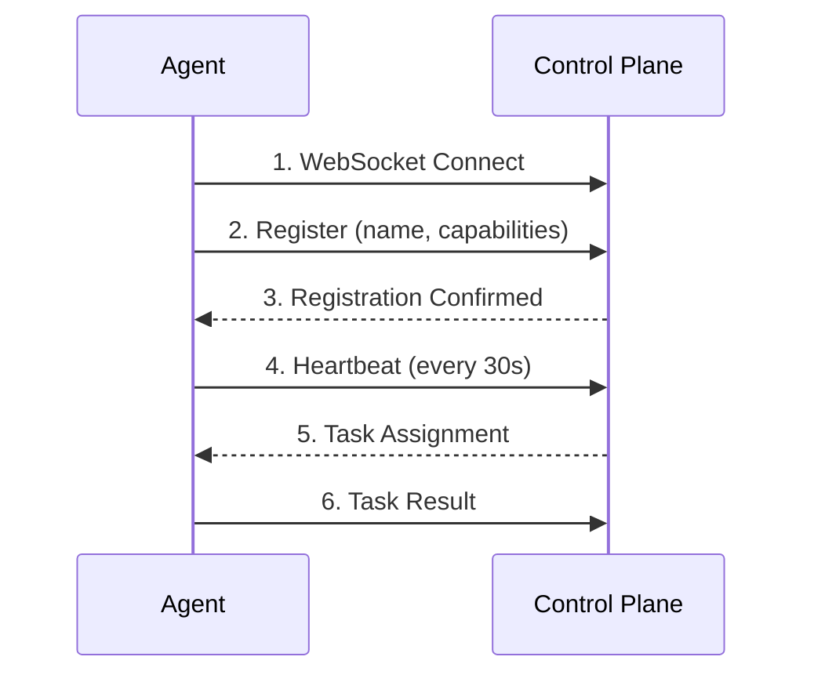

# Agent Registration

Agent registration is the process by which agents connect to the Parallax control plane and make themselves available to execute tasks.

## Registration Flow



## Basic Registration

```typescript
import { ParallaxAgent } from '@parallax/sdk-typescript';

const agent = new ParallaxAgent({
  name: 'my-agent',
  capabilities: ['text-analysis', 'summarization'],
  controlPlaneUrl: 'http://localhost:8080',
});

agent.onTask(async (task) => {
  return {
    result: await processTask(task.input),
    confidence: 0.85,
  };
});

// Register and start receiving tasks
await agent.start();
```

## Configuration Options

### Required Options

```typescript
const agent = new ParallaxAgent({
  name: 'unique-agent-name',     // Must be unique across all agents
  capabilities: ['analysis'],     // At least one capability
});
```

### Connection Options

```typescript
const agent = new ParallaxAgent({
  name: 'my-agent',
  capabilities: ['analysis'],

  // Control plane URL (or use PARALLAX_CONTROL_PLANE_URL env var)
  controlPlaneUrl: 'http://localhost:8080',

  // Reconnection settings
  reconnectInterval: 5000,       // MS between reconnect attempts
  maxReconnectAttempts: 10,      // Max attempts before giving up (0 = infinite)

  // Connection timeout
  connectionTimeout: 10000,      // MS to wait for initial connection

  // Heartbeat settings
  heartbeatInterval: 30000,      // MS between heartbeats
});
```

### Execution Options

```typescript
const agent = new ParallaxAgent({
  name: 'my-agent',
  capabilities: ['analysis'],

  // Concurrent task handling
  maxConcurrentTasks: 5,         // Handle up to 5 tasks simultaneously

  // Task timeout
  taskTimeout: 60000,            // 60s timeout per task
});
```

### Metadata

```typescript
const agent = new ParallaxAgent({
  name: 'my-agent',
  capabilities: ['analysis'],

  // Custom metadata (visible to control plane)
  metadata: {
    model: 'gpt-4',
    version: '1.2.0',
    region: 'us-east-1',
    provider: 'openai',
  },

  // Tags for filtering
  tags: ['production', 'fast', 'english'],
});
```

## Capabilities

Capabilities are string identifiers that describe what an agent can do. The control plane uses capabilities to match tasks to agents.

### Naming Conventions

```typescript
// Task types
capabilities: ['text-analysis', 'summarization', 'translation']

// Languages
capabilities: ['english', 'spanish', 'french']

// Models
capabilities: ['gpt-4', 'claude-3', 'gemini']

// Quality tiers
capabilities: ['fast', 'standard', 'expert']

// Domains
capabilities: ['medical', 'legal', 'technical']
```

### Capability Matching

When a pattern requests agents:

```yaml
agents:
  capabilities: [analysis, english]
  min: 3
```

The control plane finds agents that have **all** requested capabilities:

```typescript
// ✅ Matches - has both 'analysis' AND 'english'
new ParallaxAgent({
  capabilities: ['analysis', 'english', 'gpt-4'],
});

// ❌ Doesn't match - missing 'english'
new ParallaxAgent({
  capabilities: ['analysis', 'gpt-4'],
});
```

### Dynamic Capabilities

Update capabilities at runtime:

```typescript
const agent = new ParallaxAgent({
  name: 'dynamic-agent',
  capabilities: ['analysis'],
});

// Add a capability
agent.addCapability('translation');

// Remove a capability
agent.removeCapability('analysis');

// Set all capabilities
agent.setCapabilities(['summarization', 'extraction']);
```

## Authentication

### API Key Authentication

```typescript
const agent = new ParallaxAgent({
  name: 'my-agent',
  capabilities: ['analysis'],
  controlPlaneUrl: 'https://api.parallax.dev',
  apiKey: process.env.PARALLAX_API_KEY,
});
```

### Token Authentication

```typescript
const agent = new ParallaxAgent({
  name: 'my-agent',
  capabilities: ['analysis'],
  auth: {
    type: 'token',
    token: process.env.PARALLAX_TOKEN,
    refreshToken: process.env.PARALLAX_REFRESH_TOKEN,
    onRefresh: (newToken) => {
      // Store the new token
    },
  },
});
```

### mTLS Authentication

```typescript
const agent = new ParallaxAgent({
  name: 'my-agent',
  capabilities: ['analysis'],
  tls: {
    cert: fs.readFileSync('client.crt'),
    key: fs.readFileSync('client.key'),
    ca: fs.readFileSync('ca.crt'),
  },
});
```

## Connection Lifecycle

### Startup

```typescript
const agent = new ParallaxAgent({ ... });

// Register task handler before starting
agent.onTask(async (task) => { ... });

// Start the agent
await agent.start();

// Agent is now connected and receiving tasks
```

### Events

```typescript
agent.on('connecting', () => {
  console.log('Connecting to control plane...');
});

agent.on('connected', () => {
  console.log('Connected and registered');
});

agent.on('registered', (info) => {
  console.log('Registered as:', info.agentId);
  console.log('Capabilities:', info.capabilities);
});

agent.on('disconnected', (reason) => {
  console.log('Disconnected:', reason);
});

agent.on('reconnecting', (attempt) => {
  console.log(`Reconnecting (attempt ${attempt})...`);
});

agent.on('reconnected', () => {
  console.log('Reconnected successfully');
});

agent.on('error', (error) => {
  console.error('Agent error:', error);
});
```

### Shutdown

```typescript
// Graceful shutdown - waits for active tasks
await agent.stop();

// Force shutdown - cancels active tasks
await agent.stop({ force: true });

// Shutdown with timeout
await agent.stop({ timeout: 10000 }); // Wait max 10s for tasks
```

### Handling Signals

```typescript
const agent = new ParallaxAgent({ ... });

// Graceful shutdown on SIGTERM/SIGINT
process.on('SIGTERM', async () => {
  console.log('Received SIGTERM, shutting down...');
  await agent.stop();
  process.exit(0);
});

process.on('SIGINT', async () => {
  console.log('Received SIGINT, shutting down...');
  await agent.stop();
  process.exit(0);
});

await agent.start();
```

## Health Checks

### Heartbeats

The SDK automatically sends heartbeats to the control plane:

```typescript
const agent = new ParallaxAgent({
  heartbeatInterval: 30000,  // Every 30 seconds
});

// The control plane marks agents as unhealthy if heartbeats stop
```

### Custom Health Checks

```typescript
const agent = new ParallaxAgent({
  name: 'my-agent',
  healthCheck: async () => {
    // Check dependencies
    const dbHealthy = await checkDatabase();
    const apiHealthy = await checkExternalApi();

    return {
      healthy: dbHealthy && apiHealthy,
      details: {
        database: dbHealthy,
        externalApi: apiHealthy,
      },
    };
  },
  healthCheckInterval: 60000,  // Check every minute
});
```

### Status Reporting

```typescript
// Get current agent status
const status = agent.getStatus();
// {
//   connected: true,
//   registered: true,
//   activeTasks: 2,
//   capabilities: ['analysis'],
//   uptime: 3600000,
// }

// Report to control plane
agent.reportStatus({
  load: 0.75,        // 75% capacity used
  healthy: true,
  custom: { queueLength: 5 },
});
```

## Multiple Agents

### Running Multiple Agents

```typescript
// Run multiple specialized agents
const agents = [
  new ParallaxAgent({
    name: 'analyzer-1',
    capabilities: ['analysis', 'gpt-4'],
  }),
  new ParallaxAgent({
    name: 'analyzer-2',
    capabilities: ['analysis', 'claude-3'],
  }),
  new ParallaxAgent({
    name: 'summarizer',
    capabilities: ['summarization'],
  }),
];

// Start all agents
await Promise.all(agents.map(a => {
  a.onTask(taskHandler);
  return a.start();
}));

// Stop all agents
await Promise.all(agents.map(a => a.stop()));
```

### Agent Pool

```typescript
import { AgentPool } from '@parallax/sdk-typescript';

const pool = new AgentPool({
  agents: [
    { name: 'analyzer', capabilities: ['analysis'], instances: 3 },
    { name: 'summarizer', capabilities: ['summarization'], instances: 2 },
  ],
  controlPlaneUrl: 'http://localhost:8080',
});

pool.onTask('analysis', analysisHandler);
pool.onTask('summarization', summarizationHandler);

await pool.start();  // Starts all agent instances
await pool.stop();   // Stops all agent instances
```

## Error Handling

### Connection Errors

```typescript
agent.on('error', (error) => {
  if (error.code === 'CONNECTION_REFUSED') {
    console.error('Control plane not available');
  } else if (error.code === 'AUTH_FAILED') {
    console.error('Authentication failed');
  } else if (error.code === 'DUPLICATE_NAME') {
    console.error('Agent name already registered');
  }
});
```

### Task Errors

```typescript
agent.onTask(async (task) => {
  try {
    return {
      result: await processTask(task.input),
      confidence: 0.85,
    };
  } catch (error) {
    // Report error to control plane
    throw new TaskError('Processing failed', {
      code: 'PROCESSING_ERROR',
      details: error.message,
      retryable: true,
    });
  }
});
```

## Best Practices

1. **Unique Names** - Use unique, descriptive agent names

2. **Graceful Shutdown** - Always handle SIGTERM/SIGINT for clean shutdown

3. **Health Checks** - Implement health checks for production agents

4. **Capability Precision** - Use specific capabilities rather than broad ones

5. **Concurrent Limits** - Set appropriate `maxConcurrentTasks` for your resources

6. **Timeouts** - Configure reasonable task timeouts

7. **Logging** - Log connection events and task processing

8. **Monitoring** - Track agent metrics in production

## Next Steps

- [Agents Concept](/docs/concepts/agents) - Understanding agents
- [Executing Patterns](/docs/sdk/executing-patterns) - Running patterns
- [TypeScript SDK](/docs/sdk/typescript) - Full SDK reference
