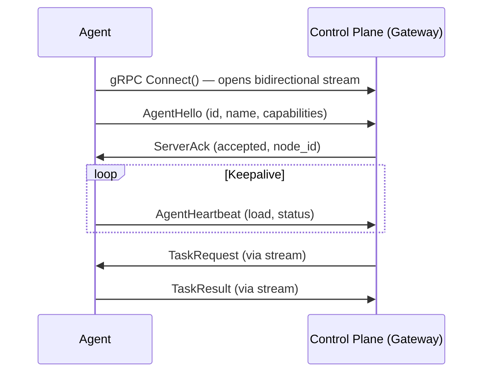

# Gateway Connection

Agents can connect to the control plane in two modes: **direct** (the agent hosts a gRPC server) or **gateway** (the agent opens an outbound stream to the control plane). Gateway mode is for agents behind NAT, firewalls, or in environments where exposing a public endpoint is impractical — Raspberry Pis, laptops, edge devices.

## How It Works



The agent calls `connectViaGateway()` instead of `serve()`. This opens a single outbound gRPC bidirectional stream. The control plane routes tasks to the agent through the same stream — no inbound port required.

## Direct vs Gateway

| | Direct (`serve()`) | Gateway (`connectViaGateway()`) |
|---|---|---|
| **Connection** | Agent starts gRPC server, control plane connects in | Agent connects out to control plane |
| **NAT traversal** | Requires port forwarding or public IP | Works behind NAT, firewalls |
| **Registration** | Registers address with registry | Registered automatically on connect |
| **Use case** | Cloud VMs, Kubernetes pods | Raspberry Pis, laptops, edge devices |
| **Reconnect** | N/A (server is always listening) | Auto-reconnect with exponential backoff |

## Usage

```typescript
import { ParallaxAgent } from '@parallaxai/sdk-typescript';

class MyAgent extends ParallaxAgent {
  constructor() {
    super('my-agent', 'My Agent', ['code-review']);
  }

  async analyze(task: string, data?: any) {
    return this.createResult({ done: true }, 0.9);
  }
}

const agent = new MyAgent();

// Connect via gateway (outbound) instead of serve() (inbound)
await agent.connectViaGateway('control-plane.example.com:8081', {
  heartbeatIntervalMs: 10000,
  autoReconnect: true,
  maxReconnectAttempts: Infinity,
  initialReconnectDelayMs: 1000,
  maxReconnectDelayMs: 30000,
});
```

## GatewayOptions

```typescript
interface GatewayOptions {
  /** gRPC channel credentials (default: insecure) */
  credentials?: grpc.ChannelCredentials;
  /** Heartbeat interval in ms (default: 10000) */
  heartbeatIntervalMs?: number;
  /** Auto-reconnect on disconnect (default: true) */
  autoReconnect?: boolean;
  /** Max reconnect attempts (default: Infinity) */
  maxReconnectAttempts?: number;
  /** Initial reconnect delay in ms (default: 1000) */
  initialReconnectDelayMs?: number;
  /** Max reconnect delay in ms, caps exponential backoff (default: 30000) */
  maxReconnectDelayMs?: number;
}
```

## Connection Lifecycle

1. **Connect** — agent opens a bidirectional gRPC stream via `AgentGateway.Connect()`
2. **Hello** — agent sends `AgentHello` with its ID, name, capabilities, and metadata
3. **Ack** — control plane responds with `ServerAck` (accepted/rejected, assigned node ID)
4. **Heartbeat** — agent sends periodic `AgentHeartbeat` messages to keep the connection alive
5. **Tasks** — control plane sends `TaskRequest` messages; agent responds with `TaskResult` or `TaskError`
6. **Threads** — control plane can send `ThreadSpawnRequest`, `ThreadInputRequest`, `ThreadStopRequest` (see [Gateway Thread Protocol](./gateway-threads))
7. **Disconnect** — on stream error or end, the agent automatically reconnects with exponential backoff

## Reconnection

When the gateway stream drops, the SDK:

1. Cleans up the heartbeat timer
2. Cleans up all active threads (calls their cleanup functions)
3. Waits `initialReconnectDelayMs` (default 1s)
4. Attempts to reconnect, doubling the delay each time up to `maxReconnectDelayMs` (default 30s)
5. Continues until `maxReconnectAttempts` is reached (default: unlimited)

## Agent Addressing

Gateway-connected agents are addressed as `gateway://<agent-id>` internally. The control plane's `AgentProxy` routes task dispatch through the gateway stream instead of making a direct gRPC call. This is transparent to patterns and orchestration logic.

## Environment Variables

| Variable | Description |
|----------|-------------|
| `PARALLAX_GATEWAY` | Default gateway endpoint (e.g. `control-plane:8081`) |
| `PARALLAX_PROTO_DIR` | Override proto file directory for the SDK |
