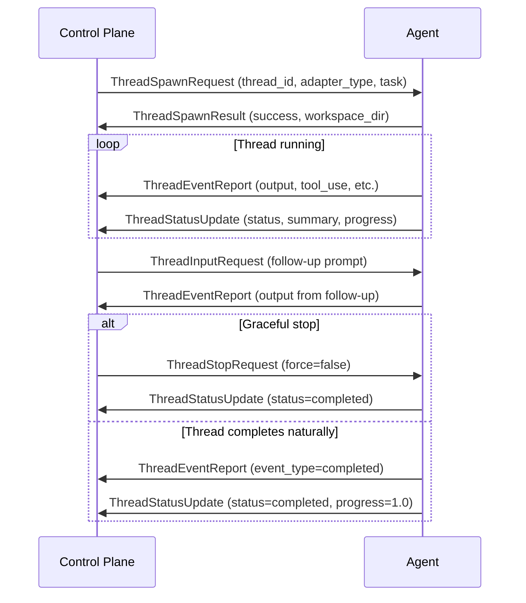

# Gateway Thread Protocol

The gateway thread protocol extends the bidirectional gRPC stream with 6 message types for managing long-lived CLI agent threads. This is how the control plane spawns, monitors, communicates with, and stops coding agent sessions running on remote machines.

## Protocol Messages

### Control Plane → Agent

#### ThreadSpawnRequest

Request the agent to spawn a new CLI agent thread.

```protobuf
message ThreadSpawnRequest {
  string thread_id = 1;          // Pre-assigned thread ID
  string adapter_type = 2;       // "claude-code", "gemini-cli", "codex", etc.
  string task = 3;               // Initial prompt/task
  string preparation_json = 4;   // JSON: workspace config, env vars, bootstrap files
  string policy_json = 5;        // JSON: timeouts, permissions, approval preset
  int32 timeout_ms = 6;          // Max thread runtime (0 = no timeout)
}
```

#### ThreadInputRequest

Send text input to a running thread (follow-up prompts, approvals, keystrokes).

```protobuf
message ThreadInputRequest {
  string thread_id = 1;
  string input = 2;              // Text to send to the thread's stdin
  string input_type = 3;         // "text", "approval", or "key"
}
```

#### ThreadStopRequest

Request the agent to stop a running thread.

```protobuf
message ThreadStopRequest {
  string thread_id = 1;
  string reason = 2;             // Why the thread is being stopped
  bool force = 3;                // true = kill immediately, false = graceful shutdown
}
```

### Agent → Control Plane

#### ThreadSpawnResult

Agent confirms thread spawned (or reports failure).

```protobuf
message ThreadSpawnResult {
  string thread_id = 1;
  bool success = 2;
  string error_message = 3;      // Set when success=false
  string adapter_type = 4;       // Adapter actually used
  string workspace_dir = 5;      // Workspace directory on the agent
}
```

#### ThreadEventReport

Streaming thread lifecycle events — output lines, state changes, tool use, errors.

```protobuf
message ThreadEventReport {
  string thread_id = 1;
  string event_type = 2;         // output, blocked, prompt_ready, completed, failed, tool_use
  string data_json = 3;          // JSON event payload
  int64 timestamp_ms = 4;        // Unix milliseconds
  int32 sequence = 5;            // Monotonic sequence within the thread
}
```

Common `event_type` values:

| Event Type | Description |
|------------|-------------|
| `output` | Terminal output from the CLI agent |
| `blocked` | Agent is waiting for input/approval |
| `prompt_ready` | Agent is at a prompt, ready for next instruction |
| `tool_use` | Agent is running a tool (file edit, shell command, etc.) |
| `completed` | Thread finished its task successfully |
| `failed` | Thread encountered an unrecoverable error |
| `turn_complete` | One conversation turn completed |
| `summary_updated` | Agent updated its work summary |

#### ThreadStatusUpdate

Periodic status and summary updates from the agent.

```protobuf
message ThreadStatusUpdate {
  string thread_id = 1;
  string status = 2;             // running, blocked, prompt_ready, completed, failed
  string summary = 3;            // Human-readable summary of current state
  double progress = 4;           // 0.0–1.0 progress indicator
  int64 timestamp_ms = 5;
}
```

## Message Flow



## JSON Fields

`preparation_json` and `policy_json` use JSON strings rather than `google.protobuf.Struct` to avoid lossy conversion of typed nested objects through the dynamic proto-loader.

### preparation_json

```json
{
  "workspace": {
    "repo": "https://github.com/org/repo.git",
    "branch": "feature-branch",
    "workspacePath": "/home/pi/workspaces/thread-abc"
  },
  "environment": {
    "GITHUB_TOKEN": "...",
    "NODE_ENV": "development"
  },
  "bootstrapFiles": {
    ".parallax/thread-memory.md": "# Context\n..."
  }
}
```

### policy_json

```json
{
  "approvalPreset": "autonomous",
  "timeout": 600000,
  "permissions": ["file_write", "shell_exec", "git_push"],
  "maxTurns": 50
}
```

## Event Routing

Thread events flow from the agent through the gateway service to the `ExecutionEventBus`, which makes them available to:

- **Patterns** — Prism scripts can react to thread state changes
- **SSE endpoint** — `GET /api/executions/:id/threads/stream` (see [Thread Stream API](../api/thread-stream))
- **Web dashboard** — real-time terminal grid display
- **Org-chart orchestrator** — monitors thread completion and coordinates next steps
