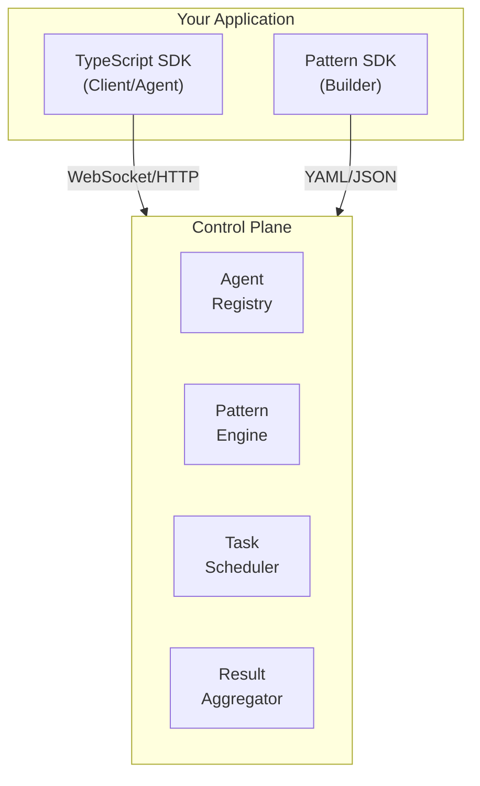

# SDK Overview

Parallax provides official SDKs for building agents and orchestrating patterns. The SDKs handle communication with the control plane, task management, and result aggregation.

## Available SDKs

| SDK | Package | Purpose |
|-----|---------|---------|
| **TypeScript** | `@parallax/sdk-typescript` | Build agents, execute patterns, client applications |
| **Pattern SDK** | `@parallax/pattern-sdk` | Build, validate, and compile patterns programmatically |

## Quick Comparison

### TypeScript SDK

For building agents and client applications:

```typescript
import { ParallaxAgent, ParallaxClient } from '@parallax/sdk-typescript';

// Build an agent
const agent = new ParallaxAgent({
  name: 'my-agent',
  capabilities: ['analysis'],
});

agent.onTask(async (task) => {
  return { result: await process(task), confidence: 0.9 };
});

agent.start();

// Or execute patterns as a client
const client = new ParallaxClient({ url: 'http://localhost:8080' });
const result = await client.executePattern('sentiment-analysis', {
  text: 'Great product!'
});
```

### Pattern SDK

For programmatically building patterns:

```typescript
import { PatternBuilder, validatePattern } from '@parallax/pattern-sdk';

const pattern = new PatternBuilder('content-moderation')
  .input({ content: 'string' })
  .agents({ capabilities: ['moderation'], min: 3 })
  .parallel({ timeout: 30000 })
  .voting({ method: 'majority' })
  .output({ verdict: '$vote.result' })
  .build();

// Validate the pattern
const validation = validatePattern(pattern);
if (!validation.valid) {
  console.error(validation.errors);
}
```

## Installation

### TypeScript SDK

```bash
npm install @parallax/sdk-typescript
# or
pnpm add @parallax/sdk-typescript
# or
yarn add @parallax/sdk-typescript
```

### Pattern SDK

```bash
npm install @parallax/pattern-sdk
# or
pnpm add @parallax/pattern-sdk
# or
yarn add @parallax/pattern-sdk
```

## Architecture Overview



## Common SDK Operations

### Agent Operations

| Operation | SDK | Method |
|-----------|-----|--------|
| Register agent | TypeScript | `agent.start()` |
| Handle tasks | TypeScript | `agent.onTask(handler)` |
| Disconnect | TypeScript | `agent.stop()` |
| Send heartbeat | TypeScript | Automatic |

### Client Operations

| Operation | SDK | Method |
|-----------|-----|--------|
| Execute pattern | TypeScript | `client.executePattern()` |
| Stream results | TypeScript | `client.streamPattern()` |
| List patterns | TypeScript | `client.listPatterns()` |
| Get pattern status | TypeScript | `client.getExecution()` |

### Pattern Operations

| Operation | SDK | Method |
|-----------|-----|--------|
| Build pattern | Pattern SDK | `PatternBuilder` |
| Validate pattern | Pattern SDK | `validatePattern()` |
| Compile to YAML | Pattern SDK | `compileToYaml()` |
| Parse YAML | Pattern SDK | `parsePattern()` |

## Configuration

### Environment Variables

```bash
# Control plane connection
PARALLAX_CONTROL_PLANE_URL=http://localhost:8080

# Agent configuration
PARALLAX_AGENT_NAME=my-agent
PARALLAX_AGENT_CAPABILITIES=analysis,summarization

# Client configuration
PARALLAX_API_KEY=your-api-key

# Logging
PARALLAX_LOG_LEVEL=info
```

### Programmatic Configuration

```typescript
import { ParallaxClient } from '@parallax/sdk-typescript';

const client = new ParallaxClient({
  url: process.env.PARALLAX_URL || 'http://localhost:8080',
  apiKey: process.env.PARALLAX_API_KEY,
  timeout: 30000,
  retries: 3,
  logging: {
    level: 'info',
    format: 'json',
  },
});
```

## Error Handling

All SDKs use typed errors:

```typescript
import {
  ParallaxError,
  ConnectionError,
  TimeoutError,
  ValidationError,
  PatternNotFoundError,
} from '@parallax/sdk-typescript';

try {
  const result = await client.executePattern('my-pattern', input);
} catch (error) {
  if (error instanceof TimeoutError) {
    console.error('Pattern execution timed out');
  } else if (error instanceof PatternNotFoundError) {
    console.error('Pattern does not exist');
  } else if (error instanceof ValidationError) {
    console.error('Input validation failed:', error.details);
  } else if (error instanceof ConnectionError) {
    console.error('Cannot connect to control plane');
  }
}
```

## TypeScript Support

All SDKs are written in TypeScript and provide full type definitions:

```typescript
import {
  ParallaxAgent,
  TaskHandler,
  TaskResult,
  AgentConfig,
} from '@parallax/sdk-typescript';

// Typed task handler
const handler: TaskHandler<MyInput, MyOutput> = async (task) => {
  const input: MyInput = task.input;

  const result: TaskResult<MyOutput> = {
    result: processInput(input),
    confidence: 0.85,
  };

  return result;
};

// Typed configuration
const config: AgentConfig = {
  name: 'typed-agent',
  capabilities: ['analysis'],
  maxConcurrentTasks: 5,
};
```

## Next Steps

- [TypeScript SDK](/docs/sdk/typescript) - Full SDK documentation
- [Pattern SDK](/docs/sdk/pattern-sdk) - Building patterns programmatically
- [Agent Registration](/docs/sdk/agent-registration) - Deep dive into agent setup
- [Executing Patterns](/docs/sdk/executing-patterns) - Pattern execution guide
