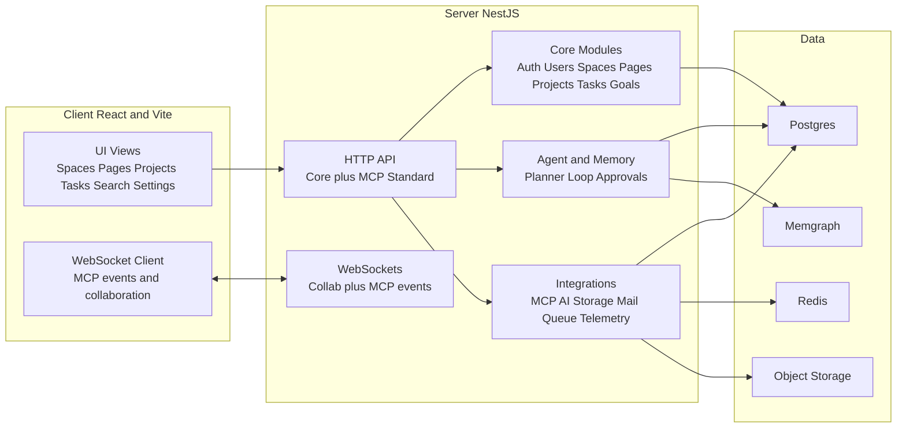
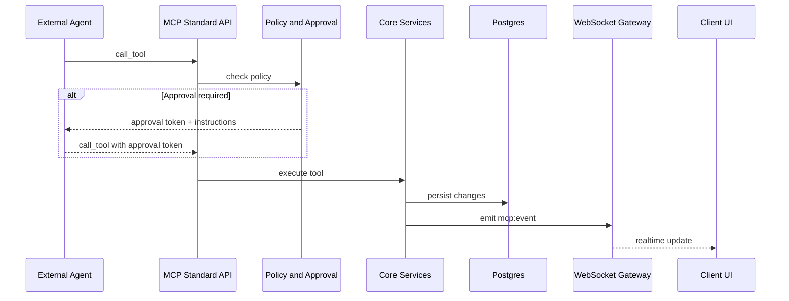
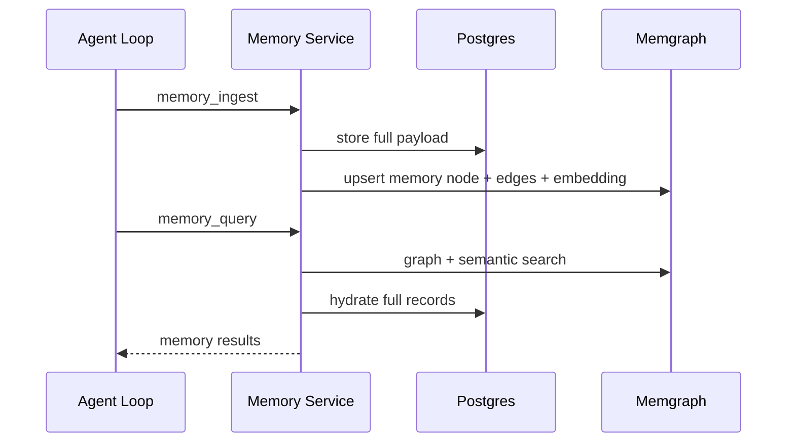
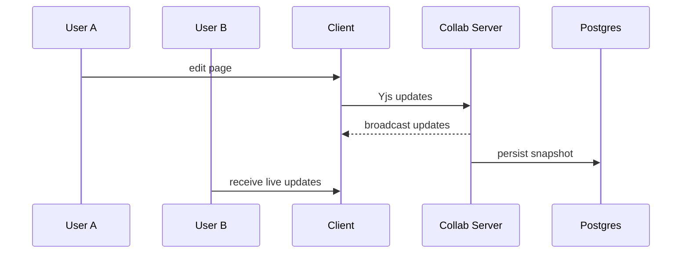

# Raven Docs - Architecture Review (Portfolio Notes)

## One-line summary
AI-native knowledge workspace that blends collaborative documentation, GTD project management, and agent workflows with MCP-based external tool access and human-in-the-loop approvals.

## Architecture at a glance (diagram)

## Architecture deep dive

### 1) Core product surfaces
- **Knowledge system**: spaces, pages, comments, attachments, history, and search are first-class.
- **Project management**: projects and tasks live alongside docs, with GTD buckets, dashboards, kanban, and task drawers.
- **Agent UX**: chat drawer, approvals, and insights surfaces connect agent output directly to pages and tasks.

### 2) Backend domain modules (NestJS)
- **Core modules**: auth, users, workspace, spaces, pages, comments, attachments, search, projects, tasks, goals.
- **Collaboration**: Hocuspocus/Yjs for realtime doc editing and presence.
- **Agent systems**: daily planner + multi-horizon plans + approval gating.
- **MCP gateway**: standard MCP endpoints with tool discovery and permissions.

### 3) MCP Standard interface
- **Single integration path**: `/api/mcp-standard/*` exposes the tool surface.
- **Auth model**: API keys scoped to user + workspace, enforced by permission guards.
- **Approval pipeline**: policy rules determine auto-apply vs approval-required vs deny.
- **Eventing**: MCP actions emit websocket events used by the client to update UI.

### 4) Agent memory system
- **Postgres**: canonical storage for full memory records and metadata.
- **Memgraph**: entity graph + vector embeddings for relationship and semantic retrieval.
- **Memory UI**: daily summaries, memory days list, and graph views in Insights.

### 5) Real-time systems
- **Doc collaboration**: WebSocket collaboration for page edits and presence.
- **MCP events**: mcp:event gateway for tool-side changes (pages, tasks, etc.).
- **Client subscriptions**: WebSocket client receives both collaboration updates and MCP events.

## Human-in-the-loop swarm orchestration (Parallax integration)
- Raven Docs is the human control plane: approvals, policy tiers, and UI surfaces make autonomous work safe and observable.
- With Parallax connected, Raven Docs can **spawn and orchestrate multiple agents** (Claude Code, Codex, Gemini, Aider) against a shared project.
- Agents operate on the same project state (tasks, pages, comments); actions flow through MCP and are reflected live in the UI.
- Humans can define a project, set priorities, and let the system run autonomously while monitoring progress via real-time updates.
- Approvals gate sensitive actions so the swarm can move fast without sacrificing control.

## Key flows (diagrams)

### A) MCP tool call with approvals

### B) Agent memory ingest and query

### C) Collaborative edit lifecycle

## Data architecture
- **Postgres**: pages, tasks, projects, memories, approvals, users, workspaces.
- **Redis**: cache, approvals context, background job state.
- **Memgraph**: memory graph + embeddings + entity relationships.
- **Object storage**: attachments (local or S3 compatible).

## Repo structure (high-signal)
- `apps/client` - React UI and feature modules
- `apps/server` - NestJS API, MCP Standard, realtime services
- `packages/editor-ext` - editor extensions and markdown utilities
- `docs` - architecture, MCP, workflows, planning
- `infra` - infrastructure and deployment assets

## Tech stack snapshot
- Frontend: React, Vite, Tiptap, Mantine UI
- Backend: NestJS, Fastify, Socket.io
- Data: Postgres, Redis, Memgraph
- Infra: Docker Compose, Terraform, GCP Cloud Run

## Portfolio framing (what to emphasize)
- Human AI collaboration: approvals, policy tiers, auditability.
- System design: clear separation of UI, API, agent systems, and MCP interface Dto layers.
- Knowledge + project workflows: docs, GTD tasks, projects, goals in one surface.
- Extensible tooling: MCP Standard with broad tool coverage.
- Memory as product: graph + embeddings that feed planning and suggestions.
