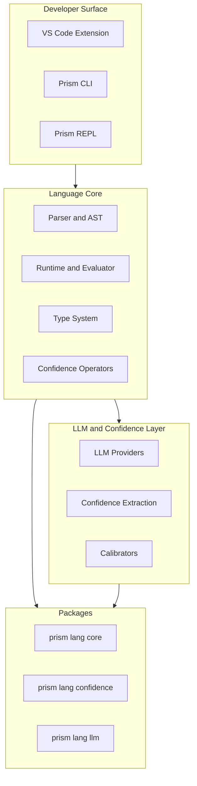
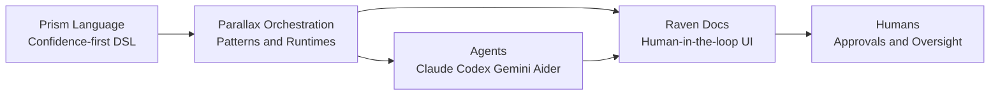

# Prism - Architecture and Vision (Portfolio Notes)

## One-line summary
Uncertainty-first programming language that makes LLMs first-class citizens with native confidence handling, powering Parallax orchestration patterns and a future calibrated-confidence model stack (Lumina).

## How Prism powers Parallax
- Parallax patterns are written in Prism, so orchestration logic is **code with confidence-aware control flow**.
- This enables agent swarms to make **probabilistic decisions** (consensus, escalation, fallback) in a deterministic, auditable way.
- Prism makes multi-agent orchestration composable: primitives and patterns map directly onto DSL constructs like `uncertain if`, confidence operators, and ensemble ops.

## Architecture at a glance (diagram)



## Core ideas
- **Uncertainty as a first-class concept**: confidence is explicit and flows through control structures and operators.
- **LLM-native syntax**: prompts and model calls are built into the language with structured output support.
- **Confidence operators**: assignment, arithmetic, logical, coalescing, and ensemble operations preserve confidence.
- **Streaming-first workflows**: stream tokens with `stream_llm()` and cancel when humans intervene.

## Language features (high-signal)
- Confidence ops: `~>`, `<~`, `~??`, `~||>`, `~&&`, `~||`, `~+`, `~-`, `~*`, `~/`
- Control flow: `uncertain if`, `uncertain while`, confidence-aware ternary `~?`
- LLM integration: configurable providers, models, temperature, and structured output options
- Runtime and tooling: parser + AST + evaluator, CLI and REPL, VS Code syntax highlighting

## Package structure
- `@prism-lang/core` - parser, runtime, types, confidence operators
- `@prism-lang/confidence` - confidence extraction + calibration utilities
- `@prism-lang/llm` - provider integrations (Claude, Gemini, OpenAI)
- `@prism-lang/cli` + `@prism-lang/repl` - developer tooling


## Prism in Parallax (example)
```prism
/**
 * Consensus pattern with confidence-aware escalation
 */
import { parallel } from "@parallax/primitives/execution"
import { consensus } from "@parallax/primitives/aggregation"

results = parallel(agents, task)
decision = consensus(results, { threshold: 0.85 })

decision ~> 0.85 ? decision : escalate("human-review")
```


## Why this matters
Prism reframes LLM software from yes/no outputs to **confidence-weighted reasoning**, so systems can route work based on calibrated uncertainty instead of brittle thresholds. That unlocks safer autonomy (escalate when uncertain), better multi-agent consensus (weight by confidence), and transparent human-in-the-loop oversight.

## Vision: calibrated confidence as the native substrate
- Prism is designed for a model paradigm where responses return **calibrated confidence** natively.
- The Lumina model architecture is aimed at producing **confidence scores** (like logprobs, but calibrated) so language can reason in a **continuous vector space of likelihoods**.
- This makes uncertainty handling intrinsic instead of bolted on, enabling safer orchestration, autonomous planning, and human-in-the-loop control.

## Portfolio framing (what to emphasize)
- Language design around uncertainty rather than binary truthiness.
- Full toolchain: parser, runtime, CLI/REPL, language extensions.
- Systems impact: Prism underpins Parallax to orchestrate multi-agent systems with confidence-aware logic.
- Forward-looking research: model architecture vision for calibrated confidence at the core of LLM responses.


## Prism -> Parallax -> Raven Docs (system flow)



## Lumina roadmap (how it slots in)
- **Today**: Prism provides confidence operators + extraction tooling, Parallax uses Prism patterns to orchestrate agents.
- **Near term**: Confidence extraction and calibration harden across providers; Prism becomes the lingua franca for uncertainty-aware workflows.
- **Mid term**: Lumina training produces calibrated confidence scores natively, reducing heuristics and post-processing.
- **Long term**: Native confidence becomes a standard model interface; Prism and Parallax become the reference stack for safe, autonomous systems.
