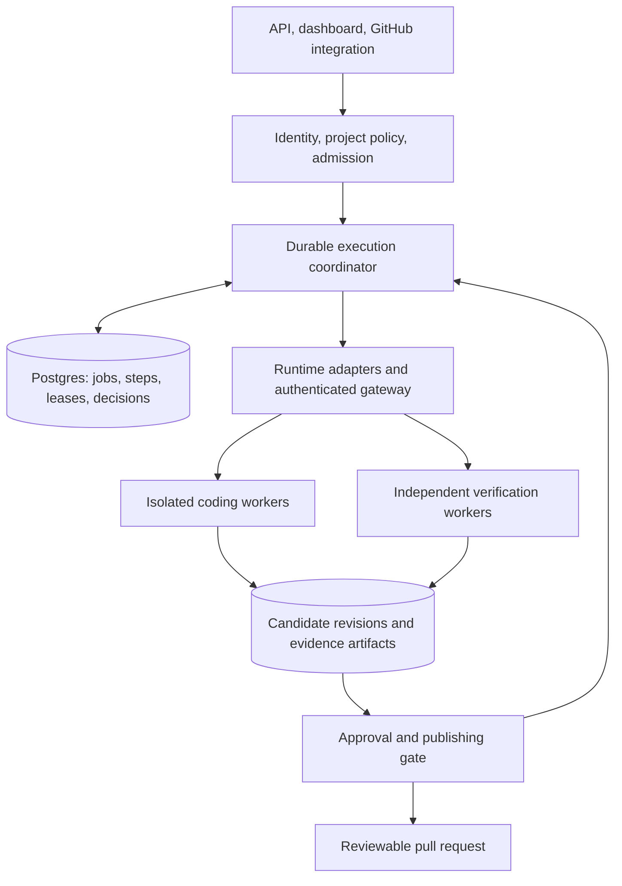

# Parallax enterprise readiness review

Reviewed September 4, 2026 · local checkout `e3c98eb`

**Historical baseline:** the findings below describe commit `e3c98eb`, before the subsequent hardening patch. See the [implementation report](HARDENING_IMPLEMENTATION_2026-09-04.md) for fixes, verification evidence, setup changes, and remaining work; fixed findings below should not be mistaken for current behavior.

**Assessment: a useful, substantial engineering prototype with a credible path to an enterprise product. It is not yet ready for an exposed, shared production service.** The most valuable investment is strengthening execution guarantees, isolation, and verification. Preserve the runtime adapters and agent/thread distinction; concentrate the product around delivering reviewed, reproducible code changes in customer-controlled environments.

This assessment combines source inspection, local tests, and isolated behavioral probes. It is not a deployed-system penetration test, a capacity benchmark, or a certification assessment. Existing untracked files were left intact. Application code was not changed.

**Readiness depends on the deployment model.**

| Offering | Assessment |
|---|---|
| Trusted developer experimentation | Useful today, with the operator understanding the host access and execution behavior. |
| Supervised internal pilot | Plausible after the immediate authorization, verification, and cancellation defects are fixed and one runtime is validated end to end. |
| Dedicated deployment for one enterprise | A credible first commercial target, after durable recovery, worker isolation, identity, and operational acceptance tests. |
| Shared service for unrelated customers | Requires explicit tenant ownership throughout storage, authorization, memory, credentials, scheduling, and runtime isolation. |
| Unattended, consequential production changes | Requires durable approval gates, verified artifacts, effective cancellation, and controlled publishing credentials. |

**The useful product is verified code-change delivery.**

Parallax addresses real coordination work: launching coding agents, preparing repositories, delegating tasks, supervising blocked sessions, reviewing results, and retaining execution history. Supporting outbound agent connections is especially useful for customer networks and private execution environments. The separation of execution substrate (`agent`) from supervised work (`thread`) is a sound foundation.

The strongest initial uses are bounded repository maintenance, repeatable migrations across repositories, and bug fixes with established acceptance tests. A platform-engineering buyer can understand the outcome: turn a defined maintenance backlog into reviewable pull requests under company policy. An org chart is a useful authoring interface; the business outcome should lead the product experience.

Verification is a promising distinction. The local [July 20 experiment](/Users/jakobgrant/Workspaces/parallax/docs/experiments/2026-07-20-self-tests-pass-scope-shrinks.md) records passing self-authored tests despite missing requirements. The [July 21 follow-up](/Users/jakobgrant/Workspaces/parallax/docs/experiments/2026-07-21-the-rematch-reviewer-wins.md) records a reviewer detecting missing scope and triggering correction. Those reports support further investment, but two runs do not establish general effectiveness or commercial demand.

Evaluate single-agent execution against a small team on the same tasks and budget. Measure accepted changes, defects found after delivery, reviewer time, total cost, wall time, abandoned runs, and human interventions. More agents are worthwhile only where those outcomes improve. The retained evidence and measured policy effectiveness could become more defensible product assets than the number of supported agent CLIs.

**Immediate blockers: authorization and trust boundaries.**

1. **User-management authorization permits privilege escalation.** The global API gate authenticates callers, but the users router checks the license rather than the caller's administrative permissions. `PUT /users/:id` accepts role, status, and password changes. An isolated probe supplied an authenticated viewer and a mocked database: the handler returned HTTP 200 and passed `role: admin` and `status: active` into the update. Other sensitive routes also lack resource authorization. This was a handler-level reproduction, not a change to a real account. See [users.ts:218](/Users/jakobgrant/Workspaces/parallax/packages/control-plane/src/api/users.ts:218), [users.ts:291](/Users/jakobgrant/Workspaces/parallax/packages/control-plane/src/api/users.ts:291), and [server.ts:727](/Users/jakobgrant/Workspaces/parallax/packages/control-plane/src/server.ts:727).

   Establish one authorization layer, enforce it on every operation, and derive resource ownership from server-side records. Cover role changes, API-key creation for another user, execution, terminal input, workspace access, and destructive operations. The existing RBAC definitions are useful starting material, but their presence does not enforce permissions.

2. **Interfaces do not share a consistent security boundary.** REST authentication is initialized only when the license enables `multi_user`; the source explicitly leaves APIs open otherwise. The execution WebSocket upgrade bypasses that middleware, and its handler checks only the execution ID. The gRPC server registers services without an application identity interceptor; its TLS setup falls back to insecure credentials when configured files are missing or unreadable. Runtime HTTP servers also need authentication. See [server.ts:129](/Users/jakobgrant/Workspaces/parallax/packages/control-plane/src/server.ts:129), [server.ts:1033](/Users/jakobgrant/Workspaces/parallax/packages/control-plane/src/server.ts:1033), [executions.ts:775](/Users/jakobgrant/Workspaces/parallax/packages/control-plane/src/api/executions.ts:775), and [grpc-server.ts:146](/Users/jakobgrant/Workspaces/parallax/packages/control-plane/src/grpc/grpc-server.ts:146).

   Make basic authentication independent of commercial licensing. Require explicit development mode for open access, reject broken production TLS configuration, bind worker identity to credentials, and authorize streams as well as request/response APIs. Enterprise packaging can add federation, provisioning, and advanced policy without making the base system open.

3. **Password storage needs replacement.** Passwords use a single salted SHA-256 operation in two implementations. The configured `bcryptRounds` does not change that algorithm. See [auth-service.ts:446](/Users/jakobgrant/Workspaces/parallax/packages/control-plane/src/auth/auth-service.ts:446) and [users.ts:422](/Users/jakobgrant/Workspaces/parallax/packages/control-plane/src/api/users.ts:422). Consolidate password handling and migrate legacy hashes on successful authentication, or use a maintained identity service. OWASP recommends password-specific adaptive hashing such as Argon2id; fast SHA-256 hashing is unsuitable for passwords. [OWASP password storage guidance](https://cheatsheetseries.owasp.org/cheatsheets/Password_Storage_Cheat_Sheet.html).

**Immediate blockers: verification must enforce the product promise.**

4. **Missing verification can become successful verification.** Unknown oracle types return confidence `1.0`. Missing reviewers, unparseable reviewer responses, and reviewer failures also return `1.0`. The compiler accepts a misspelled oracle type. I reproduced the invalid type, missing reviewer, and failed reviewer cases locally. Combining these values by minimum still permits a missing required check to appear successful when the other checks pass. See [workflow-executor.ts:822](/Users/jakobgrant/Workspaces/parallax/packages/control-plane/src/org-patterns/workflow-executor.ts:822), [workflow-executor.ts:925](/Users/jakobgrant/Workspaces/parallax/packages/control-plane/src/org-patterns/workflow-executor.ts:925), and [workflow-executor.ts:947](/Users/jakobgrant/Workspaces/parallax/packages/control-plane/src/org-patterns/workflow-executor.ts:947).

   Use explicit results such as `passed`, `failed`, `unavailable`, `inconclusive`, and `skipped`. Required checks must block acceptance when unavailable. Historical priors can remain optional supplements, but must not substitute for execution evidence. Validate YAML at load time and reject unsupported configuration. The declared `combine` setting is currently ignored in favor of `min`; either implement the advertised choices or reject them.

5. **Review and escalation are not reliable release gates.** A standalone review step emits a verdict but returns normally after rejection. The approval step asks an agent for approval and returns its response; it is not a durable human authorization. Escalation returns the supervisor's answer without re-running the failed verification. An unroutable escalation can also return a result and allow the workflow to complete. See [workflow-executor.ts:659](/Users/jakobgrant/Workspaces/parallax/packages/control-plane/src/org-patterns/workflow-executor.ts:659), [workflow-executor.ts:1140](/Users/jakobgrant/Workspaces/parallax/packages/control-plane/src/org-patterns/workflow-executor.ts:1140), and [workflow-executor.ts:1186](/Users/jakobgrant/Workspaces/parallax/packages/control-plane/src/org-patterns/workflow-executor.ts:1186).

   Separate task completion, verification outcome, and permission to publish. A corrected artifact must pass the required checks again. Human approval should name the authenticated approver, exact revision, policy version, and expiry; later changes invalidate it. Add a durable blocked state that survives restart and can be explicitly approved, rejected, retried, or cancelled.

6. **Verification commands run inside the control-plane process environment.** The command oracle calls a shell directly and defaults its working directory to `process.cwd()`. A remote worker's workspace path is not necessarily present on the control plane. This also grants the verification process access to the coordinator's environment and available credentials. See [workflow-executor.ts:869](/Users/jakobgrant/Workspaces/parallax/packages/control-plane/src/org-patterns/workflow-executor.ts:869).

   Move command verification to isolated workers. Verify a captured candidate revision with controlled environment variables, restricted network access, immutable test policy, and retained logs. Run final integration checks after combining agent contributions. Bind evidence to a commit or content digest, verifier version, policy version, and test result. The coding agent should not be able to redefine the acceptance criteria silently.

**Execution reliability is the largest architectural investment.**

7. **Cancellation currently updates status without cancelling work.** The cancellation endpoint changes stored status, notifies clients, and closes streams, but does not call the executor or stop runtime threads. Execution timeouts use `Promise.race`, which does not itself stop the losing computation. That computation can continue toward completion and workspace publication. See [executions.ts:557](/Users/jakobgrant/Workspaces/parallax/packages/control-plane/src/api/executions.ts:557) and [pattern-engine.ts:619](/Users/jakobgrant/Workspaces/parallax/packages/control-plane/src/pattern-engine/pattern-engine.ts:619).

   Implement cancellation as a durable state transition and propagate it to all activities. Require a worker acknowledgement or an explicit unresolved state. Recheck authorization to publish immediately before external side effects. Make terminal transitions conditional so a late completion cannot overwrite a cancellation.

8. **Restart recovery is failure marking, and HA recovery can invalidate healthy work.** Workflow variables and step position live in memory. Startup recovery marks pending/running executions failed. The HA leader's recovery query selects all pending/running rows without checking whether their owner is still alive. `markOrphaned` also updates by ID without the status guard its comment describes. See [workflow-executor.ts:127](/Users/jakobgrant/Workspaces/parallax/packages/control-plane/src/org-patterns/workflow-executor.ts:127), [startup-recovery.ts:89](/Users/jakobgrant/Workspaces/parallax/packages/control-plane/src/resilience/startup-recovery.ts:89), and [execution.repository.ts:193](/Users/jakobgrant/Workspaces/parallax/packages/control-plane/src/db/repositories/execution.repository.ts:193).

   Persist step attempts, timers, decisions, and activity ownership. Recover only expired ownership leases; use generation numbers to prevent an old owner from writing after takeover. Reconcile workers and external effects before retrying ambiguous operations. A rolling restart should preserve valid work and should never create duplicate pull requests.

9. **Execution identity splits between the outer engine and the org workflow.** The pattern engine has an execution ID, but `WorkflowExecutor.execute()` generates another UUID. That second ID becomes the thread context; the wrapper does not pass the outer ID through. This undermines correlation, thread lookups by execution, cleanup, and policy accounting. See [pattern-engine.ts:607](/Users/jakobgrant/Workspaces/parallax/packages/control-plane/src/pattern-engine/pattern-engine.ts:607), [pattern-engine.ts:1312](/Users/jakobgrant/Workspaces/parallax/packages/control-plane/src/pattern-engine/pattern-engine.ts:1312), and [workflow-executor.ts:128](/Users/jakobgrant/Workspaces/parallax/packages/control-plane/src/org-patterns/workflow-executor.ts:128). Introduce one canonical run ID, with distinct step, attempt, thread, and worker-session IDs beneath it.

10. **Stored thread history is useful, but is not yet a recovery protocol.** Thread persistence exists and startup can query runtimes, which is a meaningful foundation. However, gateway session and thread maps are in memory, reconnect creates a fresh active-thread map, and the greeting has no running-thread inventory. Thread projection updates and event insertion are separate operations, while event sequence is carried in data rather than enforced as a deduplication key. See [thread-persistence.service.ts](/Users/jakobgrant/Workspaces/parallax/packages/control-plane/src/threads/thread-persistence.service.ts), [gateway-service.ts:45](/Users/jakobgrant/Workspaces/parallax/packages/control-plane/src/grpc/services/gateway-service.ts:45), [gateway.proto:34](/Users/jakobgrant/Workspaces/parallax/proto/gateway.proto:34), and [thread.repository.ts:255](/Users/jakobgrant/Workspaces/parallax/packages/control-plane/src/db/repositories/thread.repository.ts:255).

   Add durable command acknowledgements, reconnect inventory, event replay cursors, deduplication, and worker reconciliation. Persist state and dispatch intent atomically. Treat the database as authoritative for orchestration decisions and let streaming interfaces present those decisions.

**Isolation, runtime compatibility, and capacity need explicit contracts.**

The central schema has users but no tenant/project ownership on executions, patterns, threads, workspaces, or memory. Episodic retrieval can omit the repository filter when no repository is supplied. This is a shared trust model, not a multi-customer isolation model. Add ownership and authorization scopes through every query and credential request before sharing a control plane between customers. A dedicated deployment per customer is a reasonable first step; it still needs project and user permissions. See [schema.prisma:50](/Users/jakobgrant/Workspaces/parallax/packages/control-plane/prisma/schema.prisma:50) and [memory-context.service.ts:24](/Users/jakobgrant/Workspaces/parallax/packages/control-plane/src/threads/memory-context.service.ts:24).

Local execution deliberately inherits host CLI authentication and defaults to autonomous permissions. The local thread-to-agent conversion also does not forward the requested approval preset to the adapter, which instead uses a process-wide setting. Treat local execution as a trusted operator mode and enforce per-job policy for managed deployments. See [local-runtime.ts:480](/Users/jakobgrant/Workspaces/parallax/packages/runtime-local/src/local-runtime.ts:480), [local-runtime.ts:522](/Users/jakobgrant/Workspaces/parallax/packages/runtime-local/src/local-runtime.ts:522), and [local-runtime.ts:717](/Users/jakobgrant/Workspaces/parallax/packages/runtime-local/src/local-runtime.ts:717).

The Helm configuration contains useful security settings for the platform, but agent pod construction is a separate path. Apply non-root execution, least privilege, restricted mounts, controlled egress, resource quotas, and narrowly scoped identities to agent workloads themselves. For mutually untrusted workloads, evaluate sandboxed containers or stronger per-customer isolation. Kubernetes documents why namespaces and ordinary containers alone are insufficient for all multi-tenancy threat models. [Kubernetes multi-tenancy guidance](https://kubernetes.io/docs/concepts/security/multi-tenancy/).

Runtime support is uneven. Docker exposes agent operations but no first-class thread implementation or thread HTTP routes. Kubernetes has thread methods and routes, but its implementation and HTTP event bridge emit/forward agent events without the normalized `thread_event` stream the control-plane client subscribes to. Kubernetes thread spawning also drops preparation/workspace/policy fields. These are source-level transport gaps; passing class tests do not demonstrate full managed-thread behavior. See [Docker server](/Users/jakobgrant/Workspaces/parallax/packages/runtime-docker/src/server.ts), [Kubernetes thread spawn](/Users/jakobgrant/Workspaces/parallax/packages/runtime-k8s/src/k8s-runtime.ts:517), [Kubernetes event bridge](/Users/jakobgrant/Workspaces/parallax/packages/runtime-k8s/src/server.ts:304), and [runtime-client.ts:462](/Users/jakobgrant/Workspaces/parallax/packages/control-plane/src/agent-runtime/runtime-client.ts:462).

Create a versioned capability handshake and a shared runtime conformance suite covering spawn, preparation, ready, output, blocked, input, completion, cancellation, reconnect, and cleanup over the actual transport. Refuse scheduling when a runtime cannot enforce the requested policy. Pin tested CLI/adapter combinations and promote upgrades after compatibility canaries.

There is no enforced workflow-wide concurrency limit in `executeParallelStep`: `maxParallel` is stored but unused there, and the implementation calls `Promise.all`. Successful workflows intentionally leave agents alive. Introduce admission control, bounded concurrency, workspace locks, per-run wall-time and retry budgets, idle expiry, and cost accounting. Record provider-reported spend when available and label estimates when it is not. A budget stop must use the same effective cancellation mechanism. See [workflow-executor.ts:120](/Users/jakobgrant/Workspaces/parallax/packages/control-plane/src/org-patterns/workflow-executor.ts:120), [workflow-executor.ts:1078](/Users/jakobgrant/Workspaces/parallax/packages/control-plane/src/org-patterns/workflow-executor.ts:1078), and [workflow-executor.ts:215](/Users/jakobgrant/Workspaces/parallax/packages/control-plane/src/org-patterns/workflow-executor.ts:215).

**The target architecture should remain compact.**

Keep a modular control-plane application, separately isolated workers, and an artifact store. Split services only where independent privilege or scaling requires it. YAML team definitions and trusted TypeScript modules should resolve into the same versioned execution/decision contract. The current large engine and executor can be separated into lifecycle coordination, verification, runtime dispatch, and publication modules without a platform rewrite.

Evaluate a durable workflow engine such as Temporal through a small end-to-end spike before committing to a migration. It can handle workflow history and durable waits, but activity side effects still need idempotency and reconciliation. A custom Postgres-backed state machine with leases and a transactional outbox is also viable if its smaller operational footprint justifies owning those semantics. Avoid maintaining several overlapping execution authorities. [Temporal's explanation of activity retries and idempotency](https://temporal.io/blog/idempotency-and-durable-execution).

Use Postgres for authoritative metadata; place large logs, terminal captures, diffs, and verification artifacts in object storage with retention and access controls. Inventory the actual need for etcd, Redis, and TimescaleDB before expanding infrastructure. Cache or registry availability must not become an alternative source of workflow truth.

Preserve the GitHub App credential work, and separate coding, verification, and publication permissions. Grant only the repository/actions required for each step. Installation tokens can be narrowly scoped and have limited lifetimes, which fits this design. [GitHub application credential guidance](https://docs.github.com/en/authentication/connecting-to-github-with-ssh/managing-deploy-keys?apiVersion=2022-11-28).

**Enterprise features should support that execution model.**

| Priority | Capability | Customer value |
|---|---|---|
| First | Evidence view for each candidate revision | Shows what changed, which requirements were checked, failures, reviewer decisions, and approval state. |
| First | Durable human approval inbox | Allows a person to inspect, approve, reject, retry, or take over work with recorded identity and revision. |
| First | OIDC federation and enforced project roles | Fits enterprise access management; extend to provisioning/SCIM and SAML when target buyers require them. |
| First | Budget and policy controls | Bounds concurrency, runtime, spend, repositories, commands, networks, and publication rights. |
| Next | Audit export and retention controls | Preserves who initiated work, changed policy, accessed secrets, approved artifacts, and published results. |
| Next | Private runner onboarding | Gives customers a supported path to keep source and execution in their environment. |
| Next | Evaluation and adapter upgrade dashboard | Shows whether policy, model, or CLI changes improve useful outcomes before promotion. |
| Later | Wider integrations and richer workflow authoring | Expand after the primary workflow is reliable and customers demonstrate demand. |

SSO-related types and a separate auth package exist, but I did not find an integrated federation flow in the control-plane auth routes inspected. Audit services exist too, but the general audit middleware is not installed in the main server and only selected routes explicitly log audit events. Finish those integrations and their acceptance tests before advertising comprehensive coverage.

Memory should carry origin, project access scope, relevant revision, expiry, and a way to remove or invalidate bad knowledge. Retrieved agent prose should remain contextual evidence rather than an authority that can change policy. A vector database is not a prerequisite for making this useful.

**Validation and release readiness.**

The control-plane suite passed **300 tests across 22 files**. Control-plane type checking passed. The Kubernetes runtime suite passed **111 tests across three files**. These are real strengths and provide a foundation for focused hardening.

The isolated probes produced these results:

| Probe | Observed result |
|---|---|
| Misspelled verifier type passed into compiler | Accepted |
| Unknown verifier executed | Confidence `1.0` |
| Required reviewer absent | Confidence `1.0` |
| Reviewer turn throws | Confidence `1.0` |
| Authenticated viewer requests admin role in user update handler | HTTP 200; admin role passed to mocked database |

The default control-plane test configuration excludes database, integration, end-to-end, and one API suite. A separate database configuration exists, but CI invokes the default test command. Therefore the green suite does not establish database recovery, transport authorization, or deployed runtime correctness. I did not run the infrastructure-dependent suites, a full workspace build, dependency vulnerability scanning, a real cluster test, or paid agent workloads. See [vitest.config.ts](/Users/jakobgrant/Workspaces/parallax/packages/control-plane/vitest.config.ts), [vitest.db.config.ts](/Users/jakobgrant/Workspaces/parallax/packages/control-plane/vitest.db.config.ts), and [ci.yml](/Users/jakobgrant/Workspaces/parallax/.github/workflows/ci.yml).

Add CI with ephemeral database/registry services, migrations from a previous release, authorization tests through every transport, and one representative runtime workflow. Add fault tests for coordinator crash, healthy-node leadership change, duplicate dispatch, worker disconnect, cancellation during verification, and restart while awaiting approval. Restore a real backup and demonstrate the resulting recovery point/time; a JSON export endpoint is not proof of disaster recovery.

The build/deploy workflows already use workload identity and commit-based image tags, which are good foundations. Make promotion depend on validation of the same revision, checked migration compatibility, and a staging smoke test. Ensure deployment configuration is checked out at the image's source revision. Branch protection and actual cloud deployment settings were not inspected.

The control-plane Dockerfile and CI use Node 20. As of this review, Node's official release table marks Node 20 and Node 18 EOL and Node 24 LTS. Move the production baseline to a supported LTS and test native CLI/PTY dependencies there. Pin package-manager/build-tool versions and release images; document the supported runtime/adapter matrix. [Node.js release status](https://nodejs.org/en/about/previous-releases).

**Recommended sequence, with completion criteria.**

1. **Establish a safe pilot.** Fix authorization, open transport paths, password storage, verification failure semantics, canonical execution IDs, and cancellation. Validate one isolated runtime over its real API and event stream. A viewer cannot mutate users or run jobs; an unavailable verifier cannot approve a change; a cancelled job cannot publish afterward.
2. **Make execution durable.** Persist steps, approvals, ownership, dispatch, and events; add reconnect reconciliation and guarded state transitions. Inject coordinator and worker failures. A healthy run survives leadership changes; a completed external effect is not duplicated; a blocked approval survives restart.
3. **Prove customer value in a dedicated deployment.** Deliver one repository-maintenance workflow, integrated enterprise identity, evidence views, budgets, and documented recovery. Compare against a single-agent baseline and measure human review time and accepted-change cost.
4. **Expand deliberately.** Complete runtime parity, support procedures, tenant isolation where required, audit export, retention, and additional integrations. Expand the product only after the pilot provides evidence of reliability and repeatable customer benefit.

The key enterprise promise to build toward is concrete: every accepted change has traceable evidence, every sensitive action has an authorized owner, and interrupted work can be reconciled without losing control of the workers or duplicating its effects.
