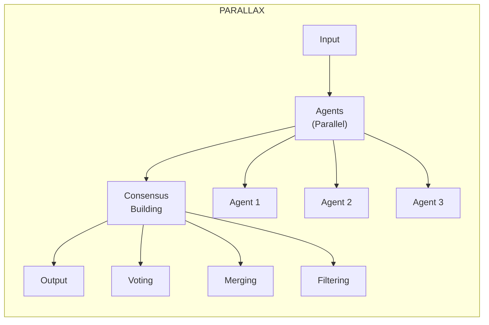

# Welcome to Parallax

**Parallax** is a multi-agent orchestration framework for building reliable AI systems through consensus, voting, and confidence-scored aggregation.

## Why Parallax?

Single AI agents are unreliable. They hallucinate, make mistakes, and produce inconsistent results. Parallax solves this by orchestrating **multiple agents** to work together, using proven distributed systems patterns to achieve reliability.

### Key Benefits

- **Higher Accuracy** - Multiple agents cross-validate each other's work
- **Confidence Scoring** - Know how reliable each response is
- **Consensus Building** - Aggregate multiple opinions into trusted results
- **Quality Gates** - Filter out low-confidence responses automatically
- **Fault Tolerance** - Graceful handling when individual agents fail

## How It Works



1. **Define a Pattern** - Describe your orchestration flow in YAML or visually
2. **Register Agents** - Connect your AI agents (any model, any provider)
3. **Execute** - Parallax routes work to agents and aggregates results
4. **Get Results** - Receive consensus results with confidence scores

## Quick Example

```yaml
name: content-moderation
version: 1.0.0

input:
  content: string

agents:
  capabilities: [content-moderation]
  min: 3

execution:
  strategy: parallel

aggregation:
  strategy: voting
  method: majority

output:
  verdict: $vote.result
  confidence: $vote.confidence
```

## What's Next?

<div className="row">
  <div className="col col--6">
    <div className="card">
      <div className="card__header">
        <h3>🚀 Get Started</h3>
      </div>
      <div className="card__body">
        Install Parallax and run your first pattern in under 5 minutes.
      </div>
      <div className="card__footer">
        <a className="button button--primary button--block" href="/getting-started/quickstart">Quickstart Guide</a>
      </div>
    </div>
  </div>
  <div className="col col--6">
    <div className="card">
      <div className="card__header">
        <h3>📚 Learn Concepts</h3>
      </div>
      <div className="card__body">
        Understand agents, patterns, and how Parallax orchestrates them.
      </div>
      <div className="card__footer">
        <a className="button button--secondary button--block" href="/getting-started/concepts">Core Concepts</a>
      </div>
    </div>
  </div>
</div>

## Powered By

<div style={{display: 'flex', alignItems: 'center', gap: '1rem', padding: '1rem', backgroundColor: 'var(--ifm-card-background-color)', borderRadius: '8px', border: '1px solid var(--ifm-color-emphasis-300)'}}>
  
  
  <div>
    <strong>Prism DSL</strong>
    <p style={{margin: 0, fontSize: '0.9rem', color: 'var(--ifm-color-emphasis-600)'}}>
      Parallax patterns compile to <a href="/prism/overview">Prism</a>, a programming language where uncertainty is a first-class citizen.
      <a href="https://docs.prismlang.dev/" target="_blank" rel="noopener noreferrer"> Learn more →</a>
    </p>
  </div>
</div>

## Open Source

Parallax is open source under the Apache 2.0 license. The open source version includes:

- ✅ Unlimited local agents
- ✅ All orchestration patterns
- ✅ YAML and visual pattern builder
- ✅ Full SDK access
- ✅ In-memory execution

[Enterprise features](/enterprise/overview) add distributed execution, persistence, high availability, and more for production deployments.
